---
# required metadata

title: Default field value in tax information isn't as expected
description: This topic provides troubleshooting information that can help when the default value of a tax information field isn't what you expect.
author: yungu
ms.date: 07/07/2021
ms.topic: article
ms.prod: 

ms.technology: 

# optional metadata

#ms.search.form:
audience: Application user
# ms.devlang: 
ms.reviewer: kfend
ms.search.scope: Core, Operations
# ms.tgt_pltfrm: 
# ms.custom: 
ms.search.region: India
# ms.search.industry: 
ms.author: wangchen
ms.search.validFrom: 2021-04-01
ms.dyn365.ops.version: 10.0.1
---

# Default field value in tax information isn't as expected

[!include [banner](../includes/banner.md)]

If the default value of one of the following tax information fields isn't what you expect, use the information in this topic to troubleshoot and fix the issue:

- Company location
- HSN/SAC 
- Price inclusive

> [!NOTE]
> If the value of any other tax information field isn't what you expect, you can apply a general debug point.

Each scenario in this topic lists the fields that the default value of the tax information field is derived from. The [appendix](#appendix) explains where you can find those fields.

## Company location

The way that the default company location is determined varies, depending on the scenario. For some scenarios, only one location is listed, and it's used as the default company location. For other scenarios, there is a sequential list of all possible locations that can be used as the default company location. Check the locations in the order that they are listed in, until you find a location that exists in your system. That location is then used as the default company location.

### Scenario: Project contract

Set a breakpoint at the company primary address location, and start debugging.

### Scenario: Project

Set a breakpoint at the project contract company location, and start debugging.

### Scenario: Project-related transactions

For transactions that don't have inventory dimensions, set a breakpoint at the company location, and start debugging. These types of transactions include hour journals, expense journals, fee journals, projects on account, and subscriptions.

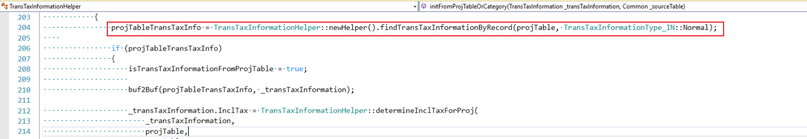

The following transactions *do* have inventory dimensions. These types of transactions include item journals and project sales orders.

- Warehouse default location for delivery purpose
- Warehouse primary address location
- Site default location for delivery purpose
- Site primary address location
- Company default location for delivery purpose
- Company primary address location

For these transactions that have inventory dimensions, set a breakpoint at **locationFetchedBasedOnInventDim**, and start debugging.

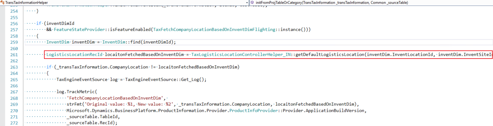

### Scenario: Transactions that aren't related to a project

The following transactions aren't related to a project. For each, the corresponding company location fields are listed.

- Free text invoice/general journal:

    - Company primary address location

- Other transactions:

    - Warehouse default location for delivery purpose
    - Warehouse primary address location
    - Site default location for delivery purpose
    - Site primary address location
    - Company default location for delivery purpose
    - Company primary address location

Set a breakpoint at **transTaxInformation.CompanyLocation**, and start debugging.

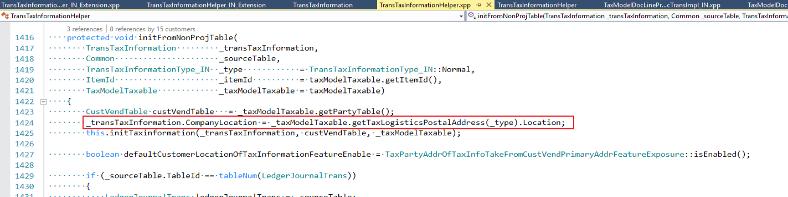

## HSN/SAC/Exempt/NonGST

The way that the default Harmonized System of Nomenclature (HSN) code/Service Accounting Code (SAC) is determined varies, depending on the scenario. For some scenarios, only one value is listed. This value is used as the default HSN/SAC/Exempt/NonGST. For other scenarios, there is a sequential list of all possible values that can be used as the default HSN/SAC/Exempt/NonGST. Check the values in the order that they are listed in, until you find a value that exists in your system. That value is then used as the default HSN/SAC/Exempt/NonGST in the tax information.

### Scenario: Non-project transactions related to an inventory item or a released product

When the HSN/SAC/Exempt/NonGST is an inventory item or a released product, set a breakpoint there, and start debugging to find the default HSN/SAC/Exempt/NonGST.

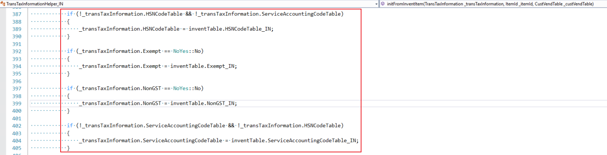

### Scenario: Non-project transactions related to a procurement category

When the HSN/SAC/Exempt/NonGST is a procurement category, set a breakpoint there, and start debugging to find the default HSN/SAC/Exempt/NonGST.

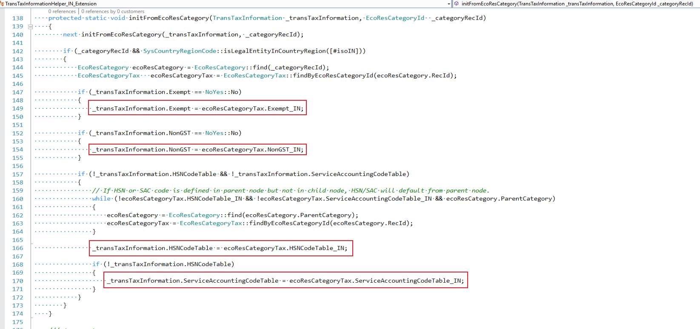

### Scenario: Project transactions

#### HSN/SAC/Exempt/NonGST field

For project transactions, the HSN/SAC/Exempt/NonGST is assigned differently.

- When the HSN/SAC/Exempt/NonGST is a project transaction, set the breakpoint there, and start debugging.

    [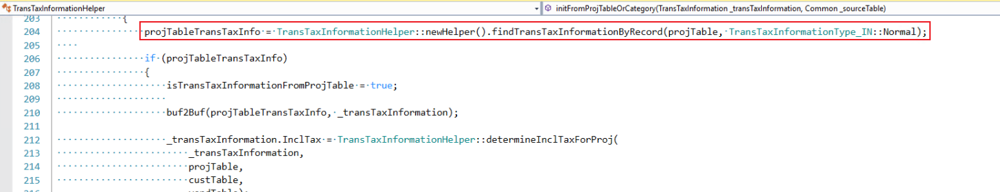](./media/default-value-not-excepted-Picture7.png)

- When the HSN/SAC/Exempt/NonGST is a project inventory item, such as an item journal or a project sales order, set a breakpoint there, and start debugging.

    

#### SAC field

- When the SAC is a project transaction, set the breakpoint there, and start debugging.

    

- When the SAC is a project inventory item, such as an item journal or a project sales order, set a breakpoint there, and start debugging.

    

- When the SAC is a project category, set a breakpoint there, and start debugging.

    [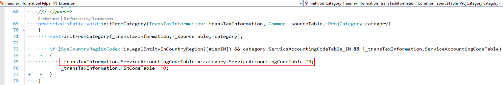](./media/default-value-not-excepted-Picture11.png)

## Price inclusive

The **Price inclusive** field is set for the transaction line if a specific condition is met.

### Scenario: Transactions that aren't related to a project

In the general ledger journal, the journal header is marked as price inclusive. The customer or vendor account that is used on the journal line is marked as the default account for the **Price inclusive** field.

For other transactions that aren't related to a project, the transaction header is marked as price inclusive.

### Scenario: Project-related transactions

The general ledger journal header is marked as price inclusive. The customer or vendor account that is used on the journal line is marked as the default account for the **Price inclusive** field. Any tax information for the project and the account that is used in the project is also marked as price inclusive.

For other project-related transactions, the transaction header, the project tax information, and the account that is used in the project are marked as price inclusive.

## Other fields

To check the default value for a specific field in the tax information, debug in the following methods.

### Scenario: Transactions that aren't related to a project

For transactions that aren't related to a project, set breakpoints at the following places, and then start debugging:

- TransTaxInformationHelper.initFromNonProjTable()
- TransTaxInformationHelper\_IN\_Extension.initFromNonProjTable()

### Scenario: Project-related transactions

For project-related transactions, set the breakpoint at `TransTaxInformationHelper:: initFromProjTableOrCategory()`, and then start debugging.

## Appendix: Find the fields related to default values in the tax information

### Fields that the company location is derived from

- **Company default location for delivery purpose:**

    Go to **Organization administration** \> **Organizations** \> **Legal entities** \> **Addresses**, and select **More options** \> **Set defaults**.

    [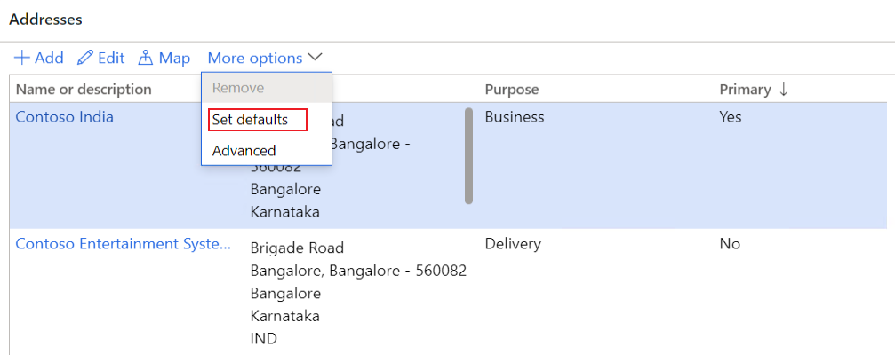](./media/default-value-not-excepted-Picture17.png)

    For the default address, **Delivery** is selected in the **Purpose** field.

    [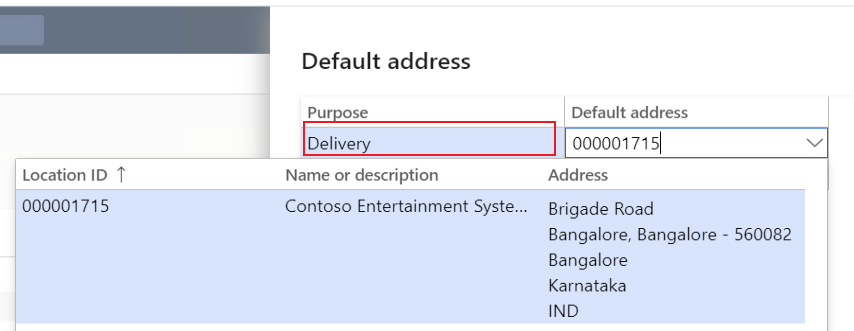](./media/default-value-not-excepted-Picture18.png)

- **Company primary address location:**

    Go to **Organization administration** \> **Organizations** \> **Legal entities** \> **Addresses**. Notice that the **Primary** field is set to **Yes**.

    [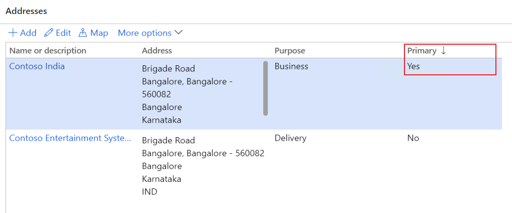](./media/default-value-not-excepted-Picture19.png)

- **Site default location for the Delivery purpose:**

    Go to **Inventory management** \> **Setup** \> **Inventory breakdown** \> **Sites** \> **Addresses**, and select **Set defaults**.

    [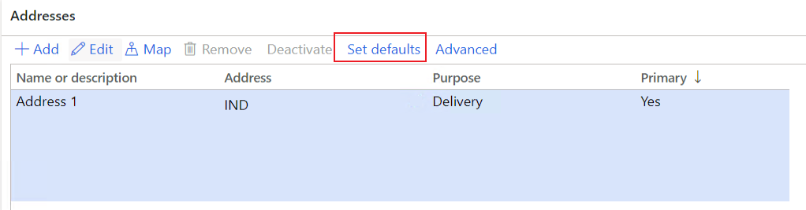](./media/default-value-not-excepted-Picture20.png)

    For the default address, **Delivery** is selected in the **Purpose** field.

- **Site primary address location:**

    Go to **Inventory management** \> **Setup** \> **Inventory breakdown** \> **Sites** \> **Addresses**. Notice that the **Primary** field is set to **Yes**.

- **Warehouse default location for delivery purpose:**

    Go to **Inventory management** \> **Setup** \> **Inventory breakdown** \> **Warehouses** \> **Addresses**, and select **Set defaults**.

    For the default address, **Delivery** is selected in the **Purpose** field.

- **Warehouse primary address location:**

    Go to **Inventory management** \> **Setup** \> **Inventory breakdown** \> **Warehouses** \> **Addresses**. Notice that the **Primary** field is set to **Yes**.

- **Project contract tax information company location:**

    Go to **Project management and accounting** \> **Projects** \> **Project contracts**. Select the project contract, and then, on the Action Pane, on the **Project contract** tab, in the **Attachments** group, select **Tax information**.

    [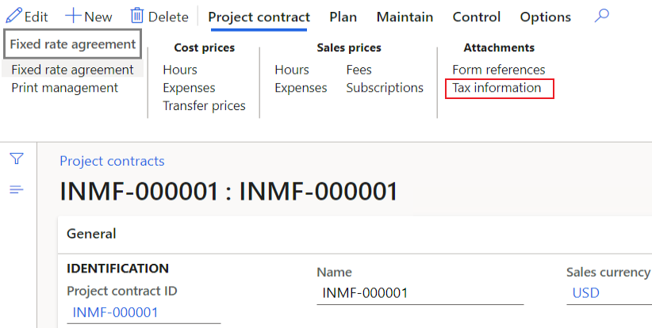](./media/default-value-not-excepted-Picture26.png)

    The company location that is used is specified in the **Location** field on the **Tax information** page.

    [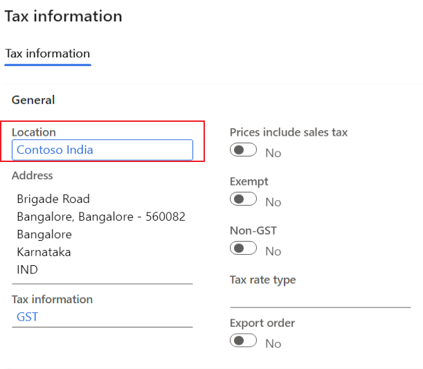](./media/default-value-not-excepted-Picture27.png)

- **Project tax information company location:**

    Go to **Project management and accounting** \> **Projects** \> **All projects**. Open the project, and then, on the Action Pane, on the **Project** tab, in the **Setup** group, select **Tax information**.

    [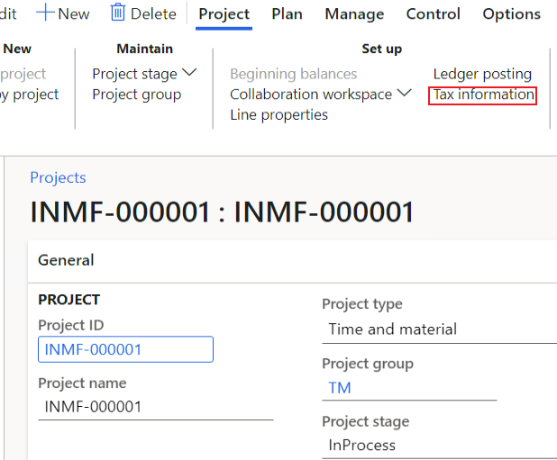](./media/default-value-not-excepted-Picture28.png)

    The company location that is used is specified in the **Location** field on the **Tax information** page.

    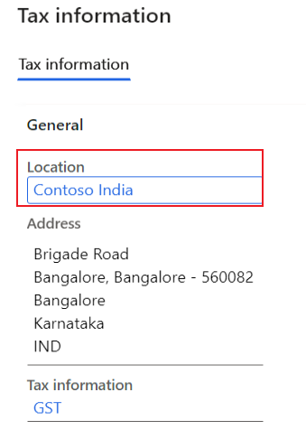

### Fields that HSN/SAC/Exempt/NonGST is derived from

- **Inventory item:**

    Go to **Product information management** \> **Products** \> **Released products**. Open the released product record, and then, in the **GST** section, notice the values of the **HSN codes** and **Service accounting codes** fields, and the settings of the **Exempt** and **Non-GST** options.

    [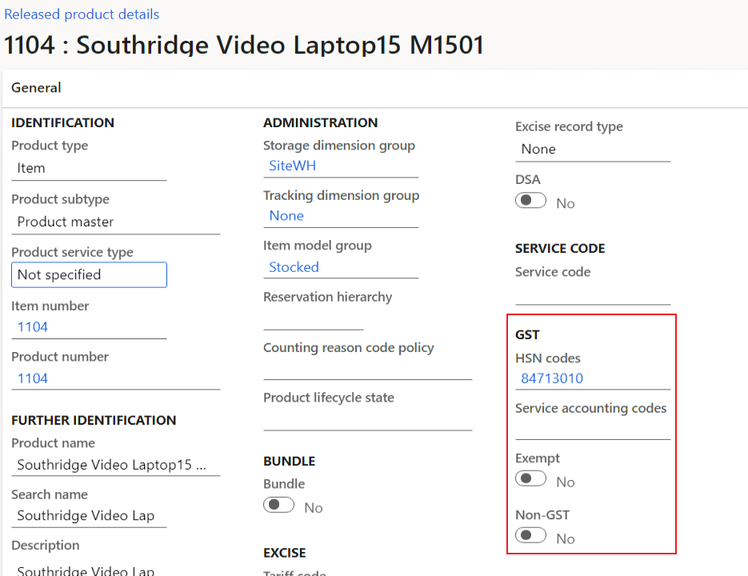](./media/default-value-not-excepted-Picture30.png)

- **Procurement category:**

    Go to **Procurement and sourcing** \> **Consignment** \> **Procurement categories**. Open the category, and then, on the **Tax information** FastTab, notice the values of the **HSN codes** and **Service accounting codes** fields, and the settings of the **Exempt** and **Non-GST** options.

    [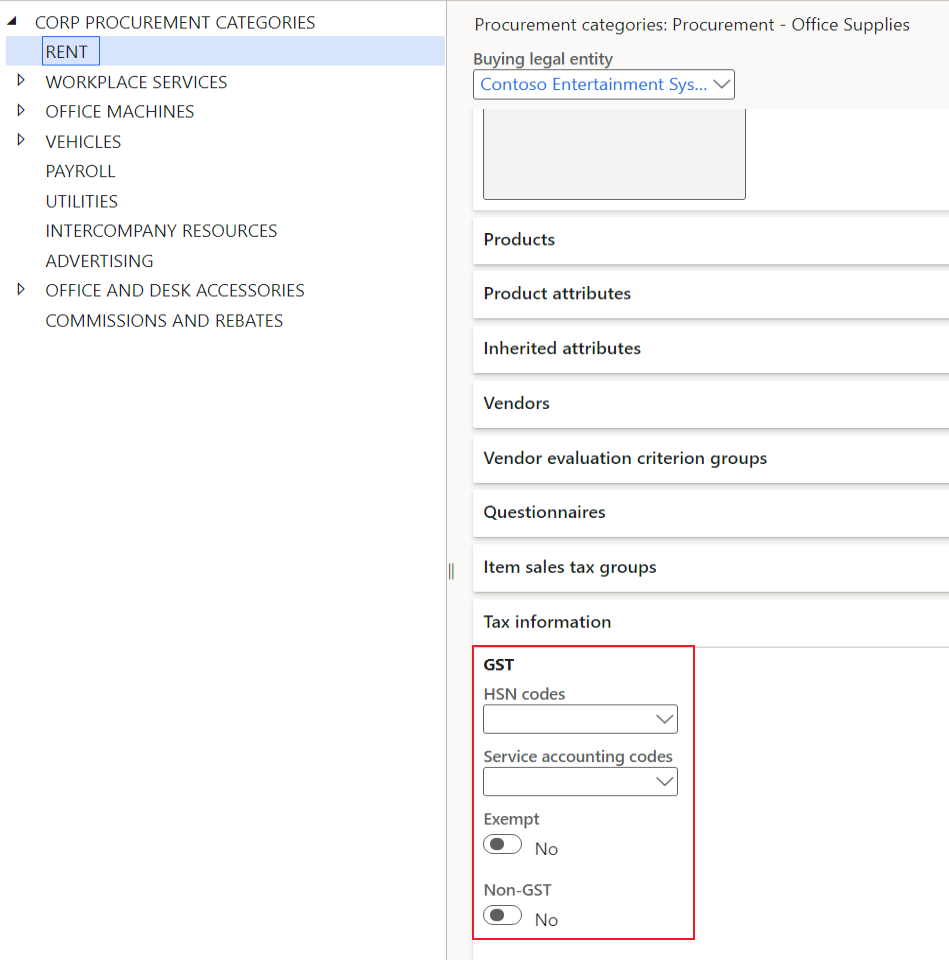](./media/default-value-not-excepted-Picture31.png)

- **Project tax information:**

    Go to **Project management and accounting** \> **Projects** \> **Project contracts**. Select the project contract, and then, on the Action Pane, on the **Project contract** tab, in the **Attachments** group, select **Tax information**.

    [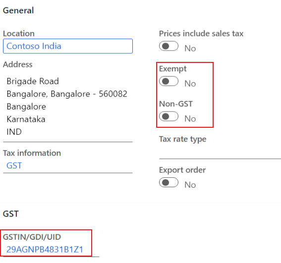](./media/default-value-not-excepted-Picture32.png)

- **Project category:**

    Go to **Project management and accounting** \> **Setup** \> **Categories** \> **Project categories**. Open the project category, and then, on the **Projects** FastTab, in the **GST** section, notice the value of the **Service accounting code** field.

    [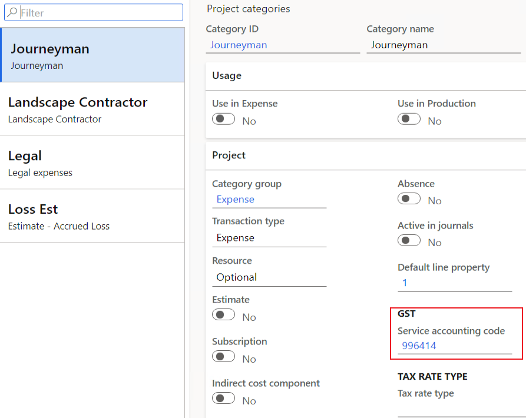](./media/default-value-not-excepted-Picture33.png)

### Fields that Price inclusive is derived from

- **Customer:**

    Go to **Accounts receivable** \> **Customers** \> **All customers**. Open the customer record, and then, on the **Invoice and delivery** FastTab, notice the setting of the **Prices include sales tax** option.

    

- **Vendor:**

    Go to **Accounts payable** \> **Vendors** \> **All vendors**. Open the vendor record, and then, on the **Invoice and delivery** FastTab, notice the setting of the **Prices include sales tax** option.

    [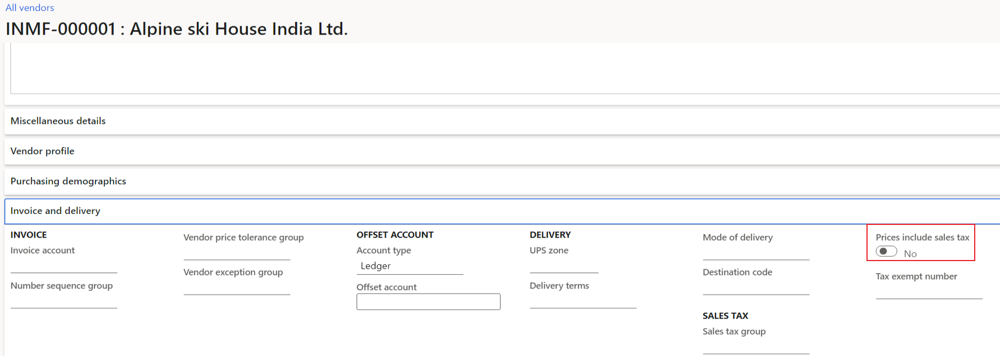](./media/default-value-not-excepted-Picture35.png)

[!INCLUDE[footer-include](../../includes/footer-banner.md)]
