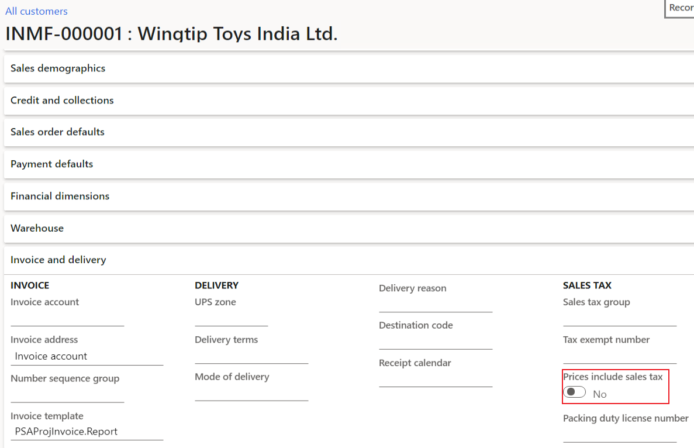

---
# required metadata

title: Default field value in tax information isn't as expected
description: This topic provides troubleshooting information to resolve the issue when the default values for tax information are't expected.
author: yungu
ms.date: 05/04/2021
ms.topic: article
ms.prod: 
ms.service: dynamics-ax-applications
ms.technology: 

# optional metadata

#ms.search.form:
audience: Application user
# ms.devlang: 
ms.reviewer: kfend
ms.search.scope: Core, Operations
# ms.tgt_pltfrm: 
# ms.custom: 
ms.search.region: India
# ms.search.industry: 
ms.author: wangchen
ms.search.validFrom: 2021-04-01
ms.dyn365.ops.version: 10.0.1
---

# Default field value in tax information isn't as expected

[!include [banner](../includes/banner.md)]

If the default value of a tax information field isn't as expected for one of the following fields, complete the sections in this topic to troubleshoot and resolve the issue.     

  - Company location
  - HSN/SAC 
  - Price inclusive

> [!NOTE]
> If there are other tax information fields whose value isn't as expected, the general debug point is also provided at the end of this topic which can be applied to the fields. 

Under each of the following scenarios, the fields that the tax information field default value derived from are listed. The paths to these derived from fields are listed in appendix.

## Company location

The default company location is determined based on different scenarios. For some scenarios, only one location is listed and it's used as default company location. In others, there is a sequential list with all the possible locations to be used as a default company location. Check the locations by following the list sequence until a location exists in your system. This location is used as the default company location.

### Scenario: Project contract

Set a breakpoint at the company primary address location and start debugging. 

  

### Scenario: Project

Set a breakpoint at the project contract company location and start debugging.

### Scenario: Project related transactions

For transactions without inventory dimensions, includingHour journal, Expense journal, Fee journal, project on account, and subscription, set a breakpoint at the company location and start debugging.

 

The following list includes transactions with inventory dimensions. These transaction types include, item journals and project sales orders.

  - Warehouse default location for delivery purpose
  - Warehouse primary address location
  - Site default location for delivery purpose
  - Site primary address location
  - Company default location for delivery purpose
  - Company primary address location

Set a breakpoint at **locationFetchedBasedOnInventDim** for these transactions with inventory dimensions, and start debugging.

   

### Scenario: Transactions not related to project

The following is a list of transactions that aren't related to a project and the corresponding company location fields.
    
   - Free text invoice/General journal: 

       - Company primary address location
    
   - Other transactions:

       - Warehouse default location for delivery purpose
       - Warehouse primary address location
       - Site default location for delivery purpose
       - Site primary address location
       - Company default location for delivery purpose
       - Company primary address location
  
Set a breakpoint at **transTaxInformation.CompanyLocation** and start debugging.
  
  
  
## HSN/SAC/Exempt/NonGST

The default HSN/SAC is determined differntly based on the scenario. In some scenarios, only one value is listed under the scenario. This value is used as the default HSN/SAC/Exempt/NonGST. In other scenarios, there is a sequential list with all possible default values that can be used as the default HSN/SAC/Exempt/NonGST. Check the values by following the list sequence until a value exists in your system. This value used as default HSN/SAC/Exempt/NonGST in the tax information.

### Scenario: Non-project transactions related to inventory item (release product)

- - HSN/SAC/Exempt/NonGST = item HSN/SAC/Exempt/NonGST

- Debug point

- 

### Scenario: Non-project transactions related to procurement category

- - HSN/SAC/Exempt/NonGST = procurement category HSN/SAC/Exempt/NonGST

- Debug point

- 

### Scenario: Project transactions

- - **Field: HSN/Exempt/NonGST**

- 1. Project tax information HSN/Exempt/NonGST

     Debug point

     

  2. Inventory item HSN/Exempt/NonGST (Item journal, project sales order)

     Debug point

     

- - **Field: SAC**

    1. Project tax information SAC

       Debug point

       

    2. Inventory Item SAC (Item journal, project sales order)

       Debug point

       

    3. Project category SAC

       Debug point

       

## Price inclusive

  The price inclusive would be set in the tax information for the transaction line if any one of the condition is met.

### Scenario: Non-project related transactions

    - **General ledger journal**

      - Journal header is marked as price inclusive 
      - Customer/vendor account used in journal line is marked as default price inclusive

    - **Other non-project related transactions**

      - Head of the transaction is marked as price inclusive

      Debug point

      

### Scenario: Project related transactions

    - **General ledger journal**

    - - Journal header is marked as price inclusive 
      - Customer/vendor account used in journal line is marked as default price inclusive
      - Project tax information is marked as price inclusive
      - The account used in the project is marked as price inclusive

    - **Other project related transactions**

    - - Header of the transaction is marked as price inclusive
      - Project tax information is marked as price inclusive
      - The account used in the project is marked as price inclusive

    - Debug point

    - 

- Other fields

  To check the default value for a certain field in tax information. Debug in the below methods.

  - **Scenario: Non-project related transactions**

  - - **Debug point**

      

      

  - **Scenario: Project related transactions**

  - - **Debug point**

      

## Appendix: How to find the fields related to default value in tax information**

- **Company location derived from fields**

- - Company default location for delivery purpose

    - Path: Organization administration->Organizations->Legal entities->Addresses

      Click on "More options", then "Set defaults"

      

      The default address with purpose "Delivery" is listed as below

      

  - Company primary address location

  - - Path: Organization administration->Organizations->Legal entities->Addresses

      The primary location is marked as "Yes"

      

  - Site default location for delivery purpose

  - - Path: Inventory management->Setup->Inventory breakdown->Sites->Addresses

      Click on "Set defaults"

      

      The default address for delivery purpose is listed as below

      

  - Site primary address location

  - - Path: Inventory management->Setup->Inventory breakdown->Sites->Addresses

      The primary location is marked as "Yes"

      

  - Warehouse default location for delivery purpose 

  - - Path: Inventory management->Setup->Inventory breakdown->Warehouses->Addresses

      Click on "Set defaults"

      

      The default address for delivery purpose is listed as below

      

  - Warehouse primary address location

  - - Path: Inventory management->Setup->Inventory breakdown->Warehouses->Addresses

      The primary location is marked as "Yes"

      

  - Project contract tax information company location

  - - Path: Project management and accounting->Projects->Project contracts

      Enter into the project contract used, then click the "Tax information"

      

      Find the company location used

      

  - Project tax information company location

  - - Path: Project management and accounting->Projects->All projects

      Enter into the project used, then click the "Tax information"

      

    - Find the company location used

    - 

- **HSN/SAC/Exempt/NonGST derived from fields**

  - Inventory item

  - - Path: Product information management->Products->Released Products

      Enter into the item used, find the HSN/SAC/Exempt/NonGST as below

      

  - Procurement category

    - Path: Procurement and sourcing->Consignment->Procurement categories

      Click on the category used, find the HSN/SAC/Exempt/NonGST as below

      

  - Project tax information

  - - Path: Project management and accounting->Projects->Project contracts

      Enter into the project contract used, then click the "Tax information"

      

  - Project category

  - - Path: Project management and accounting->Setup->Categories->Project categories

      Click on the project category used, find the SAC as below

      

- **Price inclusive derived from fields**

- - Customer

    - Path: Accounts receivable->Customers->All customers

      Enter into the customer used, find price inclusive as below

      

  - Vendor

    - Path: Accounts payable->Vendors->All vendors

      Enter into the vendor used, find price inclusive as below

      

    
[!INCLUDE[footer-include](../../includes/footer-banner.md)]
