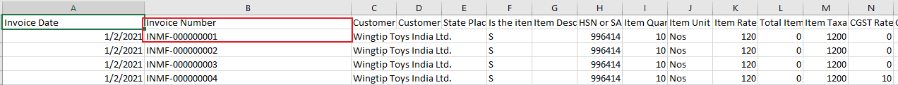
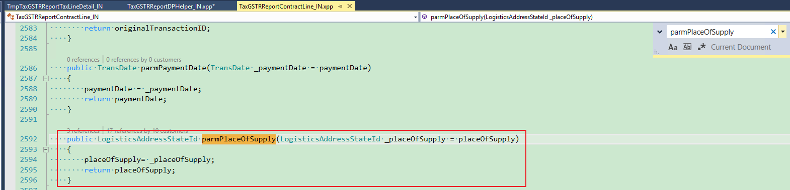

---
# required metadata

title: Incorrect field values on the GSTR report
description: This topic provides troubleshooting information that can help when field values on the generated GSTR report are incorrect.
author: yungu
ms.date: 06/08/2021
ms.topic: article
ms.prod: 

ms.technology: 

# optional metadata

#ms.search.form:
audience: Application user
# ms.devlang: 
ms.reviewer: kfend
ms.search.scope: Core, Operations
# ms.tgt_pltfrm: 
# ms.custom: 
ms.search.region: India
# ms.search.industry: 
ms.author: wangchen
ms.search.validFrom: 2021-04-01
ms.dyn365.ops.version: 10.0.1
---

# Incorrect field values on the GSTR report

[!include [banner](../includes/banner.md)]

When the GSTR report is generated, some of the field values might be incorrect. In this case, follow the steps in the sections of this topic to try to fix the issue.

This topic uses the **State of supply** value of the **Invoice and bill of supply** field in the **GSTR-1** legal entity as an example.

## Determine whether the issue is related to Excel

To determine whether the issue is related to Microsoft Excel, see [Details for issue 459982 (dynamics.com)](https://fix.lcs.dynamics.com/Issue/Details?bugId=459982&dbType=3&qc=38e839da1be8c7ec9b71b65e4c8607efe79c434c1c3dbcd2e1d86b9ba08b78a0). If the issue is related to Excel, use the information in Microsoft Dynamics Lifecycle Services (LCS) to fix it, or remove the quotation marks (") in the data. If the issue isn't related to Excel, move on to the next section.

## Review the report controller setup

1. Go to **Tax** \> **Setup** \> **Tax configuration** \> **Tax setup** \> **Configurations**.
2. On the **Report configurations** tab, verify that the correct report controller is selected.

    [](./media/field-value-incorrect-in-GSTR-report-result-Picture1.png)

3. If the incorrect controller is selected, select the correct controller. If the correct controller is already selected, move on to the next section.

## Review the TaxDocumentRowTransaction value

1. Run the following SQL query to verify that the value of **TaxDocumentRowTransaction** is correct.

    ```sql
    select * from TaxDocumentRowTransaction T1 
        inner join TaxDocumentRowTransaction_IN T2
    on T1.RecId = T2.TaxDocumentRowTransactionRecId
        inner join TaxDocumentExtension_IN T3
    on T2.TaxDocumentExtension = T3.RecId
        where T3.TaxTransactionId = 'xx'; 
    ```

    > [!NOTE]
    > In the last line of the query, replace **xx** with the invoice number from your GSTR report.
    >
    > [](./media/field-value-incorrect-in-GSTR-report-result-Picture2.png)

1. If the value is incorrect, the issue is related to posting. To fix the issue, see [Incorrect field value in an invoice journal or voucher](./apac-ind-GST-troubleshooting-invoice-journal-wrong.md). If the value is correct, move on to the next section.

## Verify that the field value was transferred to the GSTR report

1. Go to **Workspaces** \> **Electronic reporting** \> **Reporting configurations**.
2. Select the configuration, and then select **Format designer**.
3. On the **Format designer** page, select the **Mapping** tab.

    [](./media/field-value-incorrect-in-GSTR-report-result-Picture3.png)

4. In the tree, find the report name, expand **\<Report name\>** \> **Sequence** \> **Lines** \> **Sequence**, and verify that the field mapping is correct. In this example, the field mapping should be **parmPlaceOfSupply**.

    [](./media/field-value-incorrect-in-GSTR-report-result-Picture4.png)

5. Go to the **TaxGSTRReportContract_IN** class, and search in the report configuration to determine whether the field mapping exists. In this example, search for **parmPlaceOfSupply** in the **TaxGSTRReportContract_IN** class.

    [](./media/field-value-incorrect-in-GSTR-report-result-Picture5.png)

6. If the field mapping doesn't exist, report the issue to Microsoft. If the field mapping exists, move on to the next section.

## Debug code to analyze the field logic

1. Find references of the method as explained earlier in the topic.
2. Set breakpoints in the places where the method is called, and then debug it.

    [](./media/field-value-incorrect-in-GSTR-report-result-Picture6.png)

## Determine whether customization exists

If you've completed the steps in the previous section but have found no issue, determine whether customization exists. If no customization exists, create a Microsoft service request for further support.

[!INCLUDE[footer-include](../../includes/footer-banner.md)]
