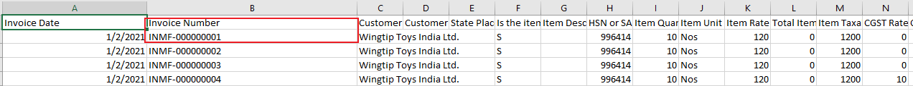
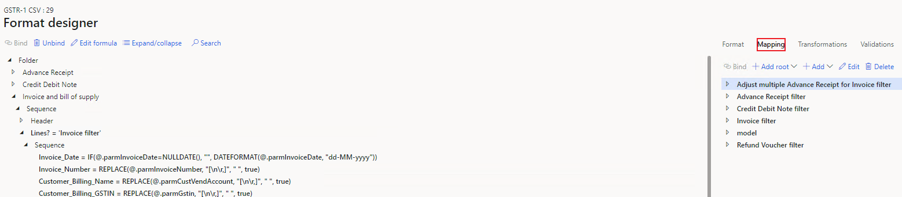
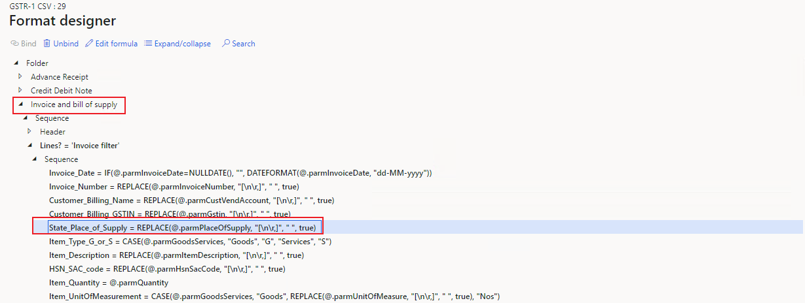
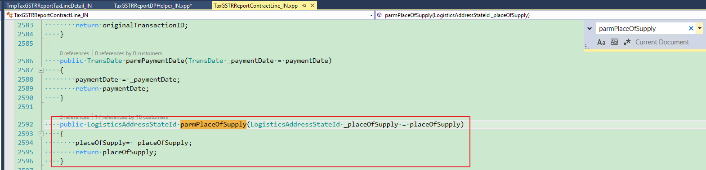
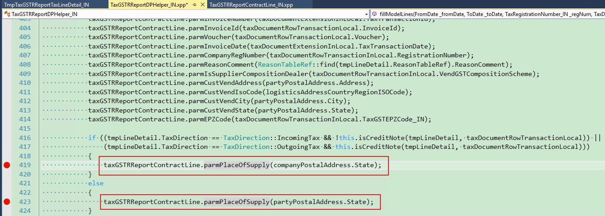

---
# required metadata

title: Some field value is incorrect in the GSTR report result
description:
author: yungu
manager: beya
ms.date: 02/04/2021
ms.topic: article
ms.prod: 
ms.service: dynamics-ax-applications
ms.technology: 

# optional metadata

#ms.search.form:
audience: Application user
# ms.devlang: 
ms.reviewer: kfend
ms.search.scope: Core, Operations
# ms.tgt_pltfrm: 
# ms.custom: 
ms.search.region: India
# ms.search.industry: 
ms.author: wangchen
ms.search.validFrom: 2021-04-01
ms.dyn365.ops.version: 10.0.1
---


# Some field value is incorrect in the GSTR report result

[!include [banner](https://github.com/MicrosoftDocs/dynamics-365-unified-operations-public/blob/live/articles/finance/includes/banner.md)]

## **Symptom**

- Some field value is incorrect in the GSTR report result

 

## **Trouble shooting guide**

**Here take field "State of supply" of "Invoice and bill of supply" in GSTR-1 as an example**

- **Step 1: Check if it is an excel issue**

  1. Please refer to [Details for issue 459982 (dynamics.com)](https://fix.lcs.dynamics.com/Issue/Details?bugId=459982&dbType=3&qc=38e839da1be8c7ec9b71b65e4c8607efe79c434c1c3dbcd2e1d86b9ba08b78a0) to check if it is excel issue. If yes, resolve it according to the LCS or remove special character, e.g. quote mark ("); otherwise, go to step 2.

- **Step 2: Check Report Controller setup**

  1. Go to *Modules -> Tax -> Setup -> Tax configuration -> Tax setup -> Configurations -> Report configurations*, check if you choose the right report controller. If not, please use the right controller;

     Otherwise, go to step 3.

     [](./media/field-value-incorrect-in-GSTR-report-result-Picture1.png)

- **Step 3: Check if value in TaxDocumentRowTransaction is correct or not**

  1. Execute SQL query as follows to check if the value of TaxDocumentRowTransaction is right or     not. If it is wrong, the issue is posting issue and go to [Field value in invoice journal or voucher is wrong](./apac-ind-GST-troubleshooting-invoice-journal-wrong.md). Otherwise, go to step 4.

     ```sql
select * from TaxDocumentRowTransaction T1 
     inner join TaxDocumentRowTransaction_IN T2
on T1.RecId = T2.TaxDocumentRowTransactionRecId
     inner join TaxDocumentExtension_IN T3
on T2.TaxDocumentExtension = T3.RecId
     where T3.TaxTransactionId = 'xx'; 
     ```
     

Here, 'xx' is the invoice number from GSTR report. Find it in your report and replace it.
     
[](./media/field-value-incorrect-in-GSTR-report-result-Picture2.png)

- **Step 4: Check if code transfers the field value to GSTR report**

  1. Go to *Workspaces -> Electronic reporting -> Reporting configurations*.

  2. Open the designer of related configuration. 

  3. Click *Mapping*.

     [](./media/field-value-incorrect-in-GSTR-report-result-Picture3.png)

  4. Find the field in the *report name ->Sequence ->Lines ->Sequence* and check if the field mapping is correct, i.e., here we should find "parmPlaceOfSupply".

     [](./media/field-value-incorrect-in-GSTR-report-result-Picture4.png)

  5. Go to class TaxGSTRReportContract_IN, and search method in report configuration to check if it exists. For example, here we should search "**parmPlaceOfSupply**" in TaxGSTRReportContract_IN. If not, report the bug to Microsoft; Otherwise, go to step 5.

     [](./media/field-value-incorrect-in-GSTR-report-result-Picture5.png)

- **Step 5: Check/Debug code to analyze the logic of field.**

- 1. Find references of the method shown in step 4.

  2. Set breakpoints in the places where the method is called and debug it.

     [](./media/field-value-incorrect-in-GSTR-report-result-Picture6.png)

- **Step 6: If no issue is found in above steps, check whether customization exists. If not, create a service request to Microsoft for further support.**


[!INCLUDE[footer-include](https://github.com/MicrosoftDocs/dynamics-365-unified-operations-public/blob/live/articles/includes/footer-banner.md)]
