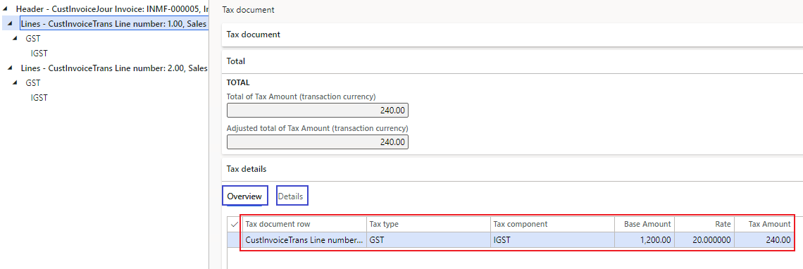
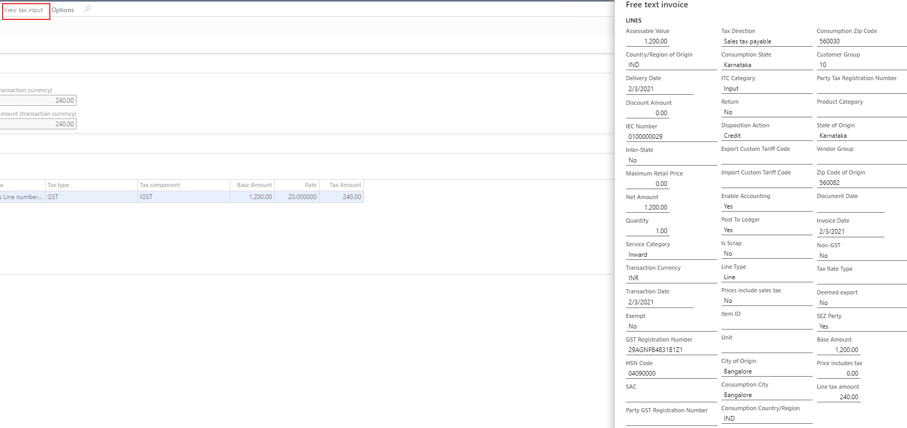
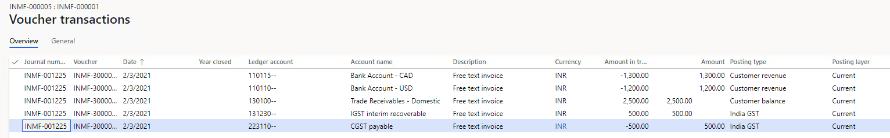
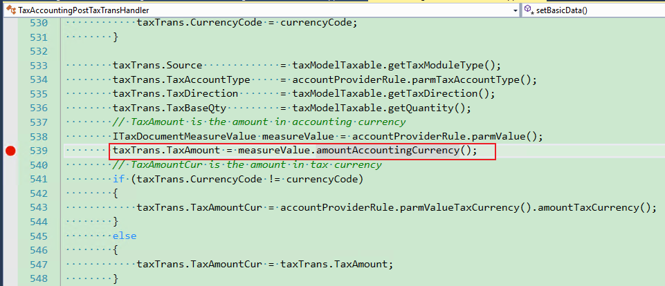
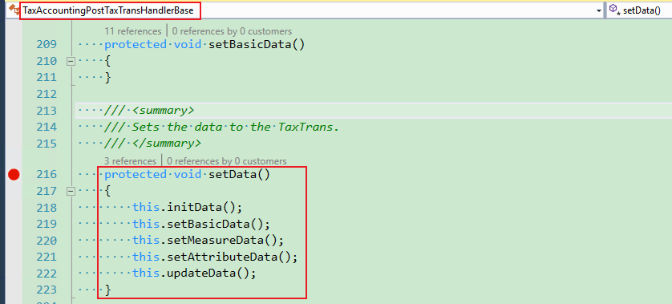
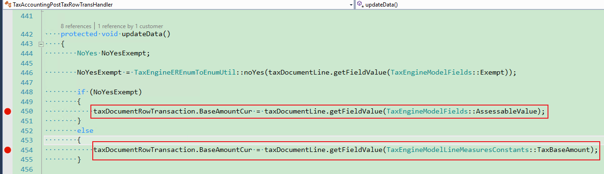
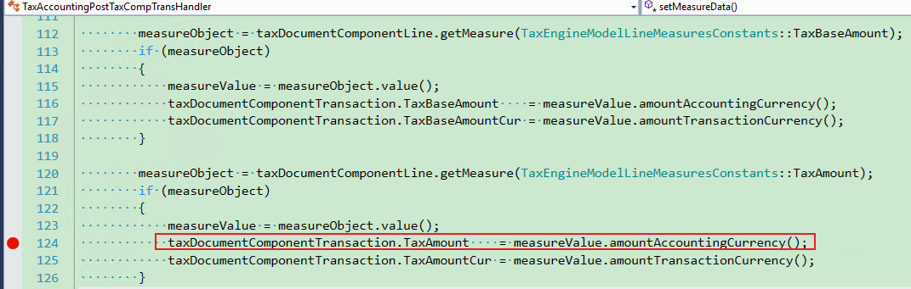

---
# required metadata

title: Incorrect field value in an invoice journal or voucher
description: This topic provides troubleshooting information that can help when a field value in an invoice journal or voucher is incorrect.
author: yungu
ms.date: 06/08/2021
ms.topic: article
ms.prod: 

ms.technology: 

# optional metadata

#ms.search.form:
audience: Application user
# ms.devlang: 
ms.reviewer: kfend
ms.search.scope: Core, Operations
# ms.tgt_pltfrm: 
# ms.custom: 
ms.search.region: India
# ms.search.industry: 
ms.author: wangchen
ms.search.validFrom: 2021-04-01
ms.dyn365.ops.version: 10.0.1
---

# Incorrect field value in an invoice journal or voucher

[!include [banner](../includes/banner.md)]

When you work with an invoice journal or a voucher, you might find an incorrect field value in the following places:

- Posted sales tax (**TaxTrans** table)
- **TaxDocumentRowTransaction** table
- **TaxDocumentComponentTransaction** table
- Voucher (**GeneralJournalAccountEntry** table)

If this issue occurs, follow the steps in the sections of this topic to try to fix it.

This topic uses a free text invoice as an example.

## Review the tax document

You should first review the tax document to determine whether the tax calculation issue also occurs there.

Follow these steps to determine whether the tax amount in the tax document is correct.

1. On the **Tax document** page, on the **Tax details** FastTab, review the field values on the **Overview** and **Details** tabs.

    

2. In the **Lines** view, select **View tax input** to review the values of additional fields, such as **Transaction date**, **Invoice date**, and **Tax direction**.

    

3. If the tax document is incorrect, see [Tax amount is wrong after calculation](apac-ind-GST-troubleshooting-tax-amount-wrong-after-calculation.md) If it's correct, move on to the next section..

## Review the voucher

In the tax document, select **Voucher** to determine whether the amount is posted to another account. If the amount is posted to another account, see [Incorrect ledger account in the voucher](apac-ind-GST-troubleshooting-ledger-account-voucher-wrong.md). If it isn't posted to another account, move on to the next section.

## Debug the code to analyze the logic

- If the field in the voucher (**GeneralJournalAccountEntry** table) is incorrect, report the issue to Microsoft.
- If field in the posted sales tax (**TaxTrans** table) is incorrect, set breakpoints, and review the logic:

    1. Set a breakpoint in **TaxAccountingPostTaxTransHandlerBase**.

        

    2. In **TaxAccountingPostTaxTransHandler**, set breakpoints where the incorrect value is assigned. For example, set breakpoints for **taxTrans.TaxAmount**.

        

- If the field in **TaxDocumentRowTransaction** is incorrect, set breakpoints, and review the logic:

    1. Set a breakpoint in **TaxAccountingPostTaxTransHandlerBase**.

        

    2. In **TaxAccountingPostTaxRowTransHandler**, set breakpoints where the incorrect value is assigned. For example, set breakpoints for **taxDocumentRowTransaction.BaseAmountCur**.

        

- If the field in **TaxDocumentComponentTransaction** is incorrect, set breakpoints, and review the logic:

    1. Set a breakpoint in **TaxAccountingPostTaxTransHandlerBase**.

        

    2. In **TaxAccountingPostTaxCompTransHandler**, set breakpoints where the incorrect value is assigned. For example, set breakpoints for **taxDocumentComponentTransaction.TaxAmount**.

        

## Determine whether customization exists

If you've completed the steps in the previous section but have found no issue, determine whether customization exists. If no customization exists, create a Microsoft service request for further support.

[!INCLUDE[footer-include](../../includes/footer-banner.md)]
