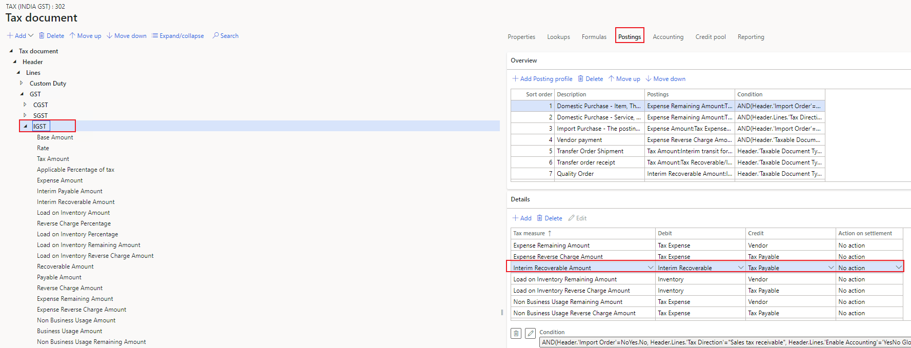
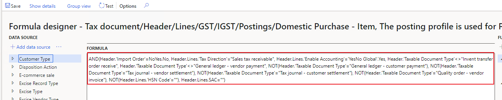

---
# required metadata

title: Ledger account in voucher is wrong
description:
author: yungu
manager: beya
ms.date: 02/04/2021
ms.topic: article
ms.prod: 
ms.service: dynamics-ax-applications
ms.technology: 

# optional metadata

#ms.search.form:
audience: Application user
# ms.devlang: 
ms.reviewer: kfend
ms.search.scope: Core, Operations
# ms.tgt_pltfrm: 
# ms.custom: 
ms.search.region: India
# ms.search.industry: 
ms.author: wangchen
ms.search.validFrom: 2021-04-01
ms.dyn365.ops.version: 10.0.1
---

# Ledger account in voucher is wrong

[!include [banner](https://github.com/MicrosoftDocs/dynamics-365-unified-operations-public/blob/live/articles/finance/includes/banner.md)]

## **Symptom**

- Ledger account in voucher is wrong.

 

## **Trouble shooting guide**

**Here take account for IGST Interim recoverable amount as an example.**

- **Step 1: Check if the amount for this account is posted correctly in the voucher. If yes, go to step 2; Otherwise, go to** [Tax amount is wrong after calculation](./apac-ind-GST-troubleshooting-tax-amount-wrong-after-calculation.md)

- **Step 2: Check tax configuration**

- 1. According to [How to open designer of current used tax configuration](./apac-ind-GST-troubleshooting-open-designer-current-used-tax-configuration.md) to open the designer of current used tax configuration.

  2. Expand *Tax document* node to "*Tax document -> Header -> Lines -> GST ->      IGST*", and click "*IGST*" node.

     

  3. Click "*Posting*" under the related tax     component and find the account for "Interim Recoverable     Amount". Note down account in     debit and credit side, which will be used in step 3. 

     

  4. Click "*Condition*" to open the formula. Check if your setting matches the condition of correct account. If yes, go to step 3; otherwise, correct your settings or modify tax configuration in extension.

     

     

- **Step 3: Check tax setup**

- 1. Go to *Modules -> Tax -> Setup -> Tax configuration -> Tax setup.*

  2. Click "*Setup*" in the related company

     

  3. Click "*Tax document -> Header -> Lines -> GST -> IGST*" or "*Tax document -> Header -> Lines -> GST*" to check values. If they are both empty, modify tax configuration in extension.

  4. Check the account is correct or not. If not, modify it; otherwise, go to step 4. Here posting type is consistency with debit/credit account in step 2.

     

- **Step 4: Check/Debug code to analyze the logic.**

  1. Set breakpoint in class "TaxAccountingPostFacade::post()", try to debug it to find root cause. If it is hard to debug, go to Microsoft.

     

- **Step 5: If no issue is found in above steps, check whether customization exists. If not, create a service request to Microsoft for further support.**

[!INCLUDE[footer-include](https://github.com/MicrosoftDocs/dynamics-365-unified-operations-public/blob/live/articles/includes/footer-banner.md)]