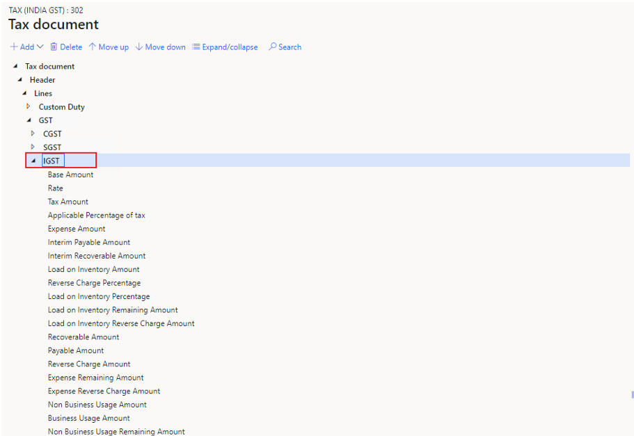

---
# required metadata

title: Incorrect ledger account in the voucher 
description: This topic provides troubleshooting information to help resolve the issue of an incorrect ledger account in the voucher.
author: yungu
ms.date: 05/06/2021
ms.topic: article
ms.prod: 
ms.service: dynamics-ax-applications
ms.technology: 

# optional metadata

#ms.search.form:
audience: Application user
# ms.devlang: 
ms.reviewer: kfend
ms.search.scope: Core, Operations
# ms.tgt_pltfrm: 
# ms.custom: 
ms.search.region: India
# ms.search.industry: 
ms.author: wangchen
ms.search.validFrom: 2021-04-01
ms.dyn365.ops.version: 10.0.1
---

# Incorrect ledger account in the voucher 

[!include [banner](../includes/banner.md)]

If you find that the ledger account in the voucher, complete the sections in this topic to try and resolve the issue. This topic will use the **IGST Interim** recoverable amount as the example.

## Verify that the amount is posted correctly 
Check the voucher and verify that the posted amount is correct. If the posted amount is correct, continue to the next section. If the posted amount isn't correct, see [Tax amount is wrong after calculation](apac-ind-GST-troubleshooting-tax-amount-wrong-after-calculation.md)

## Check the tax configuration

1. Complete the steps in the topic, [Current tax configuration designer](apac-ind-GST-troubleshooting-open-designer-current-used-tax-configuration.md) to open the designer of current tax configuration.
2. Expand the **Tax document** node to **Tax document** > **Header** > **Lines** > **GST** > **IGST**, and select **IGST**.

     

3. On the **Postings** tab, on the **Details** FastTab, find the account for **Interim Recoverable Amount**. Note the debit and credit information which you will need later. 

     

4. Select **Condition** to open the formula.

     
        
6. Check the formula to see if your setting matches the condition of the correct account. If they match, continue to the next section. If they don't, correct your settings or in the extension, modify the tax configuration.

     

## Check the tax setup

1. Go to **Tax** > **Setup** > **Tax configuration** > **Tax setup**.
2. On the **Companies** FastTAb, select the related company, and then select **Setup**.

     

3. Go to **Tax document** > **Header** > **Lines** > **GST** > **IGST** or **Tax document** > **Header** > **Lines** > **GST** to check the tax values. If both values are empty, modify the tax configuration in the extension.
4. Verify whether the account is correct. If the account isn't correct, modify it and then move ot the next step. If the account is correct, continue to the next section. The following graphic shows the posting type that is consistent with the debit and credit account you noted earlier the topic.

     

## Debug the code to analyze the logic

  1. Set a breakpoint in the **TaxAccountingPostFacade::post()** class, and try to debug it to find root cause. If it is hard to debug, report the bug to Microsoft.

     

## Determine whether customization exists

If you've completed the steps in the previous section but have found no issue, determine whether customization exists. If no customization exists, create a Microsoft service request for further support.

[!INCLUDE[footer-include](../../includes/footer-banner.md)]
