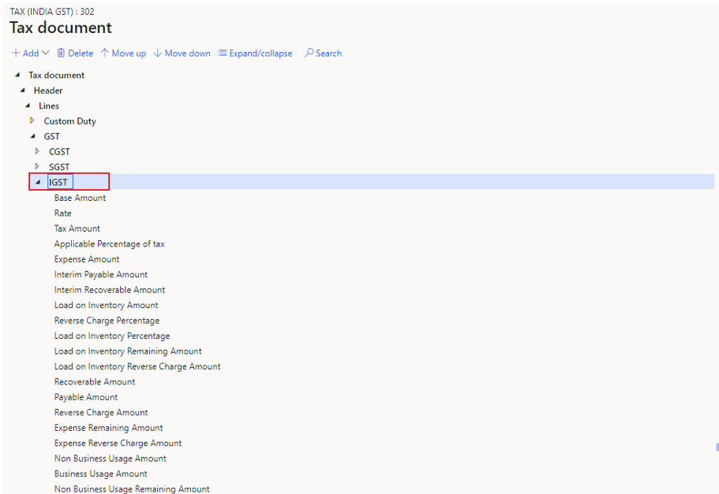
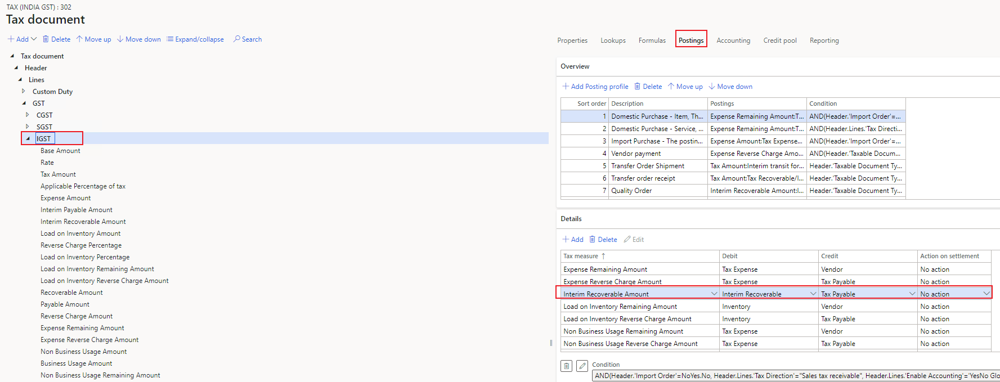
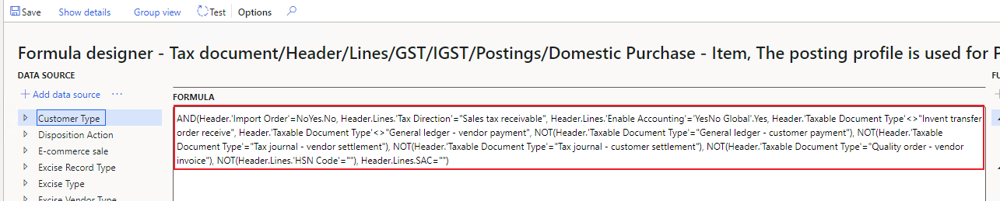
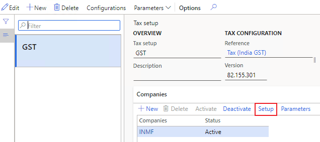
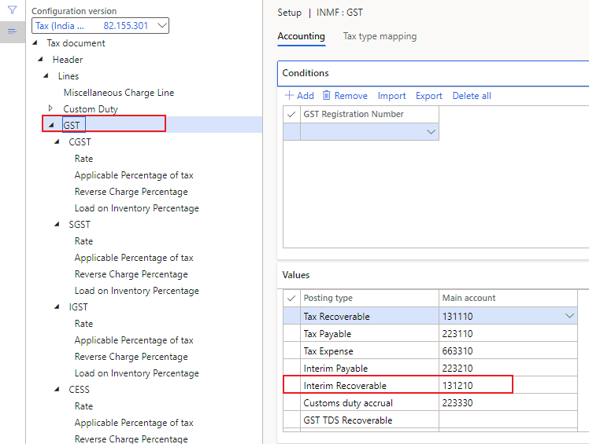
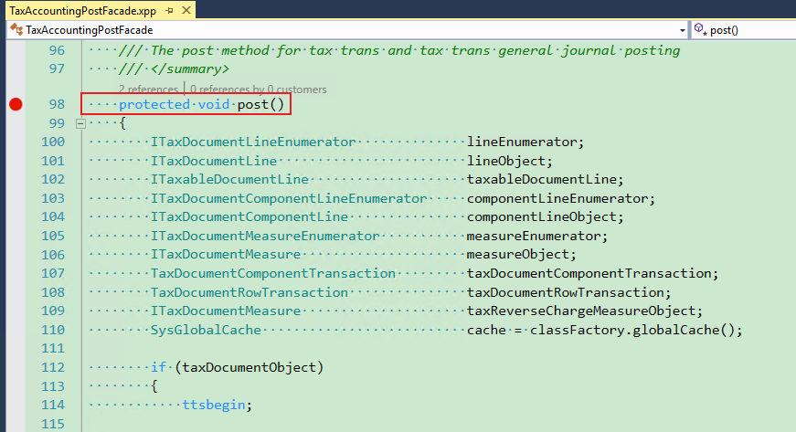

---
# required metadata

title: Incorrect ledger account in the voucher
description: This topic provides troubleshooting information that can help when the ledger account in the voucher is incorrect.
author: yungu
ms.date: 06/08/2021
ms.topic: article
ms.prod: 

ms.technology: 

# optional metadata

#ms.search.form:
audience: Application user
# ms.devlang: 
ms.reviewer: kfend
ms.search.scope: Core, Operations
# ms.tgt_pltfrm: 
# ms.custom: 
ms.search.region: India
# ms.search.industry: 
ms.author: wangchen
ms.search.validFrom: 2021-04-01
ms.dyn365.ops.version: 10.0.1
---

# Incorrect ledger account in the voucher

[!include [banner](../includes/banner.md)]

If you find that the ledger account in the voucher is incorrect, follow the steps in the sections of this topic to try to fix the issue.

This topic uses the IGST interim recoverable amount as an example.

## Verify that the amount was posted correctly

Review the voucher, and verify that the posted amount is correct. If it's correct, move on to the next section. If it's incorrect, see [Tax amount is wrong after calculation](apac-ind-GST-troubleshooting-tax-amount-wrong-after-calculation.md).

## Review the tax configuration

1. Follow the steps in [Open the designer for the current tax configuration](apac-ind-GST-troubleshooting-open-designer-current-used-tax-configuration.md).
2. Expand the **Tax document** node to **Tax document** \> **Header** \> **Lines** \> **GST** \> **IGST**, and then select **IGST**.

    

3. On the **Postings** tab, on the **Details** FastTab, find the account for **Interim Recoverable Amount**. Make a note of the debit and credit information. You will need this information later.

    

4. Select **Condition** to open the formula.

    

5. Review the formula to determine whether your settings match the condition of the correct account. If they match, move on to the next section. If they don't match, correct your settings, or modify the tax configuration in the extension.

    

## Review the tax setup

1. Go to **Tax** \> **Setup** \> **Tax configuration** \> **Tax setup**.
2. On the **Companies** FastTab, select the related company, and then select **Setup**.

    

3. Go to **Tax document** \> **Header** \> **Lines** \> **GST** or **Tax document** \> **Header** \> **Lines** \> **GST** \> **IGST**, and review the tax values. If both values are empty, modify the tax configuration in the extension.
5. Verify that the account is correct. If it's correct, move on to the next section. If it's incorrect, modify it.

    In the following illustration, notice that the posting type values are consistent with the debit and credit accounts that you made a note of earlier.

    

## Debug the code to analyze the logic

- Set a breakpoint in the **TaxAccountingPostFacade::post()** class, and try to debug it to find the root cause. If you find it difficult to debug the class, report the issue to Microsoft.

    

## Determine whether customization exists

If you've completed the steps in the previous section but have found no issue, determine whether customization exists. If no customization exists, create a Microsoft service request for further support.

[!INCLUDE[footer-include](../../includes/footer-banner.md)]
