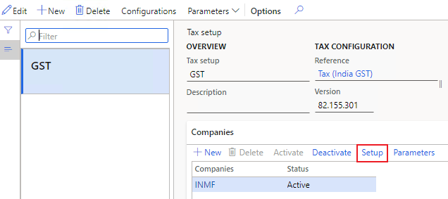
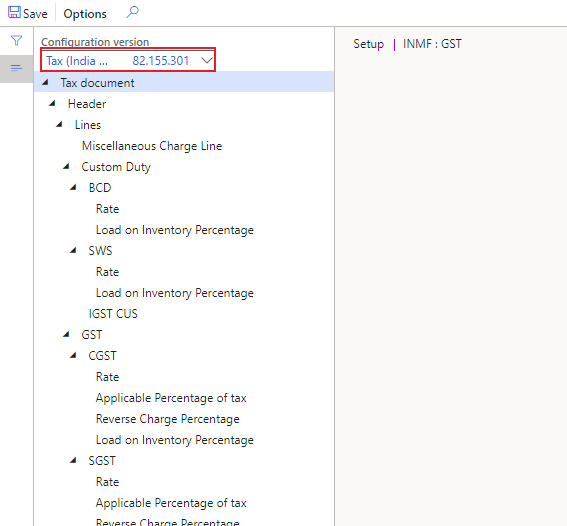
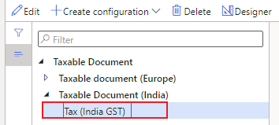
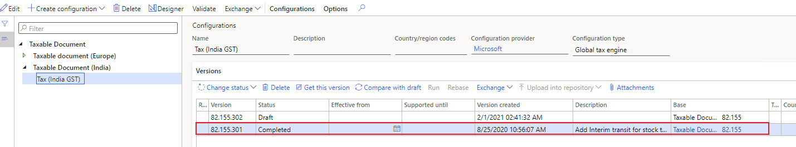
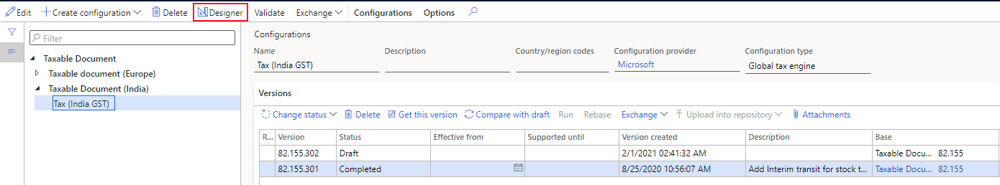

---
# required metadata

title: How to open designer of current used tax configuration
description:
author: yungu
manager: beya
ms.date: 02/04/2021
ms.topic: article
ms.prod: 
ms.service: dynamics-ax-applications
ms.technology: 

# optional metadata

#ms.search.form:
audience: Application user
# ms.devlang: 
ms.reviewer: kfend
ms.search.scope: Core, Operations
# ms.tgt_pltfrm: 
# ms.custom: 
ms.search.region: India
# ms.search.industry: 
ms.author: wangchen
ms.search.validFrom: 2021-04-01
ms.dyn365.ops.version: 10.0.1
---

# How to open designer of current used tax configuration

[!include [banner](https://github.com/MicrosoftDocs/dynamics-365-unified-operations-public/blob/live/articles/finance/includes/banner.md)]

## **Symptom**

- Unfamiliar with how to open designer of current used tax configuration

 

## **Trouble shooting guide**

**Here take tax setup in standard environment in Microsoft as an example.**

- **Step 1: Find version of current used tax configuration**

  1. Go to *Modules -> Tax -> Setup -> Tax configuration -> Tax setup.*

  2. Click "*Setup*" in the related company

     

  3. Note down the configuration version

     

- **Step 2: Open designer of current used tax configuration**

  1. Go to *Workspaces -> Electronic reporting -> Tax configurations.*

  2. Expand *Taxable Document* node to the final node. Here is "*Taxable Document -> Taxable Document (India) -> Tax (India GST)*"

     

  3. Select the current used tax configuration according to the configuration version of step 1.

     

  4. Click *Designer* button of current used tax configuration.

     

- **Step xx: If no issue is found in above steps, check whether customization exists. If not, create a service request to Microsoft for further support.**

[!INCLUDE[footer-include](https://github.com/MicrosoftDocs/dynamics-365-unified-operations-public/blob/live/articles/includes/footer-banner.md)]