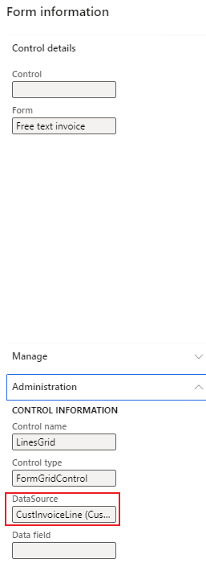

---
# required metadata

title: Some records or fields do not show in the GSTR report
description:
author: yungu
manager: beya
ms.date: 02/04/2021
ms.topic: article
ms.prod: 
ms.service: dynamics-ax-applications
ms.technology: 

# optional metadata

#ms.search.form:
audience: Application user
# ms.devlang: 
ms.reviewer: kfend
ms.search.scope: Core, Operations
# ms.tgt_pltfrm: 
# ms.custom: 
ms.search.region: India
# ms.search.industry: 
ms.author: wangchen
ms.search.validFrom: 2021-04-01
ms.dyn365.ops.version: 10.0.1
---

# Some records or fields do not show in the GSTR report

[!include [banner](https://github.com/MicrosoftDocs/dynamics-365-unified-operations-public/blob/live/articles/finance/includes/banner.md)]

## **Symptom**

- Some records or fields do not show in the report.
- Registration number filter is not working in Govt office tools

 

## **Trouble shooting guide**

- **Step 1: Check if it is an excel issue**

  1. Please refer to [Details for issue 459982 (dynamics.com)](https://fix.lcs.dynamics.com/Issue/Details?bugId=459982&dbType=3&qc=38e839da1be8c7ec9b71b65e4c8607efe79c434c1c3dbcd2e1d86b9ba08b78a0) to check if it is an excel issue. If yes, resolve it according to the LCS; otherwise, go to step 2.

- **Step 2: Check Report Controller setup**

- 1. Go to *Modules -> Tax -> Setup -> Tax configuration -> Tax setup -> Configurations -> Report configurations*

  2. Check if you choose the right report controller. If not, please use the right controller; Otherwise, go to step 3.

     

- **Step 3: If fields miss in the report, check field mapping in report format     configuration**

- 1. Go to *Workspaces -> Electronic reporting -> Reporting configurations* 

  2. Open the format designer of related report format configuration.

  3. Check if the field exists in the *report name ->Sequence ->Header ->Sequence*. If not, please modify report configuration in your extension. For example, as shown in the figure, "state place of supply" exists in "Invoice and bill of supply" according to the report configuration. 

     

- **Step 4: If lines miss in the report, check filter formula in report format configuration**

  1. Go to *Workspaces -> Electronic reporting -> Reporting configurations*

  2. Open the format designer of related report format configuration.

  3. Click *Edit* button under *Mapping* tab.

     

  4. Click *Edit formula*.

     

  5. Check formula. If the formula is incorrect, please modify it in your extension.

     

- **Step 5: Check if record in TaxDocumentRowTransaction misses or not**

  Follow steps below to check the record exists in table TaxDocumentRowTransaction. If not, then the issue is posting issue and go to Microsoft; Otherwise, go to step 6.

  For example, checks if free text invoice line misses records in TaxDocumentRowTransaction:

  1. Go to the free text invoice you want to check, right click the mouse in the lines.

     

  2. Click "Form Name: CustFreeInvoice" in brackets, find data source, here is "CustInvoiceLine"

     

  3. Get "InvoiceId" from the free text invoice.

     

  4. Execute SQL query to check TaxDocumentRowTransaction if misses records:

     select * from TaxDocumentRowTransaction 

     inner join TableIdTable on TaxDocumentRowTransaction.TransactionLineTableId = TableIdTable.ID 

     and TableIdTable.Name = '**CustInvoiceLine**'

     and TaxDocumentRowTransaction.InvoiceId = '**INMF-000004**';

- **Step 6: Check/Debug code to analyze logic of missing record**

  1. Set breakpoint as the figure shows, check if TaxGSTRReportDPHelper_IN::queryTrans gets the missing record in tmpLineDetail. If it's thought a bug here, report the issue to Microsoft.

     

  2. Set breakpoint as the figure shows, check if TaxGSTRReportDPHelper_IN::filterTrans filters the missing record. If it's thought a bug here, report the issue to Microsoft.

     

  3. Set breakpoint as the figure shows, check whether TransCategory field of missing record is correct or if the record is filtered again. If it's thought a bug here, report the issue to Microsoft.

     

- **Step 7: If no issue is found in above steps, check whether customization exists. If not, create a service request to Microsoft for further support.**

[!INCLUDE[footer-include](https://github.com/MicrosoftDocs/dynamics-365-unified-operations-public/blob/live/articles/includes/footer-banner.md)]