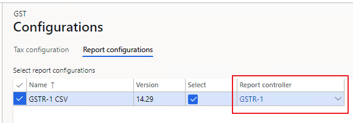
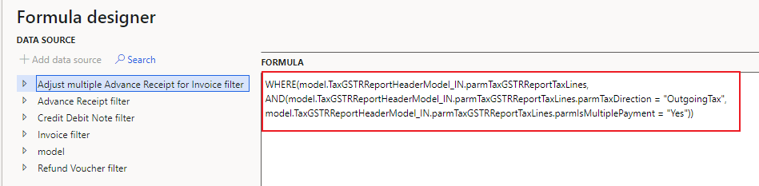
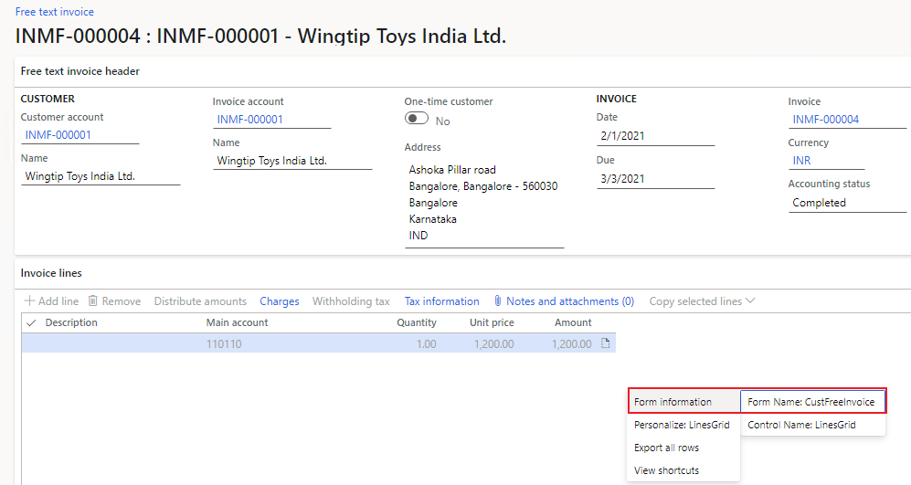
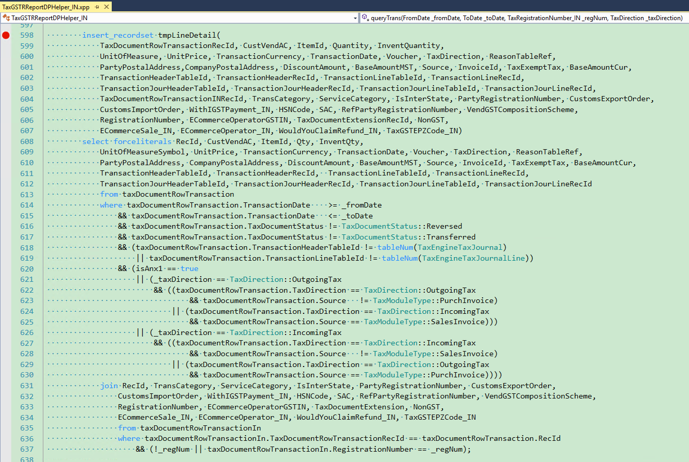

---
# required metadata

title: Records and fields don't show in the GSTR report
description: This topic provides troubleshooting information to help resolve the issue when records and fields don't show in the GSTR report.
author: yungu
ms.date: 04/27/2021
ms.topic: article
ms.prod: 
ms.service: dynamics-ax-applications
ms.technology: 

# optional metadata

#ms.search.form:
audience: Application user
# ms.devlang: 
ms.reviewer: kfend
ms.search.scope: Core, Operations
# ms.tgt_pltfrm: 
# ms.custom: 
ms.search.region: India
# ms.search.industry: 
ms.author: wangchen
ms.search.validFrom: 2021-04-01
ms.dyn365.ops.version: 10.0.1
---

# Records and fields don't show in the GSTR report

[!include [banner](../includes/banner.md)]

Conmplete the sections in this topic if some records or fields don't show in the GSTR report, or if the filter for registration numbers in government office tools isn't working.

## Check whether this is an issue with Microsoft Excel

To check whether this is an issue related to Excel, see [Details for issue 459982 (dynamics.com)](https://fix.lcs.dynamics.com/Issue/Details?bugId=459982&dbType=3&qc=38e839da1be8c7ec9b71b65e4c8607efe79c434c1c3dbcd2e1d86b9ba08b78a0). If the issue is related to Excel, resolve it according to LCS topic. Otherwise, continue to the next section.

## Check the report controller setup

1. Go to **Tax** > **Setup** > **Tax configuration** > **Tax setup** > **Configurations**.
2. On the **Report configurations** tab, check if the correct report controller is selected. If not, select the correct controller. Otherwise, continue to the next section.

     

## If fields are missing in the report, check the field mapping
If there are fields that are missing in the report, check the field mapping in the report configuration. 

1. Go to **Workspaces** > **Electronic reporting** > **Reporting configurations**. 
2. Select the report configuration and open the format designer.
3. In the tree, expand **report name** > **Sequence** > **Header** > **Sequence** to see if the field exists. For example, as shown in the following graphic, **state place of supply** exists in **Invoice and bill of supply** according to the report configuration. If the field doesn't exist, modify the report configuration in your extension.  

     

## If lines are missing in the report, check the filter formula in the report format configuration

1. Go to **Workspaces** > **Electronic reporting** > **Reporting configurations**.
2. Select the format configuration you want to work with and then open the format designer.
3. On the **Mapping** tab, select **Edit**.

     

4. Select **Edit formula**.

     

5. Check the formula. If the formula is incorrect, modify it in your extension.

     

## Check if the record in TaxDocumentRowTransaction is missing

Complete the following steps to check whether the record exists in the **TaxDocumentRowTransaction** table. If the record doesn't exist, the issue is related to posting issue and you should file a bug with Microsoft. Otherwise, continue to the next section.

In this procedure, the example used is for free text invoice line that are missing records in **TaxDocumentRowTransaction**.

1. Go to the free text invoice you want to check, and right-click in the invoice lines.

     

2. Select **Form Name: CustFreeInvoice** in brackets, find data source, here is "CustInvoiceLine"

     

  3. Get "InvoiceId" from the free text invoice.

     

  4. Execute SQL query to check TaxDocumentRowTransaction if misses records:

     select * from TaxDocumentRowTransaction 

     inner join TableIdTable on TaxDocumentRowTransaction.TransactionLineTableId = TableIdTable.ID 

     and TableIdTable.Name = '**CustInvoiceLine**'

     and TaxDocumentRowTransaction.InvoiceId = '**INMF-000004**';

- **Step 6: Check/Debug code to analyze logic of missing record**

  1. Set breakpoint as the figure shows, check if TaxGSTRReportDPHelper_IN::queryTrans gets the missing record in tmpLineDetail. If it's thought a bug here, report the issue to Microsoft.

     

  2. Set breakpoint as the figure shows, check if TaxGSTRReportDPHelper_IN::filterTrans filters the missing record. If it's thought a bug here, report the issue to Microsoft.

     

  3. Set breakpoint as the figure shows, check whether TransCategory field of missing record is correct or if the record is filtered again. If it's thought a bug here, report the issue to Microsoft.

     

## Determine whether customization exists

If you've completed the steps in the previous section but have found no issue, determine whether customization exists. If no customization exists, create a Microsoft service request for further support.

[!INCLUDE[footer-include](../../includes/footer-banner.md)]
