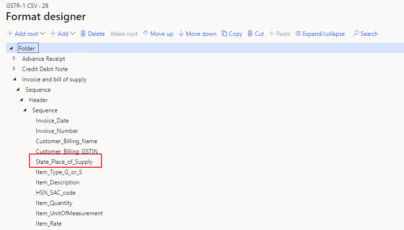

---
# required metadata

title: Records and fields don't appear on the GSTR report
description: This topic provides troubleshooting information that can help when records and fields don't appear on the GSTR report.
author: yungu
ms.date: 06/08/2021
ms.topic: article
ms.prod: 

ms.technology: 

# optional metadata

#ms.search.form:
audience: Application user
# ms.devlang: 
ms.reviewer: kfend
ms.search.scope: Core, Operations
# ms.tgt_pltfrm: 
# ms.custom: 
ms.search.region: India
# ms.search.industry: 
ms.author: wangchen
ms.search.validFrom: 2021-04-01
ms.dyn365.ops.version: 10.0.1
---

# Records and fields don't appear on the GSTR report

[!include [banner](../includes/banner.md)]

Follow the steps in the sections of this topic if some records or fields don't appear on the GSTR report, or if the filter for registration numbers in government office tools isn't working.

## Determine whether the issue is related to Excel

To determine whether the issue is related to Microsoft Excel, see [Details for issue 459982 (dynamics.com)](https://fix.lcs.dynamics.com/Issue/Details?bugId=459982&dbType=3&qc=38e839da1be8c7ec9b71b65e4c8607efe79c434c1c3dbcd2e1d86b9ba08b78a0). If the issue is related to Excel, use the information in Microsoft Dynamics Lifecycle Services (LCS) to fix it. If the issue isn't related to Excel, move on to the next section.

## Review the report controller setup

1. Go to **Tax** \> **Setup** \> **Tax configuration** \> **Tax setup** \> **Configurations**.
2. On the **Report configurations** tab, verify that the correct report controller is selected.

    [](./media/records-fileds-not-show-in-GSTR-report-Picture1.png)

3. If the incorrect controller is selected, select the correct controller. If the correct is already selected, move on to the next section.

## If fields are missing from the report, review the field mapping

If fields are missing from the report, review the field mapping in the report configuration.

1. Go to **Workspaces** \> **Electronic reporting** \> **Reporting configurations**.
2. Select the report configuration, and then open the format designer.
3. In the tree, find the report name, expand **\<Report name\>** \> **Sequence** \> **Header** \> **Sequence**, and verify that the field exists. For example, in the following illustration, the **State\_Place\_of\_Supply** field exists in the **Invoice and bill of supply** report, according to the report configuration. If the field doesn't exist, modify the report configuration in your extension.

    [](./media/records-fileds-not-show-in-GSTR-report-Picture2.png)

## If lines are missing from the report, review the filter formula in the report format configuration

1. Go to **Workspaces** \> **Electronic reporting** \> **Reporting configurations**.
2. Select the format configuration that you want to work with, and then open the format designer.
3. On the **Mapping** tab, select **Edit**.

    [](./media/records-fileds-not-show-in-GSTR-report-Picture3.png)

4. Select **Edit formula**.

    [](./media/records-fileds-not-show-in-GSTR-report-Picture4.png)

5. Review the formula. If it's incorrect, modify it in your extension.

    [](./media/records-fileds-not-show-in-GSTR-report-Picture5.png)

## Determine whether the record exists in the TaxDocumentRowTransaction table

Follow these steps to determine whether the record exists in the **TaxDocumentRowTransaction** table. If the record doesn't exist, the issue is related to posting. In that case, you should report the issue to Microsoft.

This procedure uses the example of free text invoice lines that are missing records in the **TaxDocumentRowTransaction** table.

1. Open the free text invoice that you want to work with.
2. Select and hold (or right-click) in a blank area of the **Invoice lines** grid, and then select **Form Name: CustFreeInvoice**.

    [](./media/records-fileds-not-show-in-GSTR-report-Picture6.png)

3. Make a note of the value in the **DataSource** field. In this example, it's **CustInvoiceLine**.

    [](./media/records-fileds-not-show-in-GSTR-report-Picture7.png)

4. Close the dialog box to return to the **Free text invoice** page.
5. On the header, make a note of the invoice ID in the **Invoice** field. In this example, it's **INMF-000004**.

    [](./media/records-fileds-not-show-in-GSTR-report-Picture8.png)

4. Run the following SQL query to determine whether the **TaxDocumentRowTransaction** table is missing records.

    ```sql
    select * from TaxDocumentRowTransaction
    inner join TableIdTable on TaxDocumentRowTransaction.TransactionLineTableId = TableIdTable.ID 
    and TableIdTable.Name = 'CustInvoiceLine'
    and TaxDocumentRowTransaction.InvoiceId = 'INMF-000004'
    ```

## Debug code to analyze the logic of the missing record

1. Set a breakpoint to determine whether **TaxGSTRReportDPHelper\_IN::queryTrans** gets the missing record in **tmpLineDetail**. If there appears to be an issue, report it to Microsoft.

    [](./media/records-fileds-not-show-in-GSTR-report-Picture9.png)

2. Set a breakpoint to determine whether **TaxGSTRReportDPHelper\_IN::filterTrans** filters the missing record. If there appears to be an issue, report it to Microsoft.

    [](./media/records-fileds-not-show-in-GSTR-report-Picture10.png)

3. Set a breakpoint to determine whether the **TransCategory** field of the missing record is correct, or whether the record is filtered again. If there appears to be an issue, report it to Microsoft.

    [](./media/records-fileds-not-show-in-GSTR-report-Picture11.png)

## Determine whether customization exists

If you've completed the steps in the previous section but have found no issue, determine whether customization exists. If no customization exists, create a Microsoft service request for further support.

[!INCLUDE[footer-include](../../includes/footer-banner.md)]
