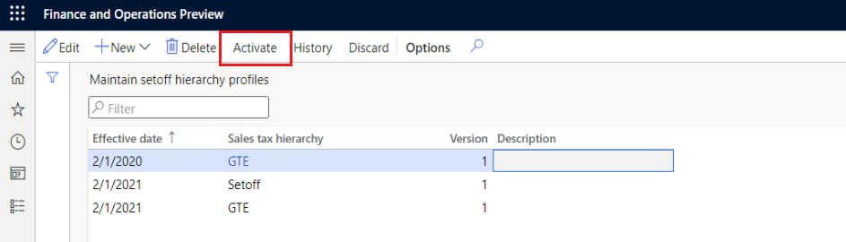
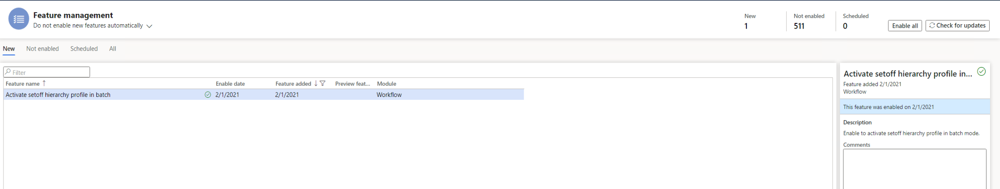
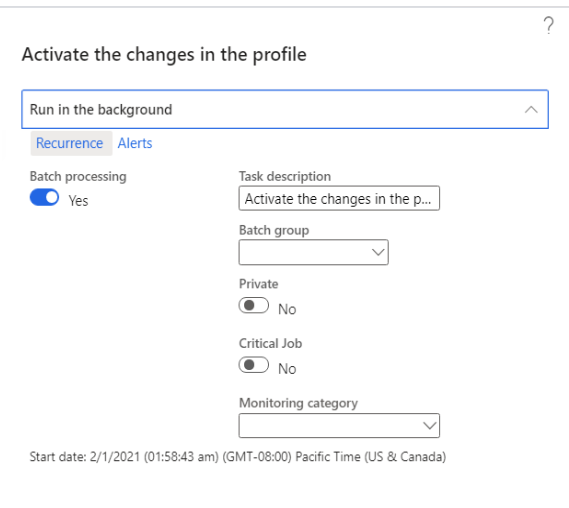
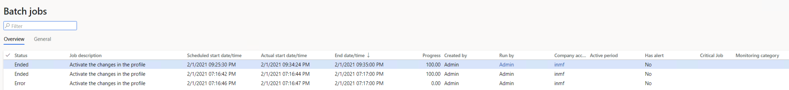

---
# required metadata

title: Activating the setoff rule takes longer than expected
description: This article provides troubleshooting information to help speed up the activation process for setoff rules. 
author: shaoling
ms.date: 04/29/2021
ms.topic: article
ms.prod: 

ms.technology: 

# optional metadata

#ms.search.form:
audience: Application user
# ms.devlang: 
ms.reviewer: kfend

# ms.tgt_pltfrm: 
# ms.custom: 
ms.search.region: India
# ms.search.industry: 
ms.author: wangchen
ms.search.validFrom: 2021-04-01
ms.dyn365.ops.version: 10.0.1
---

# Activating the setoff rule takes longer than expected

[!include [banner](../includes/banner.md)]

When you select **Activate** to activate the setoff hierarchy profile, it may take longer than expected. The delay usually happens when activating a profile for a long period, such as one year.

  

 Complete the steps in this article to troubleshoot this issue. 

1. Go to **Workspaces** > **Feature management** and in the list, find the feature, **Activate setoff hierarchy profile in batch**.
2. Select **Enable now**.

  

3. Activate the setoff hierarchy profile in batch mode.

  

4. On the **Batch jobs** page, find the job in the list and check the status.

  

5. If the issue can't be resolved, determine whether customization exists. If no customization exists, contact Microsoft Support for further assistance.

[!INCLUDE[footer-include](../../includes/footer-banner.md)]
