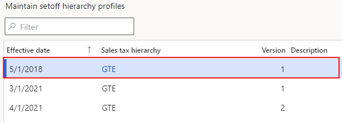
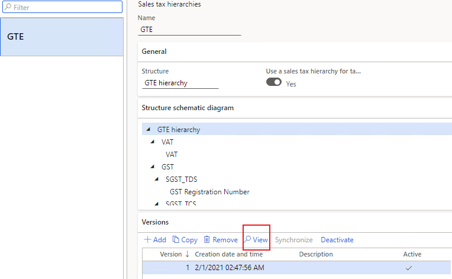
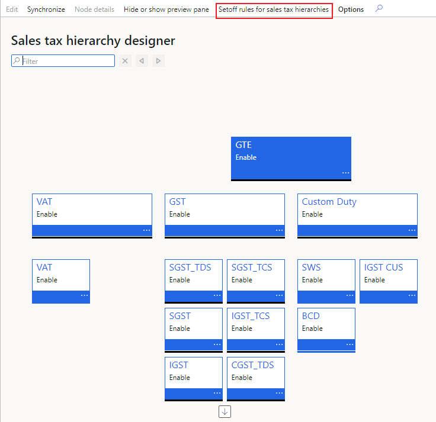
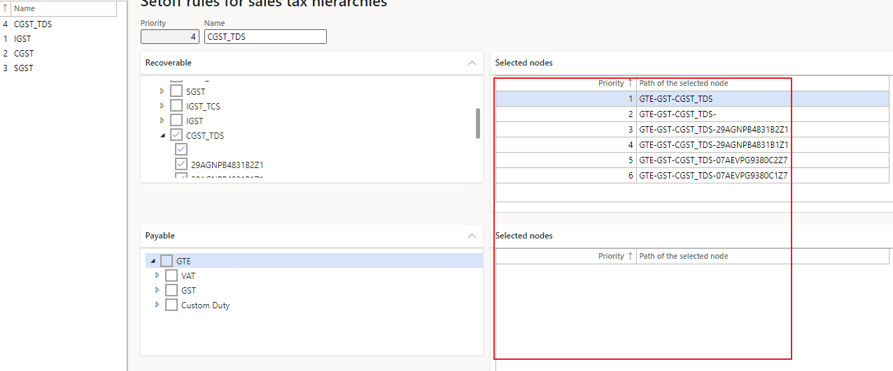

---
# required metadata

title: Setoff rule error when a tax settlement is run
description: This article provides troubleshooting information that can help fix the setoff rule error that might occur during tax settlement.
author: yungu
ms.date: 06/08/2021
ms.topic: article
ms.prod: 

ms.technology: 

# optional metadata

#ms.search.form:
audience: Application user
# ms.devlang: 
ms.reviewer: kfend

# ms.tgt_pltfrm: 
# ms.custom: 
ms.search.region: India
# ms.search.industry: 
ms.author: wangchen
ms.search.validFrom: 2021-04-01
ms.dyn365.ops.version: 10.0.1
---

# Setoff rule error when a tax settlement is run

[!include [banner](../includes/banner.md)]

When you run a tax settlement, you might receive an error message. Follow the steps in the sections of this article to fix the error.

## Find the version of the setoff rule that is currently used

1. Go to **Tax** \> **Setup** \> **Sales tax** \> **Maintain setoff hierarchy profiles**.
2. Use the values in the **Effective date** column to find the version of the setoff rule that is currently used. For example, customers want to settle transactions for February 19, 2020 (2/19/2020). As the following illustration shows, version 1 of the setoff rule is used, according to the effective date.

    

## Review the settings of the setoff rule

1. Go to **Tax** \> **Setup** \> **Sales tax** \> **Sales tax hierarchies**.
2. Select the setoff rule that is currently used.
3. On the **Versions** FastTab, select **View** to determine which sales tax hierarchies are used.

    

3. Select **Setoff rules for sales tax hierarchies**.

    

4. Determine whether the **Recoverable** and **Payable** nodes are selected or no, according to the setoff. If the nodes are not marked as defined, there might be a posting issue. In this case, you should contact Microsoft. 

    

## Determine whether customization exists

If you've completed the steps in the previous section but have found no issue, determine whether customization exists. If no customization exists, create a Microsoft service request for further support.

[!INCLUDE[footer-include](../../includes/footer-banner.md)]
