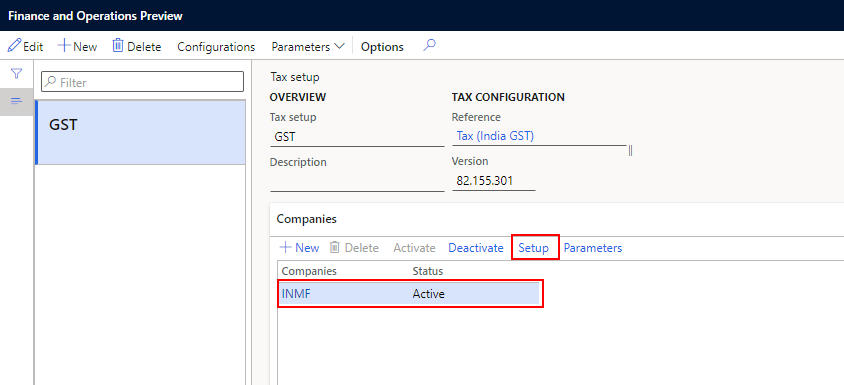
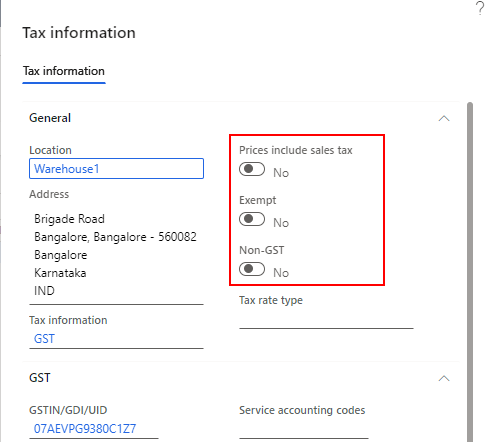
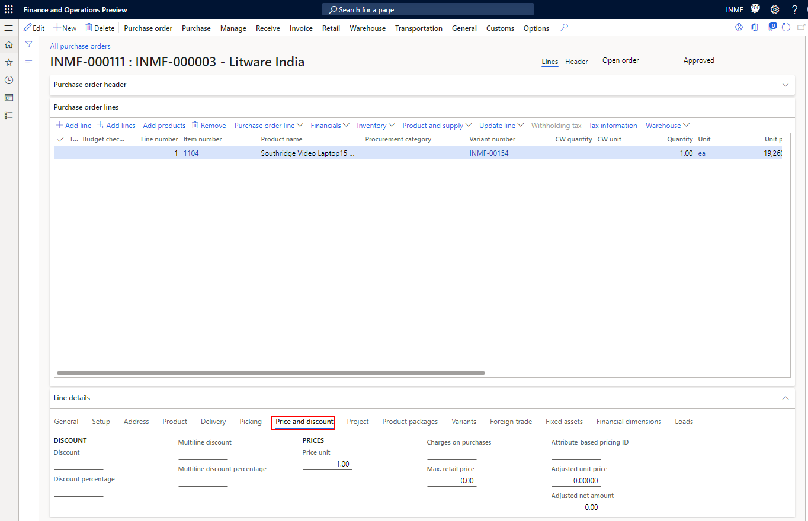
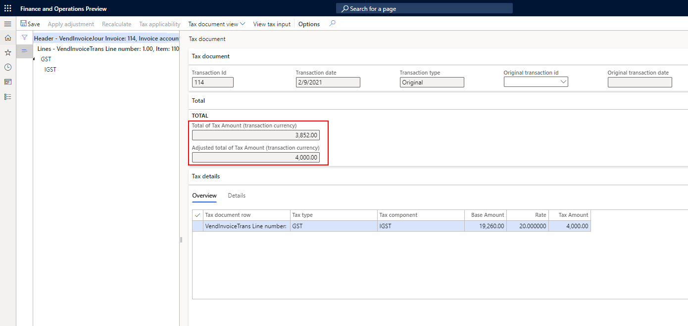

---
# required metadata

title: Incorrect tax amount after calculation
description: This topic provides troubleshooting information that can help when the calculated tax amount is incorrect.
author: peter-xu
ms.date: 04/28/2021
ms.topic: article
ms.prod: 

ms.technology: 

# optional metadata

#ms.search.form:
audience: Application user
# ms.devlang: 
ms.reviewer: kfend
ms.search.scope: Core, Operations
# ms.tgt_pltfrm: 
# ms.custom: 
ms.search.region: India
# ms.search.industry: 
ms.author: wangchen
ms.search.validFrom: 2021-04-01
ms.dyn365.ops.version: 10.0.1
---

# Incorrect tax amount after calculation

[!include [banner](../includes/banner.md)]
 
If the calculated tax on a business document is incorrect, follow the steps in this topic to troubleshoot the issue. The procedures use a purchase order as an example.

## Verify that the tax rate is correct

1. Go to **Tax** \> **Setup** \> **Tax configuration** \> **Tax setup**.
2. On the **Tax setup** page, select the company that you're working in, and then select **Setup**.

    

3. In the tax document, go to the **Header** \> **Lines** \> **GST** \> **CGST** \> **Rate** to find the corresponding rate node.
4. Based on the conditions, determine whether your transaction uses the correct rate. You can view the transaction details in the tax document by selecting **View tax input**. For more information, see [Tax isn't calculated](apac-ind-GST-troubleshooting-tax-not-calculated.md).

## Verify that the tax base is correct

Follow these steps to verify that the tax base is correct.

1. Verify that the number of tax document lines matches the number of transaction lines. If the number of lines doesn't match, determine whether any lines don't match the condition that is defined in the tax configuration. For more information, see [Tax isn't calculated](apac-ind-GST-troubleshooting-tax-not-calculated.md).
2. Verify that the tax information is correctly set for all the lines. Some settings might affect the calculation of the tax base. Here are some examples:

    - **Prices include sales tax** – If this option is set to **Yes**, Goods and Services Tax (GST) will be included in the price.
    - **Exempt** – If this option is set to **Yes**, GST won't be calculated.
    - **Non-GST** – If this option is set to **Yes**, tax that has a tax type other than GST, such as value-added tax (VAT), will be calculated.

    

3. Verify that the information on the **Price and discount** tab on the **Line details** FastTab meets your requirements.

    

## Verify that the adjustment was applied

Open the tax document, and then, on the **Total** FastTab, compare the values in the **Total of Tax Amount** and **Adjusted total of Tax Amount** fields. If they differ, the adjustment was applied.

## Determine whether customization exists

If you've completed the steps in the previous sections but have found no issue, determine whether customization exists. If no customization exists, create a Microsoft service request for further support.

[!INCLUDE[footer-include](../../includes/footer-banner.md)]
