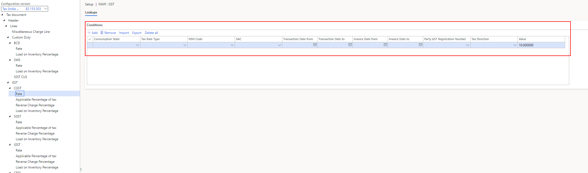

---
# required metadata

title: Tax amount is wrong after calculation
description:
author: hailxu
manager: beya
ms.date: 02/04/2021
ms.topic: article
ms.prod: 
ms.service: dynamics-ax-applications
ms.technology: 

# optional metadata

#ms.search.form:
audience: Application user
# ms.devlang: 
ms.reviewer: kfend
ms.search.scope: Core, Operations
# ms.tgt_pltfrm: 
# ms.custom: 
ms.search.region: India
# ms.search.industry: 
ms.author: wangchen
ms.search.validFrom: 2021-04-01
ms.dyn365.ops.version: 10.0.1
---

# Tax amount is wrong after calculation

[!include [banner](https://github.com/MicrosoftDocs/dynamics-365-unified-operations-public/blob/live/articles/finance/includes/banner.md)]

## **Symptom**

- Tax amount is wrong after calculation

## **Trouble shooting guide**

**The document uses Purchases Order to show the Trouble Shooting process. Other transactions can also refer to the steps.**

**Step 1: Check if the tax rate is correct.**

1. Go to *Tax -> Setup -> Tax configuration -> Tax setup*.

2. In *Tax setup* form, select the company you are working on, then click *Setup.*

   

3. Navigate to the corresponding Rate node. (e.g. Tax document >Header >Lines >GST >CGST >Rate).

4. Based on the conditions, check if your transaction matches the correct rate. You can view transaction details via *Tax document > View tax input* dialog refer to the **step 2 a - c** of [Tax is not calculated](./apac-ind-GST-troubleshooting-tax-not-calculated.md)

   

**Step 2: Check if the tax base is wrong.**

1. Check the number of tax document lines matches the actual number of transactions lines. If no, please refer to [Tax is not calculated](./apac-ind-GST-troubleshooting-tax-not-calculated.md) to check if some lines don't match the condition that defined in tax configuration.

2. Check the tax information of all lines are correctly set, some setting may impact the calculation of  the tax base, such as, *Exempt, Prices include sales tax, Non-GST.*

   Exempt: GST will not be calculated.

   Prices include sales tax: GST will be included in the price.

   Non-GST: Tax with tax type other than GST (Such as VAT) will be calculated.

   

3. Check the "Price and discount" meets your requirement.

   

**Step 3: Check if the tax rate is correct.**

1. Open *Tax document*.

2. Compare Total of Tax Amount and Adjusted total of Tax Amount. If they are different, it means that adjustment was applied.

   

**Step 4: If no issue is found in above steps, check whether customization exists. If not, create a service request to Microsoft for further support.**

[!INCLUDE[footer-include](https://github.com/MicrosoftDocs/dynamics-365-unified-operations-public/blob/live/articles/includes/footer-banner.md)]

