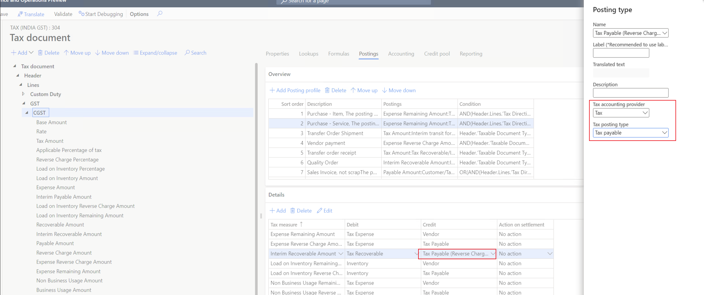
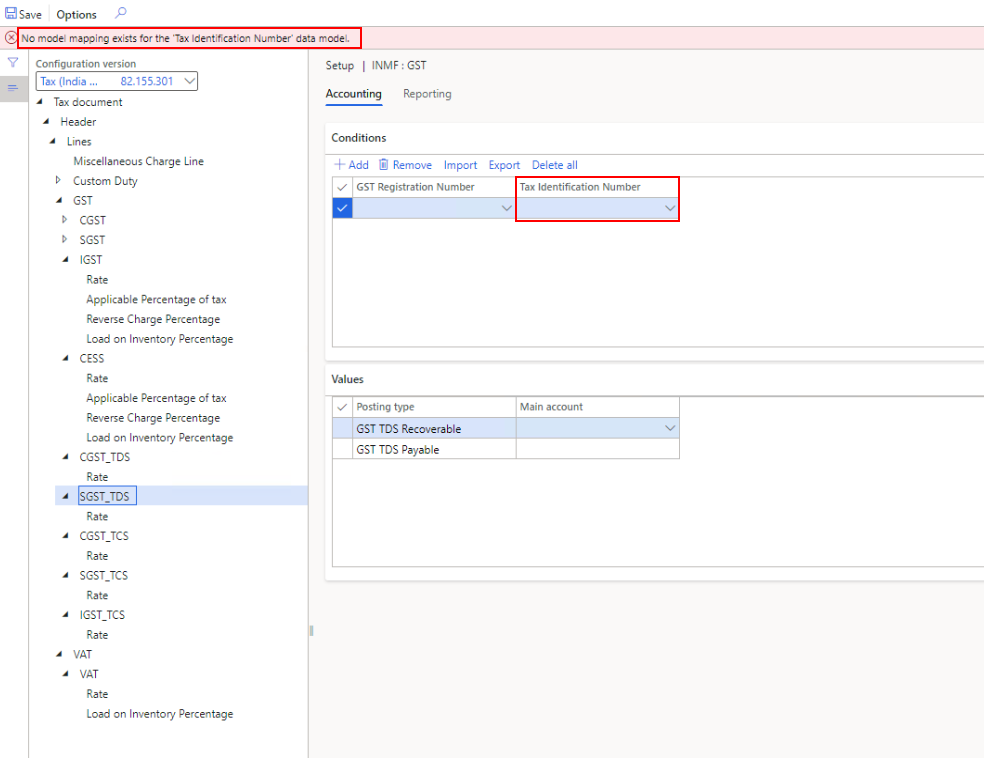
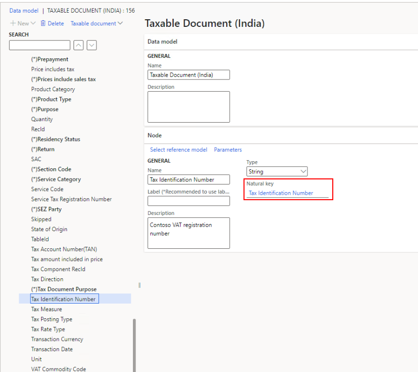
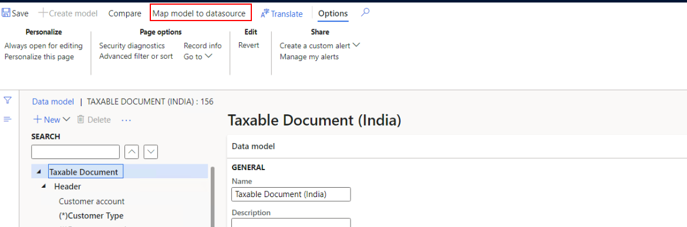
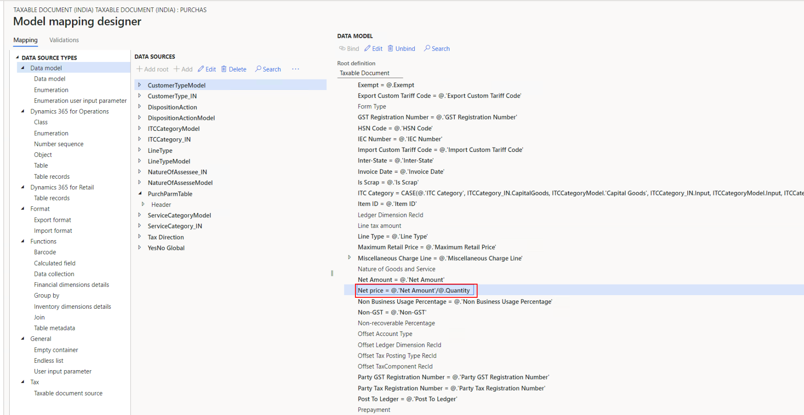

---
# required metadata

title: Tax configuration errors
description: This topic provides troubleshooting information that can help with tax configuration errors.
author: peter-xu
ms.date: 04/28/2021
ms.topic: article
ms.prod: 

ms.technology: 

# optional metadata

#ms.search.form:
audience: Application user
# ms.devlang: 
ms.reviewer: kfend
ms.search.scope: Core, Operations
# ms.tgt_pltfrm: 
# ms.custom: 
ms.search.region: India
# ms.search.industry: 
ms.author: wangchen
ms.search.validFrom: 2021-04-01
ms.dyn365.ops.version: 10.0.1
---

# Tax configuration errors

[!include [banner](../includes/banner.md)]

## RCM transactions

Reverse charge mechanism (RCM) transactions are posted for a vendor that is marked as a goods transport agency (GTA). Additionally, the transactions are marked to indicate that the reverse charge percentage was updated to 100 percent in the tax document. However, the value of the **Is reverse charge applicable** field isn't updated to **Yes** on the GSTR 2 report.

To fix this issue, when you create a new posting type for a tax payable in a tax configuration, select **Tax** in the **Tax accounting provider** field and **Tax payable** in the **Tax Posting Type** field.

For more information, see [RCM transaction for GTA vendor does not show as "Y" in RCM column in GSTR2 report](https://fix.lcs.dynamics.com/Issue/Details?bugId=515068&dbType=3).

## Model mapping error when CGST_TDS is configured

When you're configuring **CGST\_TDS**, a model mapping error might occur. The error message states that no model mapping exists for the **TDS TCS Registration Number** data model. To fix this issue, see [While configuring CGST_TDS facing model mapping error](https://fix.lcs.dynamics.com/Issue/Details?bugId=527080&dbType=3).

If you receive similar error messages, in the form "No model mapping exists for the 'xxx' data model," follow these steps.

1. Go to **Workspaces** \> **Electronic reporting** \> **Tax configurations**.
2. Select **Taxable Document**, select **Taxable Document (India)**, and then select **Designer** to open the designer for **Taxable Document (India)**.
3. Go to the **Taxable Document** node, expand **Header** \> **Lines** \> **Tax Identification Number**, and verify that the reference model is selected in the **Natural key** field.

    

4. Select **Map model to datasource**, and verify that the model mapping for the reference model exists.

    

5. Define a model mapping for the tax identification number that refers to the model mapping of **GST registration number**. For more information, see [Extend tax engine configurations](../general-ledger/extend-tax-engine-configurations.md#complete-data-mapping-for-the-extended-taxable-document).

## Error when GST is calculated

When you use division in a formula, pay close attention when the divisor is 0 (zero), because this value might cause an error when Goods and Services Tax (GST) is calculated. The error message is in the following form: "Attempted to divide by zero. Please check the formula of mapping field 'xxx' for taxable document mapping 'xxx' in active taxable document, it encounters an unhandled exception."

In the following procedure, the formula **Net price = \@.'Net Amount'/\@.Quantity** that is defined on the **PurchParmTable** model mapping is used as an example.

1. Go to **Workspaces** \> **Electronic reporting** \> **Tax configurations**.
2. Select **Taxable Document** \> **Taxable Document (India)**, and then select **Designer** to open the designer for **Taxable Document (India)**.
3. Select **Map model to datasource**.

    

4. Find and select the **Bundler.PurchOrderParm** model mapping, and then select **Designer** to open the model mapping designer.
5. In the **Data model** section, expand **Header** \> **Lines**, and find **Net price**.

    

6. Notice that the formula for the **Net price** field is **\@.'Net Amount'/@.Quantity**.
7. Contact the business department, and confirm that a quantity of 0 (zero) is allowed. If it isn't allowed, correct the transaction, and then perform the operation again. If it's allowed, change the formula to a format such as **IF(\@.Quantity = 0, \@.'Net Amount', \@.'Net Amount'/\@.Quantity)**.

[!INCLUDE[footer-include](../../includes/footer-banner.md)]
