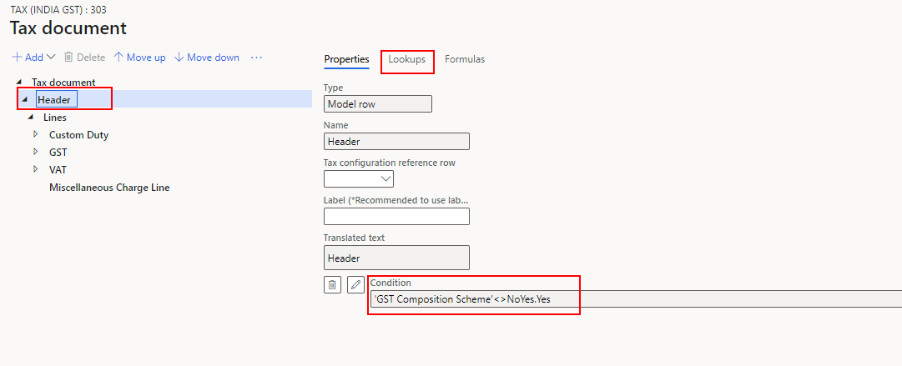
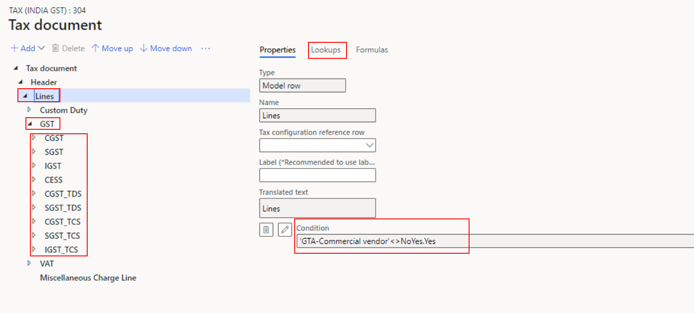
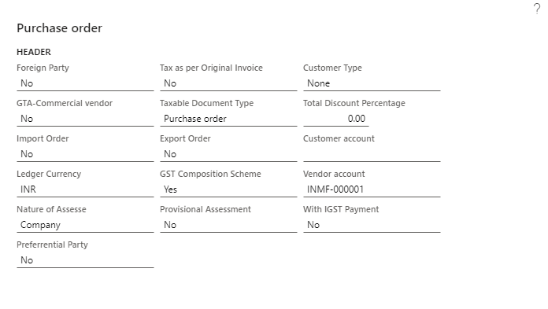
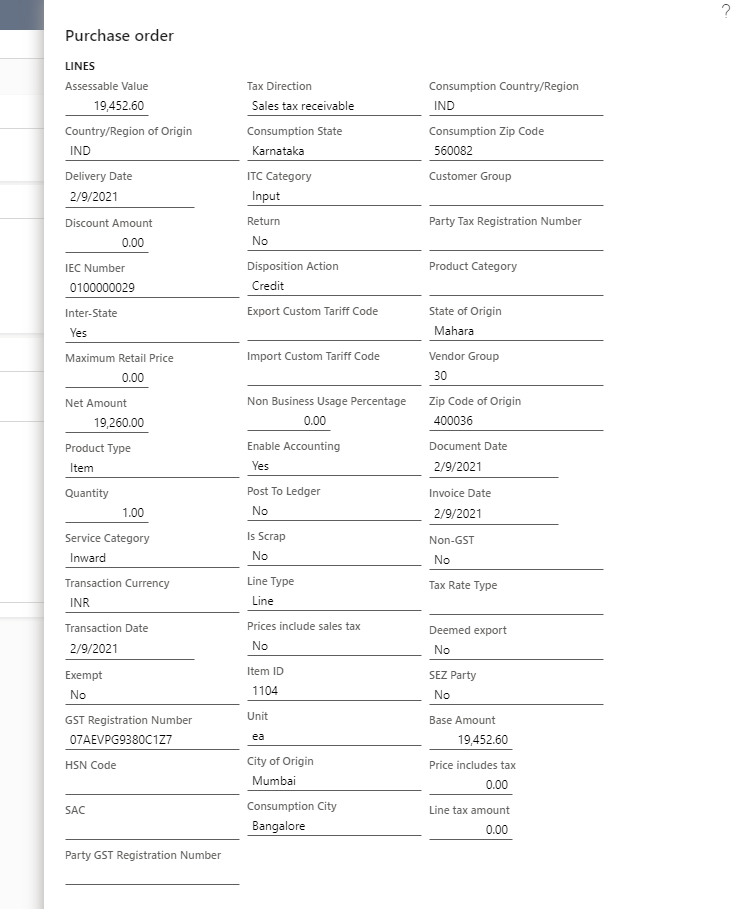
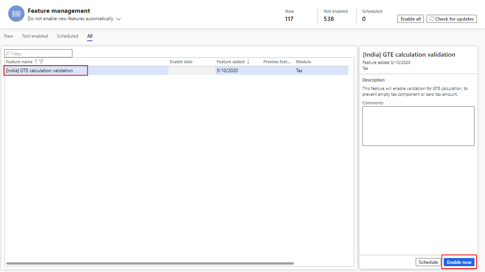
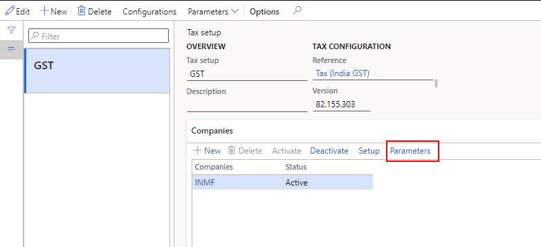
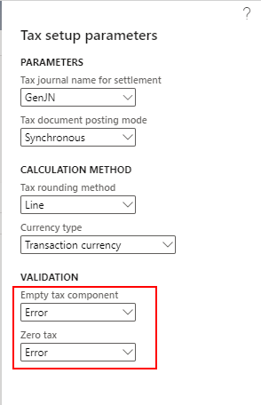

---
# required metadata

title: Tax isn't calculated
description: This article provides troubleshooting information that can help when tax isn't calculated on tax documents.
author: peter-xu
ms.date: 04/29/2021
ms.topic: article
ms.prod: 

ms.technology: 

# optional metadata

#ms.search.form:
audience: Application user
# ms.devlang: 
ms.reviewer: kfend

# ms.tgt_pltfrm: 
# ms.custom: 
ms.search.region: India
# ms.search.industry: 
ms.author: wangchen
ms.search.validFrom: 2021-04-01
ms.dyn365.ops.version: 10.0.1
---

# Tax isn't calculated

[!include [banner](../includes/banner.md)]

If you discover that tax component lines or tax document lines are missing from a tax document, follow the steps in this article to troubleshoot the issue. The procedures use a purchase order as an example to show the troubleshooting process.

For more information about the Tax engine (also referred to as GTE) or components, see [Tax engine overview](../general-ledger/tax-engine.md).

## Check the tax applicability in the tax configuration

1. Open the designer for the current tax configuration. 
2. If there are no tax document lines, select the **Header** node, and then, on the **Lookups** tab, verify that the condition is correct.

    

3. If there are no tax component lines, verify that the condition is correct on the **Lookups** tab for the **Lines**, **Tax type**, and **Tax component** nodes.

    

## Compare transaction details with other conditions

1. Select **Tax document**, and then select the **Header** node.
2. Select **View tax input** to view the transaction header details.
3. Verify that all the fields are correctly set for tax calculation.

    

4. Select the **Line** node, and then select **View tax input** to view the transaction line details.
5. Verify that all the fields are correctly set for tax calculation.

    

6. Compare the transaction fields at **Tax document** \> **View tax input** with the conditions that you found in the previous section.
7. Verify that all the fields match the corresponding conditions or lookups.

## Determine whether customization exists

If you've completed the steps in the previous sections but have found no issue, determine whether customization exists. If no customization exists, create a Microsoft service request for further support.

## Prevent transactions from being posted if GST hasn't been calculated

To prevent a transaction from being posted if GST hasn't been calculated, follow these steps to turn on and set up the **\[India\] GTE calculation validation** feature.

1. Go to **Workspaces** \> **Feature management**.
2. Find the **\[India\] GTE calculation validation** feature, and then select **Enable now**.

    

3. Go to **Tax** \> **Setup** \> **Tax configuration** \> **Tax setup**.
4. Select the company to enable the validation for, and then select **Parameters**.

    

5. In the **Tax setup parameters** dialog box, in the **Validation** section, in the **Empty tax component** and **Zero tax** fields, select one of the following values. Then select **OK** to complete the setup.

    - **None** – No validation is done.
    - **Warning** – A warning message is shown, but the posting operation isn't blocked.
    - **Error** – An error message is shown, and the posting operation is blocked.

    

    For this example, both fields are set to **Error**. Therefore, if someone tries to post a transaction, but GST hasn't been calculated, one of the following error messages is shown:

    - **No tax lines exist:** "No tax document lines are found in tax document. If it is not expected, please contact your system administrator, check the tax configuration, and try again."
    - **No tax component lines exist:** "No tax component is applicable for line %1, please contact your system administrator, check the tax setup, and try again."
    - **The tax amount is 0 (zero):** "The tax amount is 0 for line %1, please contact your system administrator, check the tax setup, and try again."

> [!NOTE]
> If you enable the validation, some typical scenarios might be blocked, such as exempt or zero-rate scenarios. You must decide how to set up the validation, based on your business.

[!INCLUDE[footer-include](../../includes/footer-banner.md)]
