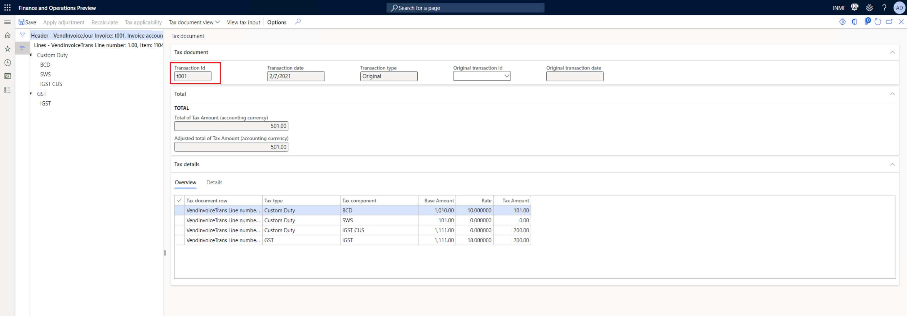

---
# required metadata

title: [Core Tax Calculation]: Tax transaction id is incorrect
description:
author: shaoling
manager: beya
ms.date: 02/04/2021
ms.topic: article
ms.prod: 
ms.service: dynamics-ax-applications
ms.technology: 

# optional metadata

#ms.search.form:
audience: Application user
# ms.devlang: 
ms.reviewer: kfend
ms.search.scope: Core, Operations
# ms.tgt_pltfrm: 
# ms.custom: 
ms.search.region: India
# ms.search.industry: 
ms.author: wangchen
ms.search.validFrom: 2021-04-01
ms.dyn365.ops.version: 10.0.1
---

# Tax transaction id is incorrect

[!include [banner](https://github.com/MicrosoftDocs/dynamics-365-unified-operations-public/blob/live/articles/finance/includes/banner.md)]

## **Symptom**

- The transaction Id of posted tax document is incorrect.

  

 

## **Trouble shooting guide**

- **Step 1:** The code logic to generate transaction Id is in TaxGSTInvoiceHelper_IN::generateGSTTransID(). Set breakpoint and start debugging from here.

  

- **Step 2:** If cannot resolve issue with above steps, check whether customization exists. If not, create a service request to Microsoft for further support (provide trace file of posting step if possible).

[!INCLUDE[footer-include](https://github.com/MicrosoftDocs/dynamics-365-unified-operations-public/blob/live/articles/includes/footer-banner.md)]