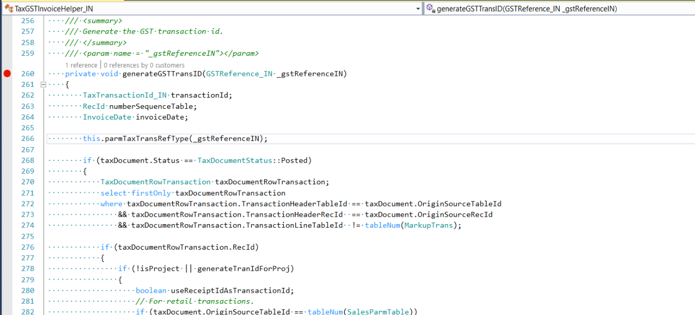

---
# required metadata

title: Tax transaction ID is incorrect
description: This topic provides troubleshooting information when the tax transaction ID is incorrect.
author: shaoling
ms.date: 04/29/2021
ms.topic: article
ms.prod: 
ms.service: dynamics-ax-applications
ms.technology: 

# optional metadata

#ms.search.form:
audience: Application user
# ms.devlang: 
ms.reviewer: kfend
ms.search.scope: Core, Operations
# ms.tgt_pltfrm: 
# ms.custom: 
ms.search.region: India
# ms.search.industry: 
ms.author: wangchen
ms.search.validFrom: 2021-04-01
ms.dyn365.ops.version: 10.0.1
---

# Tax transaction ID is incorrect

[!include [banner](../includes/banner.md)]

Complete the steps in this topic to resolve the issue when the transaction ID of posted tax document is incorrect.

1. The code logic to generate transaction ID is in **TaxGSTInvoiceHelper_IN::generateGSTTransID()**. Set a breakpoint there, and start debugging.

    

2. If the issue isn't resolved after completing step 1, determine whether customization exists. If no customization exists, create a Microsoft service request for further support. If possible,provide trace file of the posting step.

[!INCLUDE[footer-include](../../includes/footer-banner.md)]
