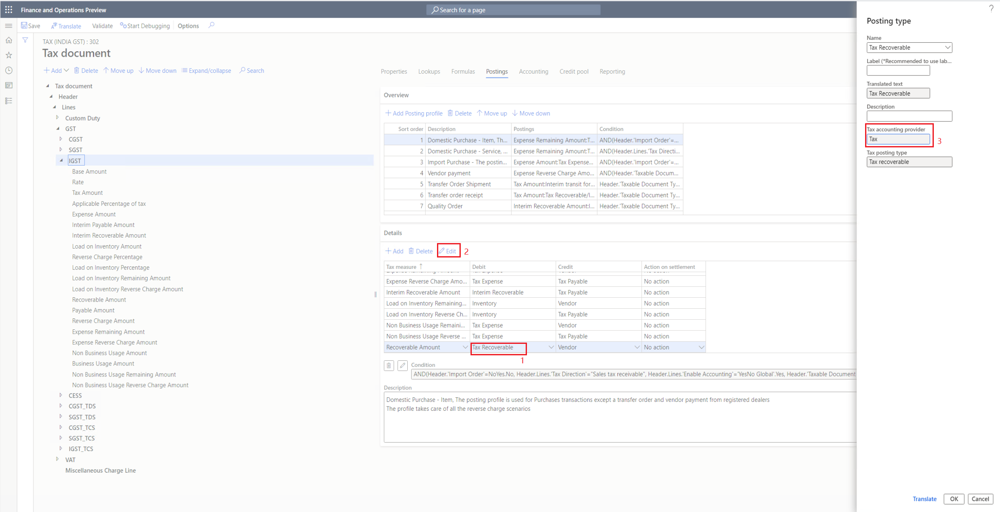
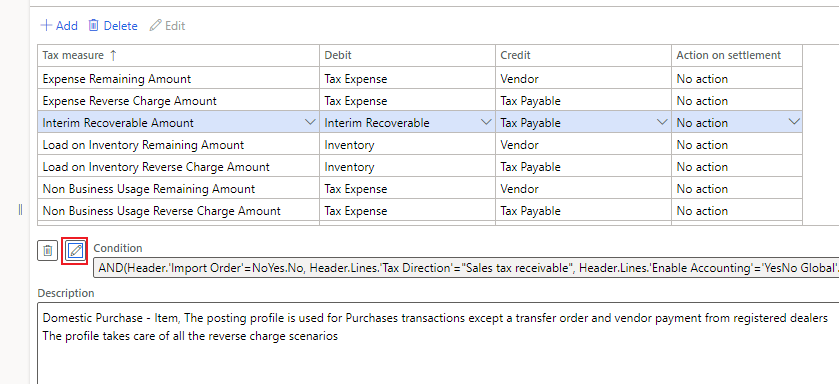

---
# required metadata

title: TaxTrans or voucher isn't generated
description: This article provides troubleshooting information to help resolve this issue when TaxTrans or voucher isn't generated.
author: shaoling
ms.date: 04/30/2021
ms.topic: article
ms.prod: 

ms.technology: 

# optional metadata

#ms.search.form:
audience: Application user
# ms.devlang: 
ms.reviewer: kfend

# ms.tgt_pltfrm: 
# ms.custom: 
ms.search.region: India
# ms.search.industry: 
ms.author: wangchen
ms.search.validFrom: 2021-04-01
ms.dyn365.ops.version: 10.0.1
---

# TaxTrans or voucher isn't generated

[!include [banner](../includes/banner.md)]

Complete the steps in this article if after posting tax there are records missing when you check the voucher and posted sales tax.

## Check if the subledger journal transferred. 

1. Go to **General ledger** > **Periodic tasks** > **Subledger journal entries not yet transferred**.
2. Transfer any record in the list, and then check the voucher and posted sales tax again.

## Check tax configuration

1. Check the posting profile of the expected measure. Select the posting type in the **Debit/Credit** column, and then select **Edit**. 
2. Check the value of tax accounting provider.

    

  The following is the rule for posting tax transactions and vouchers that are decided by the tax accounting provider. Correct the configuration if it's not working as expected.

  | **Tax accounting provider** | **Posting tax transaction** | **Posting voucher** |
  | --------------------------- | --------------------------- | ------------------- |
  | Tax                         | Yes                         | Yes                 |
  | Ledger                      | No                          | Yes                 |
  | Other                       | No                          | No                  |

## Check the formula

1. Select **Condition** to open the formula. 
2. Check the condition, and correct the tax configuration if it's not working as expected.

  

  

## Check the posting code logic
Set a breakpoint in **TaxAccountingPostFacade::post()**, and debug for the logic of generating tax transaction and voucher. 

  

## Determine whether customization exists

If you've completed the steps in the previous section but have found not the issue, determine whether customization exists. If no customization exists, contact Microsoft Support for further assistance.

[!INCLUDE[footer-include](../../includes/footer-banner.md)]
