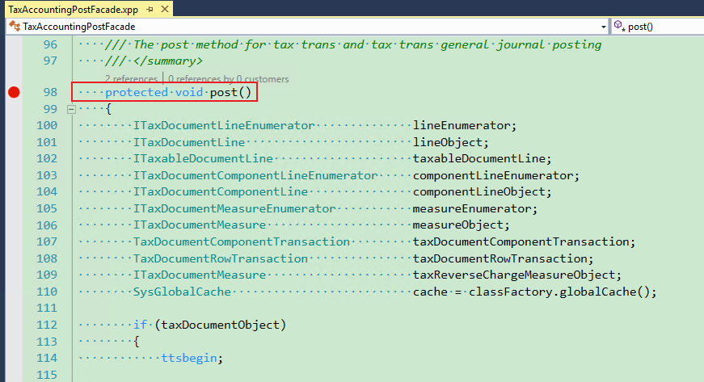

---
# required metadata

title: TaxTrans or Voucher is not generated
description:
author: shaoling
manager: beya
ms.date: 02/04/2021
ms.topic: article
ms.prod: 
ms.service: dynamics-ax-applications
ms.technology: 

# optional metadata

#ms.search.form:
audience: Application user
# ms.devlang: 
ms.reviewer: kfend
ms.search.scope: Core, Operations
# ms.tgt_pltfrm: 
# ms.custom: 
ms.search.region: India
# ms.search.industry: 
ms.author: wangchen
ms.search.validFrom: 2021-04-01
ms.dyn365.ops.version: 10.0.1
---

# TaxTrans or Voucher is not generated

[!include [banner](https://github.com/MicrosoftDocs/dynamics-365-unified-operations-public/blob/live/articles/finance/includes/banner.md)]

## **Symptom**

- After posting tax, checking voucher and posted sales tax but find some records are missing.

  

  

 

## **Trouble shooting guide**

- **Step 1:** Check whether the subledger journal transferred. Go to *General ledger -> Periodic tasks -> Subledger journal entries not yet transferred*, transfer the record if there it is, and check the voucher and posted sales tax again.

- **Step 2**: Check tax configuration. 

- - Refer to  [How to open designer of current used tax configuration](./apac-ind-GST-troubleshooting-open-designer-current-used-tax-configuration.md) for how to check the configuration.  

  - Check the posting profile of expected measure. Select the posting type in Debit/Credit column, and click *Edit* button. Check the value of tax accounting provider.

    

  - Following is the rule for posting tax transaction and voucher decided by tax accounting provider. Correct the configuration if it does not work as expected.

- | **Tax accounting provider** | **Posting tax transaction** | **Posting voucher** |
  | --------------------------- | --------------------------- | ------------------- |
  | Tax                         | Yes                         | Yes                 |
  | Ledger                      | No                          | Yes                 |
  | Other                       | No                          | No                  |

- **Step 3:** Click "*Condition*" to open the formula. Check the condition and correct tax configuration if it does not work as expected.

  

  

- **Step 4:** Check posting code logic. Set breakpoint in TaxAccountingPostFacade::post(), and debug for the logic of generating tax transaction and voucher. 

  

- **Step 5:** If cannot resolve issue with above steps, check whether customization exists. If not, create a service request to Microsoft for further support (provide trace file of posting step if possible).

[!INCLUDE[footer-include](https://github.com/MicrosoftDocs/dynamics-365-unified-operations-public/blob/live/articles/includes/footer-banner.md)]