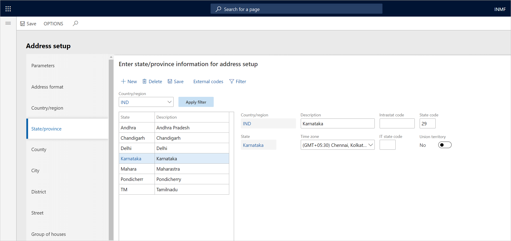

---
# required metadata

title: Update the state code and union territory
description: This topic explains how to update the state code and union territory. This task is part of the master data setup that is required to make the India localization solution for Goods and Services Tax (GST) available.
author: EricWangChen
ms.date: 06/04/2019
ms.topic: article
ms.prod: 
ms.technology: 

# optional metadata

# ms.search.form: 
audience: Application User
# ms.devlang: 
ms.reviewer: kfend
# ms.tgt_pltfrm: 
# ms.custom: 
ms.search.region: India
# ms.search.industry: 
ms.author: wangchen
ms.search.validFrom: 2019-06-01
ms.dyn365.ops.version: 10.0.4

---

# Update the state code and union territory

[!include [banner](../includes/banner.md)]

To make the India localization solution for Goods and Services Tax (GST) in Microsoft Dynamics 365 Finance available, you must complete the following master data setup:

- Define a business vertical.
- Update the state code and union territory.
- Create a Goods and Services Tax Identification Number (GSTIN) master.
- Define GSTINs for the legal entity, warehouse, vendor, or customer masters.
- Define Harmonized System of Nomenclature (HSN) codes and Service Accounting Codes (SACs).
- Create main accounts for the GST posting type.
- Create a tax settlement period.
- Attach the GSTIN to a tax registration group.

Follow these steps to update the state code and union territory.

1. Go to **Organization administration** \> **Global address book** \> **Addresses** \> **Address setup**.
2. On the **State/province** tab, select a state.
3. In the **State code** field, enter a value.
4. Set the **Union territory** option to **Yes** to identify the state as a union territory.
5. Select **Close**.

[!INCLUDE[footer-include](../../includes/footer-banner.md)]
