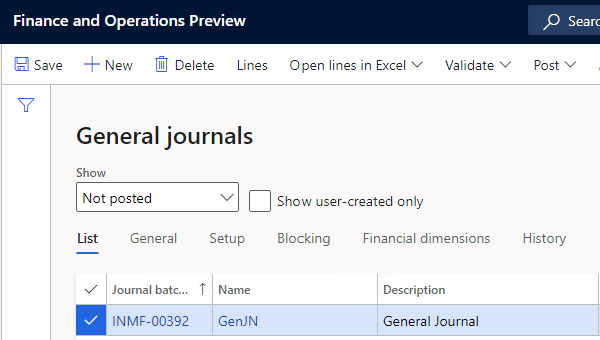

---
# required metadata

title: Calculate TDS on invoices using journals
description: This article lists the steps for calculating Tax Deducted at Source (TDS) on journals.
author: kailiang
ms.date: 02/12/2021
ms.topic: article
ms.prod: 

ms.technology: 

# optional metadata

ms.search.form: 
# ROBOTS: 
audience: Application User
# ms.devlang: 
ms.reviewer: kfend
# 
# ms.tgt_pltfrm: 
ms.assetid: b4b406fa-b772-44ec-8dd8-8eb818a921ef
ms.search.region: Global
# ms.search.industry: 
ms.author: kailiang
ms.search.validFrom: 2021-02-12
ms.dyn365.ops.version: AX 10.0.17

---

# Calculate TDS on invoices using journals

[!include [banner](../includes/banner.md)]

This article lists the steps for calculating Tax Deducted at Source (TDS) on journals.

Begin by opening the **General journals** page (**General ledger > Journal entries > General journals**).

1. Create journal lines using the journal forms that are listed in the table. Select the account type and offset account type and enter the amount for the transaction. 

   > [!NOTE]
   > On the **Invoice approval journal** page, select **Find vouchers** and select invoices to calculate TDS on. View the invoices created in the **Invoice register** page or the **Find vouchers** page.  

2. On the **General** tab of the **Journal voucher** page, view or modify the default TDS group defined for the vendor or customer, in the **TDS group** field. The TDS amount that's calculated on journal lines is based on the formula defined for the TDS tax codes listed in the **TDS group** field. 

   > [!NOTE]
   > The **Withholding tax group**  field and the **TCS group** field become unavailable when you select a TDS group in the **TDS group** field. The **Withholding tax group** field is available only on the **General journal** page. TDS is calculated only if the **Calculate withholding tax** check box is selected for the vendor or customer on the **All vendors** or **All customers** pages.   

3. Select the **Tax information** tab. Select the alternate addresses of a company that's set up for the company in this field, if required. You can view the company name in the **Name** field, which is under the **Company information** field group. 

4. View the nature of assessee category of the vendor or customer in the **Nature of assessee** field, which is under the **Withholding tax** field group. In the **Tax Account Number** (**TAN**) field, view the TAN of the selected company name that's displayed.  

5. Select **Withholding tax** in **Withholding tax** menu to open the **Temporary withholding tax transactions** page. The following fields are displayed on the upper pane of the **Temporary withholding tax transactions** page.

   - **Withholding tax amount in total** - The total TDS calculated for the transaction for the TDS group.

   - **Value** - The total percentage used to calculate TDS for the transaction. The total percentage is based on the formula that is defined for TDS tax codes attached to the TDS group.

   - **Adjusted withholding tax amount in total** - The total adjusted TDS amount for all tax codes in the TDS group.

   - **TDS** - If selected, a TDS group is attached to the transaction.

  The fields on the **Overview**, **General**, and **Adjustment** tabs on the **Temporary withholding tax transactions** page display the calculated TDS amount and adjusted TDS amount details for each TDS tax code attached to the TDS group.

6. Select **Threshold** to open the **Threshold** page. View the threshold limit and exception threshold limit defined for the TDS tax component attached to a specific TDS tax code on this page.

   Select **Formula designer** to open the **Formula designer** form. View the formula defined for a specific TDS tax code in this page. Close the **Formula designer** and **Temporary withholding tax transactions** pages to return to the **Journal voucher** page.

8. Enter the other required details. Validate and post the journal. The TDS amount that's calculated on purchase invoices is posted to the payable account. The TDS amount that's calculated on sales invoices is posted to the receivable account that is defined for each TDS tax code in the TDS group. The payable accounts or receivable accounts for TDS tax codes are defined on the **Withholding tax codes** page.

9. Select **Posted withholding tax** to open the **Withholding tax transactions** page. In the **Value** field, the total percentage used to calculate TDS for the transaction is displayed.

   The fields on the **Overview**, **General**, and **Amount** tabs in the Withholding tax transactions page display the calculated TDS amount and adjusted TDS amount details for each TDS tax code attached to the TDS group.
