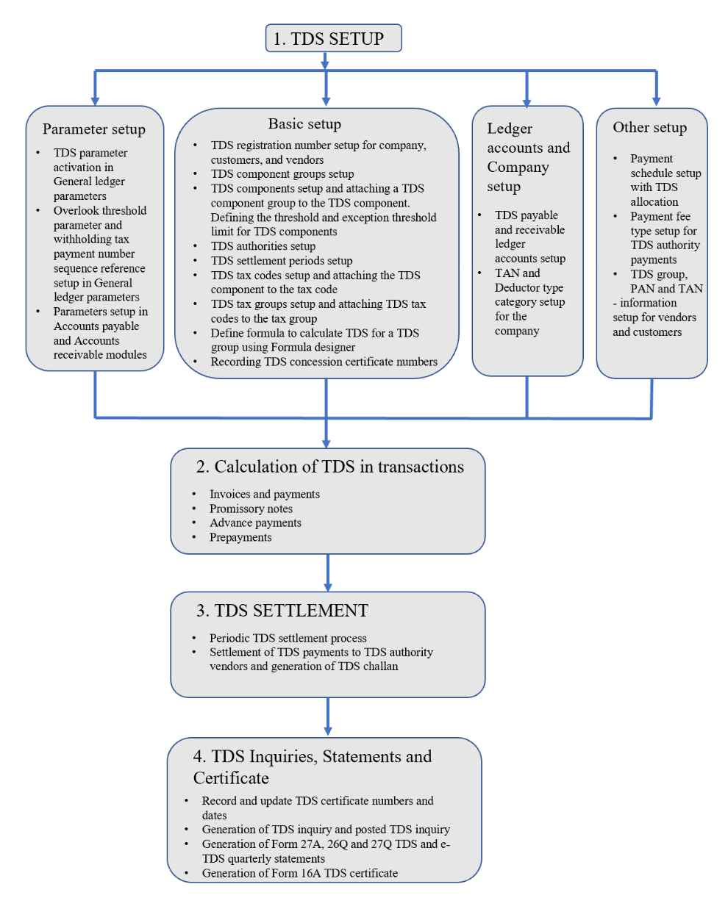

---
# required metadata

title: India Tax Deducted at Source (TDS) overview
description: This topic provides detailed information about India Tax Deducted at Source (TDS). The TTCS documentation covers the functionality of the Tax Deducted at Source (TDS) feature. 
author: kailiang
manager: AnnBe
ms.date: 02/12/2021
ms.topic: article
ms.prod: 
ms.service: dynamics-ax-applications
ms.technology: 

# optional metadata

ms.search.form: 
# ROBOTS: 
audience: Application User
# ms.devlang: 
ms.reviewer: roschlom
# ms.search.scope: Core, Operations
# ms.tgt_pltfrm: 
ms.custom: 15721
ms.assetid: b4b406fa-b772-44ec-8dd8-8eb818a921ef
ms.search.region: Global
# ms.search.industry: 
ms.author: kailiang
ms.search.validFrom: 2021-02-12
ms.dyn365.ops.version: AX 10.0.17

---

# India Tax Deducted at Source (TDS) overview

[!include [banner](../includes/banner.md)]

This topic provides detailed information about India Tax Deducted at Source (TDS).

- Basic setup for TDS

- Formula designer and threshold limit functionality used for TDS calculation

- Calculation of TDS on invoices, payments, promissory notes, and intercompany transactions

- Periodic TDS settlement process and settlement of TDS amounts to TDS authority vendors

- Recording and updating TDS certificate numbers and dates

### Introduction

This topic provides detailed information about India Tax Deducted at Source (TDS). The TTCS documentation covers the functionality of the Tax Deducted at Source (TDS) feature. This documentation also describes how to do the basic setup for TDS, calculate TDS on transactions, TDS settlement process, record TDS certificate numbers, generate TDS inquiries, TDS statements, and TDS certificate.

As per the Income tax Act, 1961, income tax is deducted at source by the receiver of the service at the time of advance payment or accounting of credit, whichever takes place earlier. The person who makes the payment must deduct the tax amount and pay only the net balance to the provider of service. The tax is deducted using the rates that are notified by the government for a period. Tax Deducted at Source (TDS) is applied on services that are notified by the government. The rate of deduction is based on the status of the entity that receives the payment or provides the service, such as, Individual, Hindu Undivided Family (HUF), Company, Firm, Association of Persons (AOP), Body of Individuals (BOI), or Local authority. 

The services that are notified by the Government of India on which TDS is applied are listed below:

### Residents

- Income from salaries (Under section 192)

- Income from interest on securities (Under section 193)

- Income from dividend (Under section 194)

- Income from interest (Under section 194A)

- Income from lotteries or puzzles (Under section 194B)

- Winning from horse races etc. (Under section 194BB)

- Contractors and sub-contractors (Under section 194C)

- Insurance commission (Under section 194D)

- Income from deposit under national saving scheme (Under section 194EE)

- Income from mutual fund or UTI (Under section 194F)

- Commission, Remuneration, Prize etc., on sale or lottery (Under section 194G)

- Payment of Commission or brokerage (Under section 194H)

- Rent (Under section 194I)

- Professional service (Under section 194J)

- Income from Units (Under section 194K)

- Payment of compensation on acquisition of certain immovable property (Under section 194LA)

### Non-residents

Payments to Non-resident sportsmen or sports association (Under section 194E)

Other sums (Under section 195)

Income in respect of units of non-residents (Under section 196A)

- Income from foreign currency bonds or shares of Indian Company (Under section 196C)

- Incomes of foreign institutional investors from securities (Under section 196D)

- Salary and all other positive incomes under any head on income (Section 192)

- Interest on securities (Section 193)

- Interest other than interest on securities (Section 194A)

- Payments to contractors and sub-contractors (Section 194C)

- Winnings from Lottery or crossword puzzles (Section 194B)

- Winnings from horse races (Section 194BB)

- Insurance Commission covering all payments for procuring Insurance business (Section 194D)

- Any interest other than interest on securities payable to non-residents not being a company or to a foreign company (Section 195)

- Payment to non-resident sportsman including athlete or sports association or institution. In case of non-resident sportsman, payments in respect of advertisements as well as articles on any game/sports in India in newspapers, magazines, and so. is included (Section 194E)

- Payment in respect of deposits under NSS \[National Savings Scheme\](Section 194EE)

- Payment on account of repurchase of Units by Mutual Fund or UTI (Section 194F)

- Payment for Commission or brokerage (Section 194H)

- Payment of rent (Section 194I)

- Payment of fees for professional or technical services (Section 194J)

- Commission to Stockiest, distributors, buyers and sellers of Lottery tickets including remuneration or prize on such tickets (Section 194G)

- Income from Units purchased in foreign currency or long-term capital gain arising from the transfer of such Units purchased in foreign currency (Section196B)

- Payment of any income to non-residents in respect of interest or dividend on bonds and shares (Section 196C) etc.

TDS is calculated on purchase, sales, sales return, credit notes, fixed assets acquisition, prepayments, advance payments, promissory notes, works tax, and intercompany transactions.

>  [!NOTE]
>  In the current Indian tax scenario,  TDS is not calculated on sales transactions. Microsoft Dynamics AX  has a provision to calculate TDS recoverable on sales transactions to cater  to intercompany transactions. 

TDS is always calculated considering the threshold limit and the exception threshold limit defined for the TDS component.

The periodic TDS settlement process must be run and the TDS payments must be settled to TDS authority vendors.

The certificate numbers and dates for TDS certificates received from vendors or customers can be recorded and updated. The Form 26Q and Form 27Q quarterly statements and the Form 16A certificate for TDS also can be generated in Microsoft Dynamics AX 2009.

