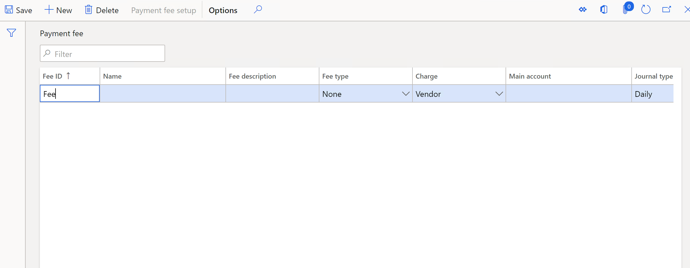
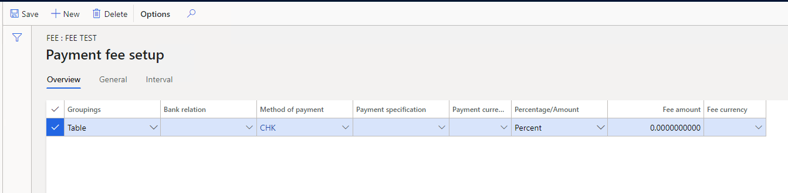
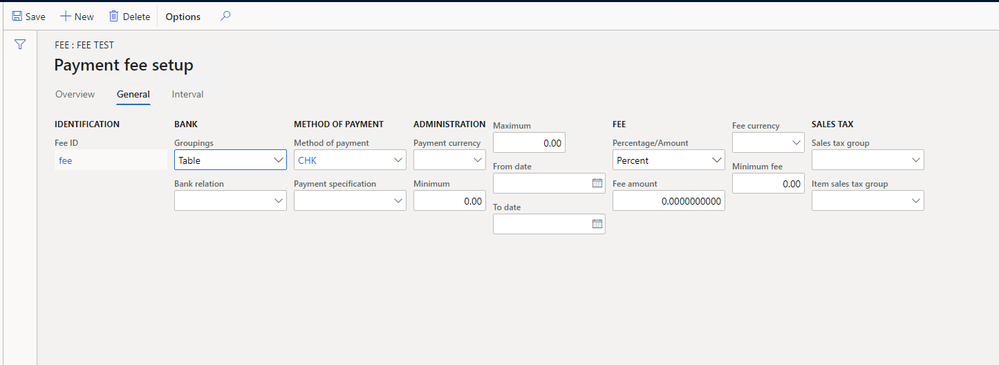
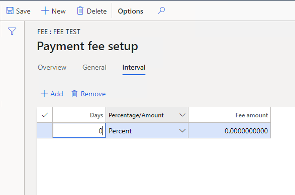

---
# required metadata

title: Set up payment fees for TDS authority payments
description: This article explains how to set up payment fees that are charged for Tax Deducted at Source (TDS) authority payments.
author: kailiang
ms.date: 02/12/2021
ms.topic: article
ms.prod: 

ms.technology: 

# optional metadata

ms.search.form: 
# ROBOTS: 
audience: Application User
# ms.devlang: 
ms.reviewer: kfend
# 
# ms.tgt_pltfrm: 
ms.assetid: b4b406fa-b772-44ec-8dd8-8eb818a921ef
ms.search.region: Global
# ms.search.industry: 
ms.author: kailiang
ms.search.validFrom: 2021-02-12
ms.dyn365.ops.version: AX 10.0.17

---

# Set up payment fees for TDS authority payments

[!include [banner](../includes/banner.md)]

This article explains how to set up payment fees that are charged for Tax Deducted at Source (TDS) authority payments.

1. Go to **Accounts payable \> Payment setup \> Payment fee**.

    

2. Select **New** to create a payment fee, and enter the required details.
3. In the **Fee type** field, select the type of payment fee:

    - **None**
    - **Interest** – Interest is charged on late payments that are made to the TDS authority vendor.
    - **Others** – Other charges are charged on late payments that are made to the TDS authority vendor.

    If you select **Interest** or **Others**, the **Charge** field is automatically set to **Ledger**.

4. If you selected **Interest** or **Others** in the **Field type** field, in the **Main account** field, select the ledger account to post the interest or other charges to.
5. Enter the other required details.
6. On the Action Pane, select **Payment fee setup** to open the **Payment fee setup** page, where you can set up payment fees for various combinations of banks, methods of payment, payment specifications, currencies, and date intervals.

    

7. On the **Overview** tab, in the **Groupings** field, specify which banks you're setting up the payment fee for:

    - **Table** – The fee is valid for a specific bank account.
    - **Group** – The fee is valid for a specific bank group.
    - **All** – The fee is valid for all the bank accounts.

8. If you selected **Table** or **Group** in the **Groupings** field, in the **Bank relation** field, select the specific bank account or bank group that you're setting up the payment fee for.
9. In the **Method of payment** field, select the method of payment for the payment of fees.
10. In the **Payment specification** field, select or enter the payment specification code that was generated on the **Payment specification** page.
    - The Payment specification is used with electronic fund transfer methods of payment.
12. In the **Payment currency** field, select the currency that activates the fee. Only transactions that use the selected currency can activate the fee. If you leave this field blank, all currencies activate the fee.
13. In the **Percentage/Amount** field, select the calculation method. The options are **Amount**, **Percent**, and **Interval**.
14. In the **Fee amount** field, specify the fee amount as either a percentage of the payment or the amount for one payment.
15. In the **Fee currency** field, specify the currency code for the fee.
16. Select the **General** tab to view or modify the details for the selected bank account.

    

16. In the **Minimum** field, enter the minimum transaction amount that activates the fee.
17. In the **Maximum** field, enter the maximum transaction amount that activates the fee.
18. In the **From date** and **To date** fields, define a date range for calculating fees.
19. In the **Minimum fee** field, specify the amount of the fee as either a percentage of the payment or the amount for one payment.
20. In the **Sales tax group** field, select the sales tax group to use to calculate the sales tax for the fee amount.
21. In the **Item sales tax group** field, select the item sales tax group to use to calculate the item sales tax for the fee amount.
22. Select the **Interval** tab. 

    

23. In the **Days** field, enter the number of days between the posting date (discounting date) of the payment and the due date of the promissory note.
24. In the **Percentage/Amount** field, select whether the specification is a percentage or a set amount.
25. In the **Fee amount** field, enter the amount of the fee as either a percentage of the payment or the amount for one payment.
26. Close the **Payment fee setup** page.
27. Close the **Payment fee** page.
