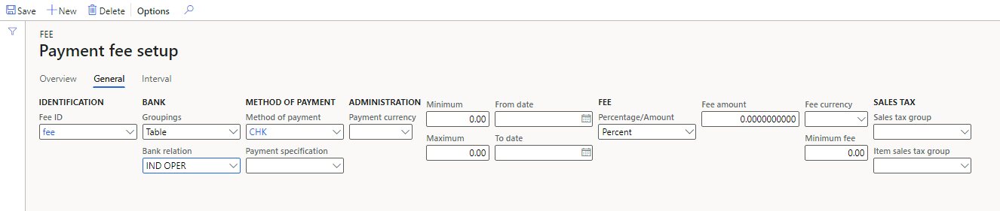

# Payment fee setup to charge payment fee for TDS authority payments

Follow these steps to set up payment fee for TDS authority payments.

Go to  **Accounts payable > Payment setup > Payment fee**

1. On the **Overview** tab, press ALT+N to create a payment fee. Enter the required details.

2. In the **Fee** **type** field, select the payment fee type. The options are:

- **None**

- **Interest**: Select this option to charge interest on late payment made to the TDS authority vendor.

- **Others**: Select this option to charge other charges on late payment made to the TDS authority vendor. 

3. In the **Charge** field, the **Ledger** option is displayed automatically when the **Interest** or **Others** option is selected in the **Fee** **type** field.

4. In the **Main** **account** field, select the ledger account to post the interest or other charges. Enter the other required details.

5. Click the **Payment** **fee** **setup** button to set up payment fees for various combinations of banks, methods of payment, payment specifications, currencies, and date intervals.

6.  Click the **Overview** tab. In the **Groupings** field, select the option to set up the bank information for. The options are:

- **Table**: Fee is valid for the bank account selected in the Bank relation list.

- **Group**: Fee is valid for the bank group selected in Bank relation list.

- **All**: Fee is valid for all the bank accounts.

7. In the **Bank** **relation** field, specify the bank to set up the payment fees setup for.

8. In the **Method** **of** **payment** field, select the method of payment for the payment of fees.

9. In the **Payment** **specification** field, select or enter the payment specification code generated using the **Payment** **specification** form.

10. In the **Fee Currency** field, select the currency that activates the fee. Only transactions with this currency can activate the fee. If blank, all currencies will activate the fee.

11. In the **Percentage**/**Amount** field, select the calculation method. The options are Amount, Percent, and Interval.

12. In the **Fee** **amount** field, specify the fee amount in percentage of the payment or amount for one payment.

13. In the **Fee Currency** field, specify the currency code for fee.

14. Click the **General** tab to view or modify the details entered for the selected bank account.

15. In the **Minimum** field, enter the minimum transaction amount to activate the fee.

16. In the **Maximum** field, enter the maximum transaction amount to activate the fee.

17. In the **From** date field, enter the starting date for the date interval to calculate the fees.

18. In the **To** date field, enter the ending date for the date interval to calculate the fees.

19. In the **Minimum** **fee** field, specify the amount of the fee in percentage of the payment or amount for one payment.

20. In the **Sales** **tax** **group** field, select the sales tax group to calculate the sales tax for the fee amount.

21. In the **Item** **sales** **tax** **group** field, select the item sales tax group to calculate the item sales tax for the fee amount.

22. Click the **Interval** tab. 

23. In the **Days** field, enter the number of days between the posting date (discounting date) of the payment and the due date of the promissory note.

24. In the **Percentage**/**Amount** field, select if the specification is a percentage or an absolute amount.

25. In the **Fee** **amount** field, enter the amount of the fee in percent of the payment or amount for one payment.

26. Close the **Payment** **fee** **setup** form.

27. Close the **Payment** **fee** form.