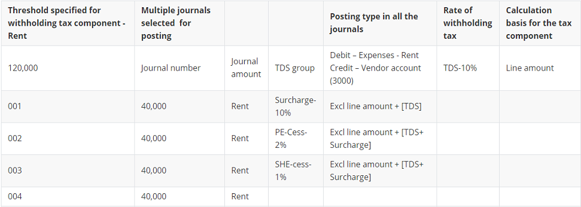

---
# required metadata

title: Payment, posting and reversal
description: This topic describes payments, posting of payments, and reversal of payments that are associated with Tax Deducted at Source (TDS).
author: kailiang
manager: AnnBe
ms.date: 02/12/2021
ms.topic: article
ms.prod: 
ms.service: dynamics-ax-applications
ms.technology: 

# optional metadata

ms.search.form: 
# ROBOTS: 
audience: Application User
# ms.devlang: 
ms.reviewer: roschlom
# ms.search.scope: Core, Operations
# ms.tgt_pltfrm: 
ms.custom: 15721
ms.assetid: b4b406fa-b772-44ec-8dd8-8eb818a921ef
ms.search.region: Global
# ms.search.industry: 
ms.author: kailiang
ms.search.validFrom: 2021-02-12
ms.dyn365.ops.version: AX 10.0.17

---
# Payment, posting and reversal

[!include [banner](../includes/banner.md)]

This topic describes payments, posting of payments, and reversal of payments that are associated with Tax Deducted at Source (TDS). 

**Allocation of payments using Proportional TDS payment schedule**
If the TDS payment schedule that's attached to the invoice specifies **Proportionally** as the withholding tax allocation, the installment amount is calculated based on the net amount, that is, invoice amount minus the TDS amount. For example, if the invoice amount is 100,000 and the TDS amount is 20,000, the installments are calculated based on 80,000 (100,000-20,000).

**Payment term is COD**
If terms of payment are **C.O.D** (Cash On Delivery) on an attached purchase invoice, TDS is calculated on the invoice. The net amount after deducting the TDS amount is posted to the Cash account

**Discount**
If the line discount, multi-line discount, or total discount is attached to an invoice, the TDS is calculated on the invoice amount after considering the discount. For example, if the invoice amount is 10,000 and the line discount is 100, TDS is calculated on 9,900.

**Purchase Invoices with TDS group and TCS group attached to gifferent invoice lines**
An invoice with a TDS group and a Tax Collected at Source (TCS) group attached to different invoice lines can't be posted. However, TDS is calculated for the partial invoice amount if the purchase order is partially invoiced.

**Advance payments and prepayments**
TDS can be calculated on advance payments and prepayments made to vendors. When the prepayment or advance payment is attached to a purchase by clicking **Accounts payable > Purchase order > Functions button > Open transaction editing**, TDS will be calculated only on the amount that exceeds the advance payment or prepayment amount, if any.

For example, suppose an advance payment transaction for 10,000 is created for Vendor 1. TDS is calculated for the transaction. Later, a purchase invoice is created for 15,000 for Vendor 1 and the advance payment transaction is linked to the invoice. In this transaction, TDS is calculated only for 5,000.

> [!Note]
> If the **Amount incl. sales tax** check box is selected for a prepayment, TDS is calculated on the payment amount inclusive of sales taxes.  

**Automatic posting**
If a purchase invoice is created using a method of payment that has the **Automatic posting** check box selected, an automatic payment voucher is created for the net amount after deducting the TDS amount. For example, if the invoice amount is 100,000 and the total TDS amount is 11,330, the automatic payment voucher is posted for the net amount after deducting the TDS amount, which is, 88,670.

**Returned item invoices or credit notes**
If a credit note or a returned item invoice is created using a credit note, the TDS amount that's calculated only on the original invoice is reversed. The TDS amount is not reversed if TDS has already been paid to the tax authority, or if the TDS settlement process has already been run for the period.

If the returned item invoice or credit note is posted for a partial quantity, the proportionate TDS amount will be reversed.

## Post multiple journals with withholding tax (TDS)
The calculation and accounting of withholding tax (TDS) in India depends on the threshold limit defined for a withholding tax component. When you post multiple journals, if the cumulative transaction amount for a journal does not exceed the threshold limit specified for the withholding tax component, TDS is not calculated for that journal. When the cumulative transaction amount exceeds the threshold limit specified for the withholding tax component, TDS is calculated for the respective journal amount including the previous transactions on which TDS was applied, but not calculated.

This following examples explain the consideration of threshold limits when posting multiple journals that include withholding tax (TDS). The posting validation rules that are applicable for India withholding tax must be satisfied for the journal to post.

**Example 1:**
The following table shows the details of multiple journals posted for the TDS component – Rent, for the vendor account 3000.

When the journals are posted simultaneously, the threshold for posting multiple journals is based on the chronological order of posting the journals. In this example Journal 001 is posted first, then journals 002, 003 and 004 are posted in chronological order.

 The voucher entry for the journal 001 is as follows:

| Account               | Debit  | Credit |
| --------------------- | ------ | ------ |
| Expenses – Rent       | 40,000 |        |
| Vendor account (3000) |        | 40,000 |

 The voucher entry for the journal 002 is as follows:

| Account               | Debit  | Credit |
| --------------------- | ------ | ------ |
| Expenses – Rent       | 40,000 |        |
| Vendor account (3000) |        | 40,000 |

 The voucher entry for the journal 003 is as follows:

| Account               | Debit  | Credit |
| --------------------- | ------ | ------ |
| Expenses – Rent       | 40,000 |        |
| Vendor account (3000) |        | 40,000 |

The voucher entry for the journal 004 is as follows:

| Account               | Debit     | Credit    |
| --------------------- | --------- | --------- |
| Expenses – Rent       | 40,000    |           |
| Vendor account (3000) |           | 40,000    |
| Vendor account (3000) | 18,128.00 |           |
| TDS Payable           |           | 16,000.00 |
| Surcharge Payable     |           | 1,600.00  |
| PE-Cess Payable       |           | 352.00    |
| SHE Cess Payable      |           | 176.00    |

 

If the **Overlook threshold** check box is selected for the tax code on the **Withholding tax groups** page, all the journals are posted with the withholding tax code calculated on the individual journal amounts.

**Example 2:**

The following table shows the details of  multiple journals posted for TDS component – Rent, for vendor account 3000.

| Threshold specified for withholding  tax component - Rent | Multiple journals selected  for posting | Posting type in all the  journals | Rate of withholding tax | Calculation basis for the tax  code                       | Overlook threshold limit  check box |  Amount  | Marked or not  |
| --------------------------------------------------------- | --------------------------------------- | --------------------------------- | ----------------------- | --------------------------------------------------------- | ----------------------------------- | ----------- | ------ |
| 50,000                                                    | Journal number                          | Journal amount                    | TDS group               | Debit – Expenses - Rent   Credit – Vendor  account (3000) | TDS-10%                             | Line amount | Marked |
| 005                                                       | 20,000                                  | Rent                              | Surcharge-10%           | Excl line amount + [TDS]                                  | Marked                              |             |        |
| 006                                                       | 20,000                                  | Rent                              | PE-Cess-2%              | Excl line amount + [TDS+ Surcharge]                       | Unmarked                            |             |        |
| 007                                                       | 9000                                    | Rent                              | SHE-cess-1%             | Excl line amount + [TDS+ Surcharge]                       | Marked                              |             |        |
| 008                                                       | 2,000                                   | Rent                              |                         |                                                           |                                     |             |        |
| 009                                                       | 1,000                                   | Rent                              |                         |                                                           | Marked                              |             |        |
| 010                                                       | 20,000                                  | Rent                              |                         |                                                           | Marked                              |             |        |

 

**Step 1**: In this example the journals 005 and 006 are posted together. The taxes are calculated if the **Overlook threshold limit** check box is marked. The taxes for the transaction are calculated as follows:

| Journal | Transaction Amount | TDS  | Surcharge | PE-Cess | SHE-Cess |
| ------- | ------------------ | ---- | --------- | ------- | -------- |
| 005     | 20,000             | 2000 | 200       | 44      | 22       |
| 006     | 20,000             | 2000 | 200       | 44      | 22       |

 

**Step 2**: The **Overlook threshold limit** check box is cleared. The journal 007 is posted. Taxes are not calculated if the cumulative transaction amount does not exceed the specified threshold limit.

| Journal | Transaction Amount | TDS  | Surcharge | PE-Cess | SHE-Cess |
| ------- | ------------------ | ---- | --------- | ------- | -------- |
| 007     | 9000               | 0    | 0         | 0       | 0        |

**Step 3**: The **Overlook threshold limit** check box is selected. The journals 008, 009, and 010 are posted. 

| Journal | Transaction Amount | TDS      | Surcharge | PE-Cess | SHE-Cess |
| ------- | ------------------ | -------- | --------- | ------- | -------- |
| 008     | 2,000.00           | 200.00   | 20.00     | 4.40    | 2.20     |
| 009     | 1,000.00           | 100.00   | 10.00     | 2.20    | 1.10     |
| 010     | 20,000.00          | 2,000.00 | 200.00    | 44.00   | 22.00    |

> [!Note]
> In the Indian business scenario, the threshold limit and the exception threshold limit are not applicable to the TCS tax type. However, flexibility is provided in the application to define the threshold limit and the exception threshold limit for the TCS tax components, as well. If defined, the functionality of threshold applicable to the TDS tax codes will be  applied as is, to the TCS tax codes.   

**Reverse transactions**
If a transaction on which TDS is calculated is reversed by clicking **Accounts payable or Accounts receivable > vendors/customers > transactions button > reverse transaction button or general ledger > chart of accounts > transactions button > reverse transaction button, the TDS amount is reversed with the transaction amount**.

For invoices that have the TDS calculated on the cumulative amount of a group of invoices because of a threshold limit, the TDS amount is reversed only when the specific invoice on which the TDS is calculated is reversed. For transactions that are created after the reversal transaction, TDS will be calculated again considering the threshold limit.

For example, the threshold limit is 25,000; three invoices are posted for 10,000, 10,000, and 6,000 respectively. The TDS is calculated on the third invoice on the cumulative amount of 26000. If you reverse the first and second invoice, the TDS amount will not be reversed. The TDS amount is reversed only when you reverse the third invoice.
