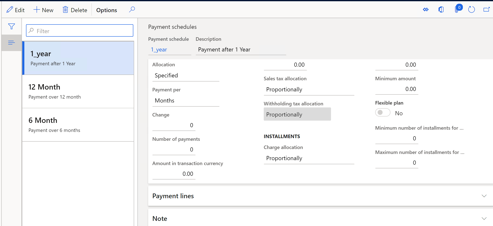

# Payment schedule setup with TDS allocation

Follow these steps to set up payment schedule with TDS allocation.

 Go to **Accounts payable > Payment  setup > Payment schedules**

2. Click **New** to create a payment schedule. Enter the required details.

3. In the **Allocation** field, select the method to allocate the payment for the payment schedule. The options are:

- **Total**
- **Fixed** **amount**
- **Fixed** **quantity**

- **Specified**

4. If the **Total** option is selected in the **Allocation** field, the TDS allocation method for the payment schedule is displayed as **Total** in the **Withholding** **tax** **allocation** field. If the **Fixed** **amount**, **Fixed** **quantity**, or **Specified** option is selected in the **Allocation** field, the TDS allocation method for the payment schedule is displayed automatically as **Proportionally** in the **Withholding** **tax** **allocation** field.

>   [!Note]
>
>   If the **Withholding** **tax** **allocation**  field is set to **Total**, the payment installments are calculated based  on the gross amount including the TDS amount.  If the **Withholding** **tax** **allocation**  field is set to **Proportionally**, the payment installments are  calculated based on the net invoice amount after deducting the TDS amount.   

5. Enter the other required details and close the form.
