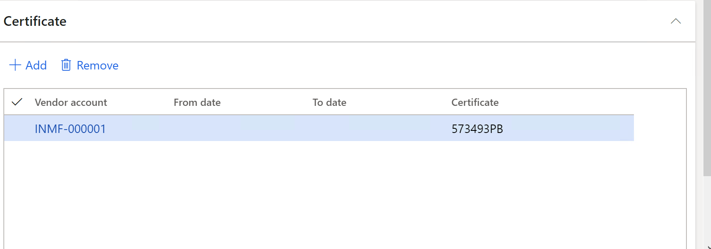

---
# required metadata

title: Record TDS concession certificate numbers
description: This article explains how to record the Tax Deducted at Source (TDS) concession certificate numbers that are issued to vendors.
author: kailiang
ms.date: 02/12/2021
ms.topic: article
ms.prod: 

ms.technology: 

# optional metadata

ms.search.form: 
# ROBOTS: 
audience: Application User
# ms.devlang: 
ms.reviewer: kfend
# 
# ms.tgt_pltfrm: 
ms.assetid: b4b406fa-b772-44ec-8dd8-8eb818a921ef
ms.search.region: Global
# ms.search.industry: 
ms.author: kailiang
ms.search.validFrom: 2021-02-12
ms.dyn365.ops.version: AX 10.0.17

---

# Record TDS concession certificate numbers

[!include [banner](../includes/banner.md)]

This article explains how to record the Tax Deducted at Source (TDS) concession certificate numbers that are issued to vendors.

1. Go to **Tax \> Indirect taxes \> Withholding tax \> Withholding tax concessions**.
2. In the **Tax type** field, select **TDS** to record concession certificates for the TDS tax type.
3. On the **Overview** tab, select **Alt+N** to create a line.

    

4. In the **Withholding tax code** field, select the TDS tax code that the vendor concession certificates are issued for. The **Withholding tax code name** field shows the name of the TDS tax code.
5. In the **From date** and **To date** fields, define the period of validity for the concession certificate that uses the TDS tax code to calculate TDS for the vendor on a concessional basis.
6. In the **Remarks** field, enter any remarks.
7. In the **Section** field, enter the legal section code that the TDS concession certificate is availed under.

    If the section code is 197, the value "A" appears in both the "Reason for non-deduction/lower deduction" column in Form 26Q and the "Reason for non-deduction/lower deduction/grossing up (if any)" column in Form 27Q. If the section code is 197A, the value "B" appears in both those places.

8. Select the **Certificate** FastTab to record TDS concession certificate numbers for vendors.
9. In the **Vendor account** field, select the vendor account that the TDS concession certificate is issued for.
10. In the **From date** and **To date** fields, define the period of validity for the TDS concession certificate.

    The calculation of TDS on a concessional basis is based on the period when the certificate is created for the vendor.

11. In the **Certificate** field, enter the TDS concession certificate number.

    

12. Close the page.
