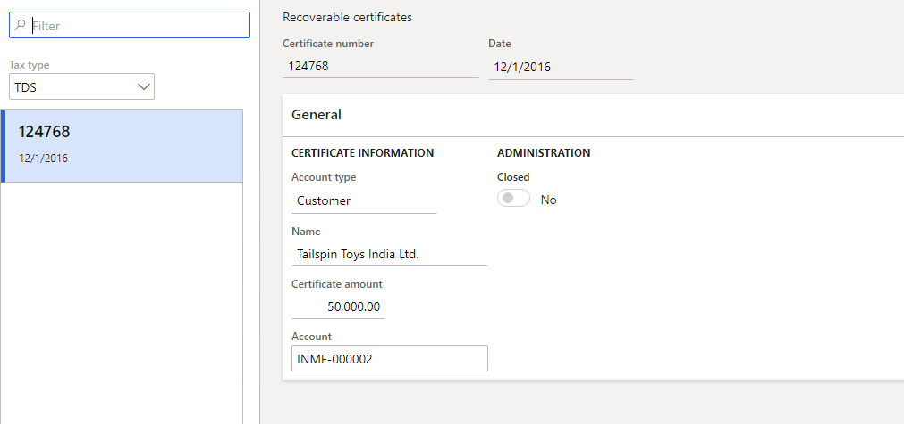

---
# required metadata

title: Record TDS recoverable certificate numbers
description: This article explains how to use the Recoverable certificates page to record the certificate numbers and dates for Tax Deducted at Source (TDS) certificates that are received for a specific vendor, customer, or ledger.
author: kailiang
ms.date: 02/12/2021
ms.topic: article
ms.prod: 

ms.technology: 

# optional metadata

ms.search.form: 
# ROBOTS: 
audience: Application User
# ms.devlang: 
ms.reviewer: kfend
# 
# ms.tgt_pltfrm: 
ms.assetid: b4b406fa-b772-44ec-8dd8-8eb818a921ef
ms.search.region: Global
# ms.search.industry: 
ms.author: kailiang
ms.search.validFrom: 2021-02-12
ms.dyn365.ops.version: AX 10.0.17

---

# Record TDS recoverable certificate numbers

[!include [banner](../includes/banner.md)]

This article explains how to use the **Recoverable certificates** page to record the certificate numbers and dates for Tax Deducted at Source (TDS) certificates that are received for a specific vendor, customer, or ledger. To update the TDS certificate numbers and dates that are recorded for TDS transactions on this page, use the **Update certificate** page (**General ledger \> Periodic \> Withholding tax \> Update certificate**). After you've finished updating TDS certificate numbers, close them.

Follow these steps to record the TDS certificate numbers and dates.

1. Go to **Tax \> Indirect tax \> Withholding tax \> Recoverable certificates**.

     

2. On the **Recoverable certificates** page, in the **Tax type** field, select **TDS**.
3. Select **New** to create a record.
4. In the **Certificate number** field, enter the TDS certificate number.
5. In the **Account type** field, select the type of account that the TDS certificate is received for: **Vendor**, **Customer**, or **Ledger**.
6. In the **Account** field, select the vendor, customer, or ledger account number, depending on the account type that you selected. The **Name** field shows the name of the vendor, customer, or ledger account.
7. In the **Certificate amount** field, enter the amount of the TDS certificate.
8. In the **Date** field, enter the certificate date for the certificate number.
9. Select **Inquiries** to open the **Certificate transactions** page, where you can view the TDS transactions that the TDS certificate number and date are updated for. This information can be updated on the **Update certificate** page (**Tax \> Declarations \> Withholding tax \> Update certificate**).

    The **Update certificate** page shows the following information for each TDS transaction:

    - **Date** – The posting date of the TDS transaction.
    - **Voucher** – The voucher number of the TDS transaction.
    - **Source** – The module that the TDS transaction was created in.
    - **Account** – The vendor, customer, or ledger account number that the TDS transaction was created for.
    - **Name** – The name of the vendor, customer, or ledger account that the TDS transaction was created for.
    - **Amount** – The invoice amount that the TDS was calculated on.
    - **Tax amount** – The TDS tax amount that was calculated for the transaction.
    - **Certificate date** – The TDS certificate date that was updated for the TDS transaction.
    - **Certificate number** – TDS certificate number that was updated for the TDS transaction.

10. On the **Recoverable certificates** page, select the **Closed** check box to close the TDS certificate number after you've finished updating it for TDS transactions on the **Update certificate** page.

    To select the **Closed** check box for all records on the page, select **Mark all**.

    > [!NOTE]
    > TDS certificate numbers that the **Closed** check box is selected for aren't available on the **Update certificate** page.
