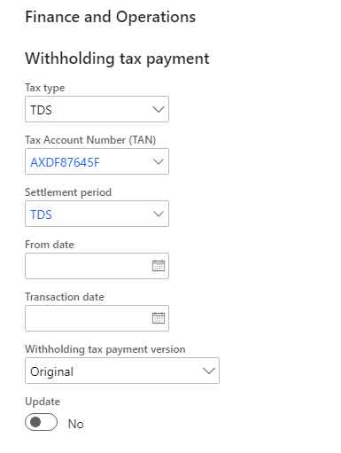

---
# required metadata

title: Run the periodic TDS settlement process
description: This article explains how to settle periodic Tax Deducted at Source (TDS).
author: kailiang
ms.date: 02/12/2021
ms.topic: article
ms.prod: 

ms.technology: 

# optional metadata

ms.search.form: 
# ROBOTS: 
audience: Application User
# ms.devlang: 
ms.reviewer: kfend
# 
# ms.tgt_pltfrm: 
ms.assetid: b4b406fa-b772-44ec-8dd8-8eb818a921ef
ms.search.region: Global
# ms.search.industry: 
ms.author: kailiang
ms.search.validFrom: 2021-02-12
ms.dyn365.ops.version: AX 10.0.17

---

# Run the periodic TDS settlement process

[!include [banner](../includes/banner.md)]

This article explains how to settle periodic Tax Deducted at Source (TDS).

1. Go to **Tax \> Declarations \> Withholding tax \> Withholding tax payment**.

    

2. In the **Withholding tax payment** dialog box, in the **Tax type** field, select **TDS**.
3. In the **Tax Account Number (TAN)** field, select the Tax Account Number (TAN) to run the settlement process for.
4. In the **Withholding tax component group** field, select the TDS component group to run the settlement process for.
5. In the **Settlement period** field, select the TDS settlement period to run the settlement process for.

    > [!NOTE]
    > The TDS settlement process is run for all periods that are set up for the TDS settlement period on the **Periods** tab of the **Withholding tax settlement periods** page (**Tax \> Indirect taxes \> Withholding tax \> Withholding tax settlement periods**).

6. In the **From date** field, select the start date to run the TDS settlement process from.

    For a specific period within the settlement period, the start date that is defined for the period is taken as the "from" date. For example, the TDS settlement period has two periods: April 1 through April 30, 2009, and May 1 through May 31, 2009. If you select **04/06/2009** (April 6, 2009) as the start date in the **From date** field, the settlement process will still run from April 1, 2009.

    If you enter a later period in the **From date** field, but without settling a previous period within the settlement period, the settlement won't occur for any previous periods. For example, the TDS settlement period has three periods: April 1 through April 30, 2009, May 1 through May 31, 2009, and June 1 through June 30, 2009. If you select **05/01/2009** (May 1, 2009) as the start date in the **From date** field, the settlement process will run only from May 1 through May 31, 2009. The settlement won't occur for April 1 through April 30, 2009.

7. In the **Transaction date** field, select the date to post the TDS settlement transaction.
8. In the **Withholding tax payment version** field, select the TDS settlement version:

     - **Original** – Use this option to run the TDS settlement process for the first time. The original payment version is used only one time to run the TDS settlement process for a combination of a TAN, a withholding tax component group, and a withholding tax settlement period.
    - **Latest versions** – Use this option if the TDS settlement process has already been run for the specified period. Include back-dated transactions that were posted after the settlement process was previously run for the period. You can use this option to run the settlement process any number of times.

9. Select the **Update** check box to run the TDS settlement process and post the amounts to the ledger accounts. If this check box is cleared, the settlement process won't be run, and the financial entries won't be generated.
10. Select **OK** to run the TDS settlement process and generate the withholding tax payment report. The status of TDS transactions that are included in the settlement process is shown as **Settled** on the **Settlement** page (go to **Accounts payable \> Payments \> Vendor payment journal**, select **Lines**, select **Functions**, and then select **Settlement**).

### Important points

- If a withholding tax component group isn't selected during the settlement process, the settlement occurs for all the withholding tax component groups for the selected TAN and settlement period. A separate line is created for each withholding tax component group on the **Open transaction editing** page.
- The settlement process is based on the nature of assessee category for a settlement period. Transactions where the nature of assessee category is **Company** are settled and are shown as one line on the **Open transaction editing** page. Transactions where the nature of assessee is something other than **Company** are settled and are shown as one line on the **Open transaction editing** page.
- The due date for the settled TDS transaction lines on the **Open transaction editing** page is based on the terms of payment that are defined for the TDS authority vendor on the **Vendors** page. If the terms of payments aren't defined for the TDS authority vendor, the last day of the settlement period is shown as the due date.
