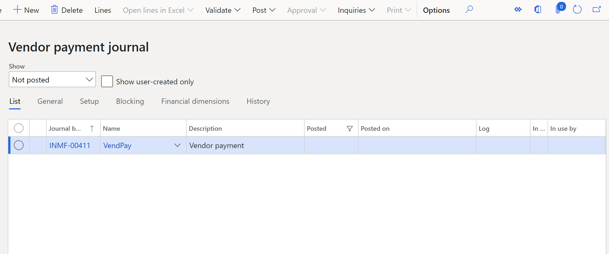

---
# required metadata

title: Settle TDS payments to TDS authority vendors and generate TDS challan
description: This article explains how to settle Tax Deducted at Source (TDS) payments to TDS authority vendors.
author: kailiang
ms.date: 03/12/2021
ms.topic: article
ms.prod: 

ms.technology: 

# optional metadata

ms.search.form: 
# ROBOTS: 
audience: Application User
# ms.devlang: 
ms.reviewer: kfend
# 
# ms.tgt_pltfrm: 
ms.assetid: b4b406fa-b772-44ec-8dd8-8eb818a921ef
ms.search.region: Global
# ms.search.industry: 
ms.author: kailiang
ms.search.validFrom: 2021-02-12
ms.dyn365.ops.version: AX 10.0.17

---

# Settle TDS payments to TDS authority vendors and generate TDS challan

[!include [banner](../includes/banner.md)]

This article explains how to settle Tax Deducted at Source (TDS) payments to TDS authority vendors.

1. Go to **Accounts payable \> Payments \> Vendor payment journal**.

    

2. On the **Vendor payment journal** page, select **New** to create a journal line.
3. In the **Account** field, select the TDS authority vendor to settle TDS payments to.
4. Select **Settlement transactions** to open the **Settlement transactions** page, where you can view the settled TDS transactions for the TDS authority vendor.

    The settled TDS transactions for a settlement period are shown in the following way:

    - TDS transactions where the nature of assessee category is **Company** are shown as one transaction line.
    - TDS transactions where the nature of assessee category is **HUF**, **Firm**, **Individual**, **AOP**, **BOI**, **Local authority**, or **Others** are shown as one transaction line.
    - The **Amount** field shows the total TDS amount that is due to be paid to the TDS authority vendor.

5. Select **Withholding tax transactions** to view the different TDS transactions that are included for the settlement record. You can view the split of each TDS transaction that has been included in the settlement process for the settlement period on this page.
6. On the **Overview** tab, select the **Mark** check box for the TDS transactions to settle to the TDS authority vendor.

    The **Overview** tab shows the following information for each open TDS transaction:

    - **Date** – The TDS transaction date.
    - **Voucher** – The voucher number.
    - **Source** – The module that the TDS transaction is posted in.
    - **Vendor/Customer** – The vendor or customer account number that the TDS is deducted from.
    - **Name of deductee/party** – The name of the vendor or customer that the TDS is deducted from.
    - **Nature of assessee** – The nature of assessee category that the deductee belongs to.
    - **Amount** – The invoice amount that the TDS was calculated on.
    - **Tax amount** – The TDS amount that was calculated for the transaction.

    > [!NOTE]
    > Clear the **Mark** check box for any TDS transactions that should not be settled to the TDS authority vendor.

    On the **General** tab, the **PAN** field shows the permanent account number (PAN) of the deductee. The **Date** field shows the date of the TDS calculation, and the **Value** field shows the total percentage that was used for the TDS calculation.

7. Select **Voucher** to view the voucher entries for the TDS transaction.
8. Close the page.
10. Select **Withholding tax components** to open the **Withholding tax components** page, where you can view the TDS that was calculated per TDS tax component for a specific TDS tax code.

    On the **Overview** tab, the **Tax component** field shows the TDS tax component that was used for the transaction. The **Amount** field shows the TDS amount that was calculated for the TDS tax component, in the base currency. The **Accumulated amount** field shows the total TDS amount that was calculated for the TDS tax component for all settled transactions.

    On the **Amount** tab, the **Default currency** section shows the TDS amount that was calculated for the TDS tax component, in the default currency. The **Secondary currency** section shows the amount in the secondary currency.

11. Close the **Withholding tax components** page.
12. On the **Open transaction editing** page, in the **Amount** field, notice that the total amount to settle to the TDS authority vendor for the settlement period is updated.
13. To settle the TDS transactions of different TDS settlement periods to the TDS authority vendor, select the **Mark** check box for the transactions.
14. Close the **Open transaction editing** page.

    > [!NOTE]
    > If only a few transactions are selected for settlement on the **Withholding tax transactions** page, the total TDS amount of the selected transactions is updated in the **Correction** field on the **Open transaction editing** page. The correction amount is updated on the journal line on the **Journal voucher** page, and the **Open transaction editing** page is closed.

    On the **Journal voucher** page, the **Debit** field shows the total amount to pay to the TDS authority vendor.

15. Enter the offset account details.

    > [!NOTE]
    > If TDS transactions have different Tax Account Numbers (TANs), journal lines are created per TAN on the **Journal voucher** page.

16. On the **Payment fee** tab, in the **Fee ID** field, select a fee ID that has a fee type of **Interest** or **Others** to charge the payment fee for delayed payments that are made to the TDS authority vendor.

    On the **Tax information** tab, in the **Company information** section, the **Name** field shows the company name. In the **Withholding tax** section, the **Tax Account Number (TAN)** field shows the TAN that is attached to the transaction line.

17. Validate and post the journal.
18. Select **Withholding tax \> Challan information** to enter the challan details for the transaction.

    The **Voucher** field shows the voucher number of the transaction.
    
19. Select the **TDS deposited by book entry** check box if the TDS amount is deposited by using book entry.
20. In the **Challan number** field, enter the challan number that is used to make the payment to the TDS authority vendor.
21. In the **Date** field, enter the challan date.
22. In the **Bank name** field, select the name of the bank that the TDS amount that is payable to the TDS authority vendor should be deposited to. This field lists all the bank accounts that were set up for the TDS authority vendor at **Accounts payable \> All vendors \> Set up \> Bank accounts**.
23. In the **BSR code** field, enter the Basic Statistical Return (BSR) code of the bank.
24. Close the page.

### Example

The period 04/01/2009 is settled for the **Rent** TDS component group by using the periodic TDS settlement process. The total TDS amount of 141,625.00 is posted to the TDS vendor authority account for the TDS settlement period. You can view this amount in the **Amount** field on the **Open transaction editing** page for the TDS authority vendor.

If you select **Withholding tax transactions** to view the different TDS transactions that were settled for the period, the following information is shown.

| TDS amount |
|------------|
| 16,995.00  |
| 22,660.00  |
| 28,325.00  |
| 16,995.00  |
| 28,325.00  |
| 16,995.00  |
| 11,330.00  |

For a specific TDS amount, you can select **Withholding tax components** to view the TDS that was calculated per TDS tax component for a specific TDS tax code. For this example, you select **Withholding tax components** for the TDS amount 16,995.00. The tax amount that was calculated per component for the transaction is shown.

| Tax component | Amount    | Accumulated amount |
|---------------|-----------|--------------------|
| TDS           | 1,5000.00 | 125,000.00         |
| Surcharge     | 1,500.00  | 12,500.00          |
| PE-Cess       | 330.00    | 2,750.00           |
| SHE Cess      | 165.00    | 1,375.00           |

If you selected only the TDS amounts 16,995.00, 22,660.00, and 2,8325.00 for settlement on the **Withholding tax transactions** page, the total amount for settlement is shown as **67,980.00** in the **Correction** field on the **Open transaction editing** page. If this transaction is marked for settlement, and the **Open transaction editing** page is closed, the amount **67,980.00** is shown in the **Debit** field on the **Journal voucher** page.

You can now post the journal and generate the TDS challan.

### Adjustment of advance payments that are made to TDS authority vendors

To adjust an advance payment that was made to the TDS authority vendor to an actual payment, go to **Accounts payable \> Vendors \> All vendors \> Transactions editing**. If the actual payment that is made exceeds the advance payment, two challan numbers are generated for the transaction. However, only the first challan number is shown in the TDS inquiry.
