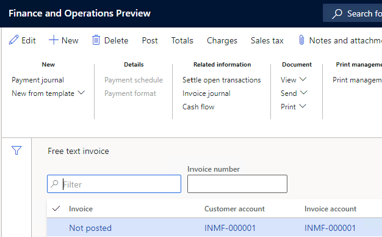

---
# required metadata

title: TDS calculation on invoices from the Free text invoice page
description: This article explains how to calculate Tax Deducted at Source (TDS) on invoices by using the Free text invoice page.
author: kailiang
ms.date: 02/12/2021
ms.topic: article
ms.prod: 

ms.technology: 

# optional metadata

ms.search.form: 
# ROBOTS: 
audience: Application User
# ms.devlang: 
ms.reviewer: kfend
# 
# ms.tgt_pltfrm: 
ms.assetid: b4b406fa-b772-44ec-8dd8-8eb818a921ef
ms.search.region: Global
# ms.search.industry: 
ms.author: kailiang
ms.search.validFrom: 2021-02-12
ms.dyn365.ops.version: AX 10.0.17

---

# TDS calculation on invoices from the Free text invoice page

[!include [banner](../includes/banner.md)]

This article explains how to calculate Tax Deducted at Source (TDS) on invoices by using the **Free text invoice** page.

1. Go to **Accounts receivable \> Invoices \> All free text invoices**.

    

2. Select **New** to create a free text invoice, and enter the required details.
3. Select the **Invoice** tab. In the **Withholding tax group** section, the **Nature of assessee** field shows the nature of assessee category of the customer.
4. In the **TDS group** field, review or change the default TDS group that is defined for the customer.

    > [!NOTE]
    > When you select a value in the **TDS group** field, the **TCS group** field becomes unavailable. TDS is calculated only if the **Calculate withholding tax** option is set to **Yes** for the customer on the **All customers** page.

5. On the **Tax information** tab, in the **Company information** section, in the **Name** field, select the company name for an alternate address that has been set up for the company.

    In the **Withholding tax** section, the **Tax Account Number (TAN)** field shows the tax account number (TAN) for the selected company.

6. On the **Invoice lines** tab, create invoice lines, and enter the required details.

    In the **Withholding tax group** section, the **Tax Account Number (TAN)** field shows the TAN, and the **TDS group** field shows the TDS group.

7. Select **Withholding tax** to open the **Temporary withholding tax transactions** page. The upper part of this page has the following fields:

    - **Withholding tax amount in total** – The total TDS that was calculated for the transaction for the TDS group.
    - **Value** – The total percentage that was used to calculate TDS for the transaction. The total percentage is based on the formula that is defined for the TDS tax codes and attached to the TDS group.
    - **Adjusted withholding tax amount in total** – The total adjusted TDS amount for all tax codes in the TDS group.
    - **TDS** – A selected checkbox indicates that a TDS group is attached to the transaction.

    The fields on the **Overview**, **General**, and **Adjustment** tabs show the calculated TDS amount and details of the adjusted TDS amount for each TDS tax code that is attached to the TDS group.

8. Select **Threshold** to open the **Threshold** page, where you can review the threshold limit that is defined for the TDS tax component that is attached to a specific TDS tax code.
9. Select **Formula designer** to open the **Formula designer** page, where you can review the formula that is defined for a specific TDS tax code.
10. Post the free text invoice. The TDS amount that is calculated for the free text invoice is posted to the receivable account that is defined for each TDS tax code in the TDS group. The receivable accounts for TDS tax codes are defined on the **Withholding tax codes** page.
11. Select **Posted withholding tax** to open the **Withholding tax transactions** page. The **Value** field shows the total percentage that was used to calculate TDS for the transaction.

    The fields on the **Overview**, **General**, and **Amount** tabs show the TDS amounts that were calculated on the invoice lines.

12. Review the TDS calculation information for each TDS tax code that is attached to the TDS group.
