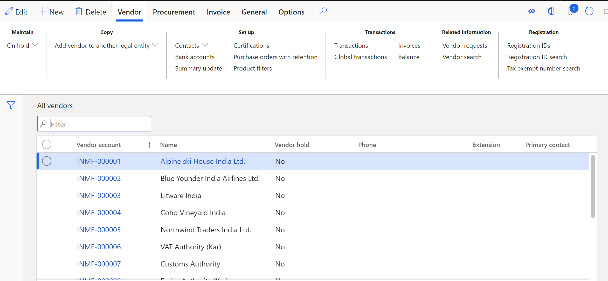
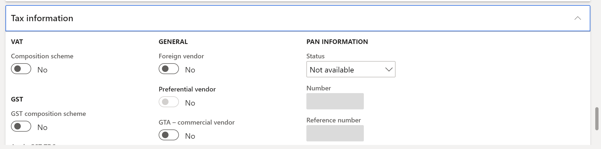

---
# required metadata

title: Set up TDS group, PAN, and TAN information for vendors and customers
description: This article explains how to set up information about the Tax Deducted at Source (TDS) group, permanent account number (PAN), and tax account number (TAN) for vendors and customers.
author: kailiang
ms.date: 02/12/2021
ms.topic: article
ms.prod: 

ms.technology: 

# optional metadata

ms.search.form: 
# ROBOTS: 
audience: Application User
# ms.devlang: 
ms.reviewer: kfend
# 
# ms.tgt_pltfrm: 
ms.assetid: b4b406fa-b772-44ec-8dd8-8eb818a921ef
ms.search.region: Global
# ms.search.industry: 
ms.author: kailiang
ms.search.validFrom: 2021-02-12
ms.dyn365.ops.version: AX 10.0.17

---

# TDS group, PAN, and TAN information setup for vendors and customers

[!include [banner](../includes/banner.md)]

This article explains how to set up information about the Tax Deducted at Source (TDS) group, permanent account number (PAN), and tax account number (TAN) for vendors and customers.

1. Go to **Accounts payable \> Vendors \> All vendors** or **Accounts receivable \> Customers \> All customers**.

    

2. On the Action Pane, select **New** to create a vendor or customer, and enter the required details. Alternatively, select an existing vendor or customer.
3. On the **Invoice and delivery** FastTab, in the **Withholding tax** section, set the **Calculate withholding tax** option to **Yes** to calculate withholding tax, TDS, or Tax Collected at Source (TCS) for the vendor or customer.
4. TDS for a purchase invoice is calculated based on the default TDS group that is defined for the vendor or customer. In the **TDS group** field, select the default TDS group.

    > [!NOTE]
    > When you select a TDS group in the **TDS group** field, the **Withholding tax group** and **TCS group** fields become unavailable.

5. On the **Tax information** FastTab, in the **PAN information** section, in the **Status** field, select the status of the permanent account number for the vendor or customer:

    - **Not available** – The vendor or customer doesn't have a PAN.
    - **Received** – The vendor or customer has a PAN.
    - **Applied** – The vendor or customer has applied for a PAN.
    - **Invalid** – The vendor or customer has a PAN, but it isn't valid.

6. If you selected **Received** in the **Status** field to indicate that the vendor or customer has a PAN, enter the PAN in the **Number** field. The PAN must consist of five alphabetic characters, then four numeric characters, and then one alphabetic character. Here is an example: **ABCDE1260A**.
7. If you selected **Applied** in the **Status** field to indicate that the vendor or customer has applied for PAN, enter the reference number in the **Reference number** field.
8. In the **Nature of assessee** field, select the nature of assessee category that the vendor or customer belongs to:

    - Company
    - HUF
    - Firm
    - Individual
    - AOP
    - BOI
    - Local authority
    - Others

    

9. On the Action Pane, on the **Vendor** tab, in the **Registration** group, select **Registration IDs** to open the **Manage addresses** page.
10. On the **Manage addresses** page, on the **Tax information** FastTab, select **Add** or **Edit** to open the **Manage tax information** page, where you can maintain the tax registration entry.
11. On the **Manage tax information** page, on the **Withholding tax** FastTab, in the **Tax Account Number (TAN)** field, enter the TAN. The TAN must consist of four alphabetic characters, then five numeric characters, and then one alphabetic character. Here is an example: **AFGH54821T**.
12. Close the page.
