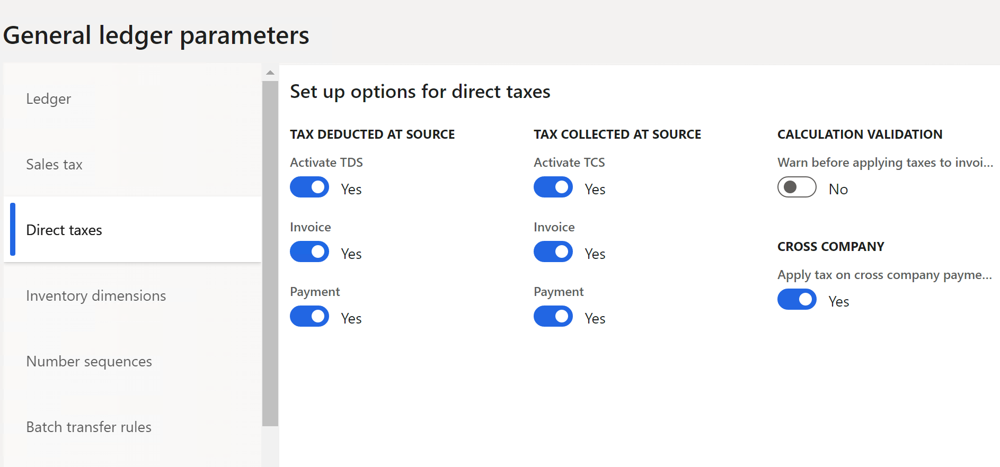
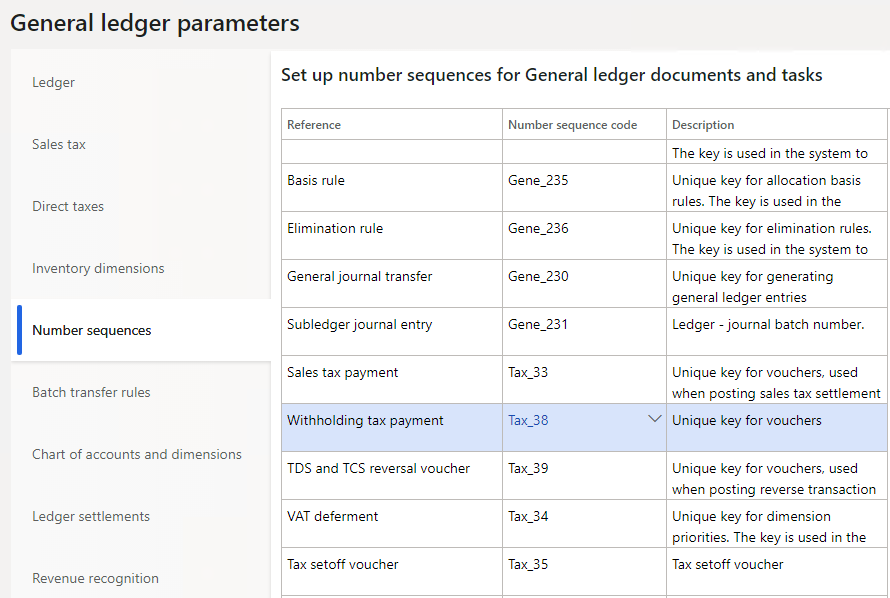

---
# required metadata

title: Set the TDS parameters
description: This topic explains how to set parameters to activate Tax Deducted at Source (TDS) functionality in specified transactions. This is a necessary step to use the Tax Deducted at Source TDS feature.
author: kailiang
manager: AnnBe
ms.date: 02/12/2021
ms.topic: article
ms.prod: 
ms.service: dynamics-ax-applications
ms.technology: 

# optional metadata

ms.search.form: 
# ROBOTS: 
audience: Application User
# ms.devlang: 
ms.reviewer: roschlom
# ms.search.scope: Core, Operations
# ms.tgt_pltfrm: 
ms.custom: 15721
ms.assetid: b4b406fa-b772-44ec-8dd8-8eb818a921ef
ms.search.region: Global
# ms.search.industry: 
ms.author: kailiang
ms.search.validFrom: 2021-02-12
ms.dyn365.ops.version: AX 10.0.17

---
# Set the TDS parameters

[!include [banner](../includes/banner.md)]

This topic explains how to set parameters to activate Tax Deducted at Source (TDS) functionality in specified transactions. This is a necessary step to use the Tax Deducted at Source TDS feature.

1. Go to **General ledger \> Ledger setup \> General ledger parameters**.
2. On the **Direct taxes** tab, in the **Tax Deducted at Source** section, set the **Activate TDS** option to **Yes** to activate the TDS functionality, and the pages and fields that are used for it.
3. Set the **Invoice** option to **Yes** to activate the fields that are used to calculate and deduct TDS at the invoice level.
4. Set the **Payment** option to **Yes** to activate the fields that are used to calculate and deduct TDS at the payment level.
5. In the **Overlook threshold** section, in the **Exceeding threshold limit** field, select the type of message that is shown if the cumulative transaction amount exceeds the threshold for the first time when the **Overlook threshold** check box is selected for the TDS component that is attached to the withholding tax group. The following options are available:

    - **None** – No message is shown.
    - **Error** – An error message is shown, and the transaction can't be posted.
    - **Warning** – A warning message is shown. In the message box, select **Yes** to calculate TDS on the selected transaction amount. Select **No** to cancel the posting and calculation of TDS.

        > [!NOTE]
        > If you select **No**, the transaction can be posted only when the **Overlook threshold** check box is cleared for the TDS component that is attached to the withholding tax group. TDS will be calculated for the selected transaction together with all transactions that TDS wasn't previously deducted for.

    

6. On the **Number sequences** tab, find the row where the **Reference** field is set to **Withholding tax payment**. In the **Number sequence code** field for the row, select the number sequence code. The number sequence code is used to generate voucher numbers for the periodic TDS settlement process.

    > [!NOTE]
    > To run the periodic TDS settlement process, go to **Tax \> Declarations \> Withholding tax \> Withholding tax payment**.

    

7. Close the page.
