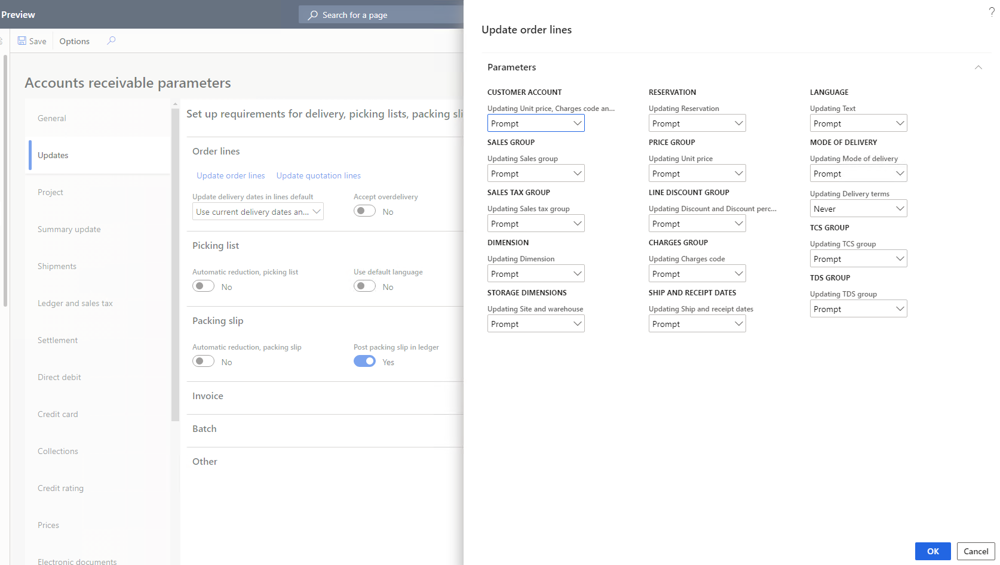
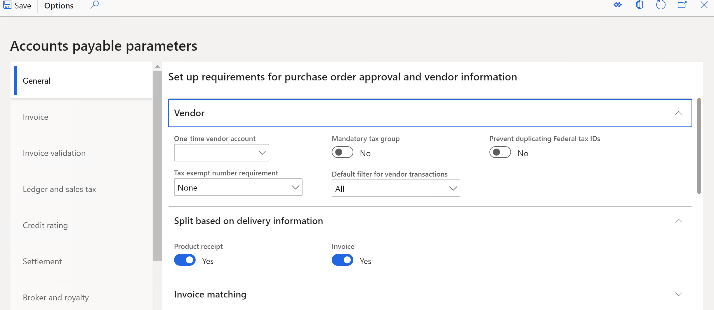

---
# required metadata

title: Set TDS parameters in Accounts payable and Accounts receivable
description: This article explains how to set parameters in Accounts payable and Accounts receivable to support Tax Deducted at Source (TDS) deductions.
author: kailiang
ms.date: 02/12/2021
ms.topic: article
ms.prod: 

ms.technology: 

# optional metadata

ms.search.form: 
# ROBOTS: 
audience: Application User
# ms.devlang: 
ms.reviewer: kfend
# 
# ms.tgt_pltfrm: 
ms.assetid: b4b406fa-b772-44ec-8dd8-8eb818a921ef
ms.search.region: Global
# ms.search.industry: 
ms.author: kailiang
ms.search.validFrom: 2021-02-12
ms.dyn365.ops.version: AX 10.0.17

---

# Set TDS parameters in Accounts payable and Accounts receivable

[!include [banner](../includes/banner.md)]

This article explains how to set parameters in Accounts payable and Accounts receivable to support Tax Deducted at Source (TDS) deductions.

1. Go to **Tax \> Setup \> Parameters \> Accounts receivable parameters**.
2. On the **Updates** tab, select **Update order lines** to open the **Update order lines** dialog box.
3. In the **TDS group** section, in the **Updating TDS group** field, specify the method to use to update the TDS group at the line level. This setting is used when the TDS group is updated on an order header. The following options are available:

    - **Never** – The TDS group isn't updated on the order lines when it's updated on the order header.
    - **Always** – The TDS group is automatically updated on the order lines when it's updated on the order header.
    - **Prompt** – Users receive a message that prompts them to update the TDS group on the order lines.
4. Select **OK**.

    

5. Go to **Tax \> Setup \> Parameters \> Accounts payable parameters**.
6. On the **General** tab, on the **Split based on delivery information** FastTab, set the **Product receipt** option to **Yes** to post and split a product receipt that has different delivery addresses and tax account numbers (TANs). If this option is set to **No**, you can't post a purchase packing slip that has different delivery addresses and TANs.
7. Set the **Invoice** option to **Yes** to post and split a purchase invoice that has different delivery addresses and TANs.

    

8. Close the page.
