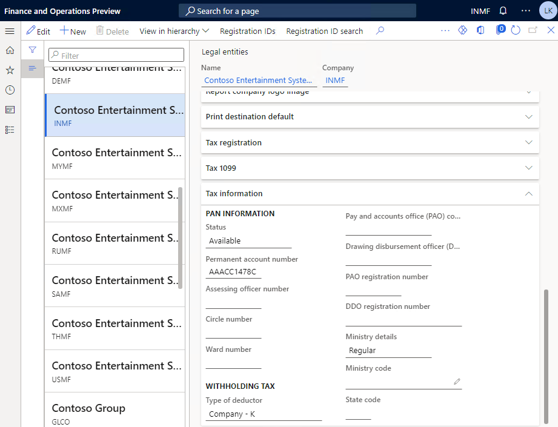
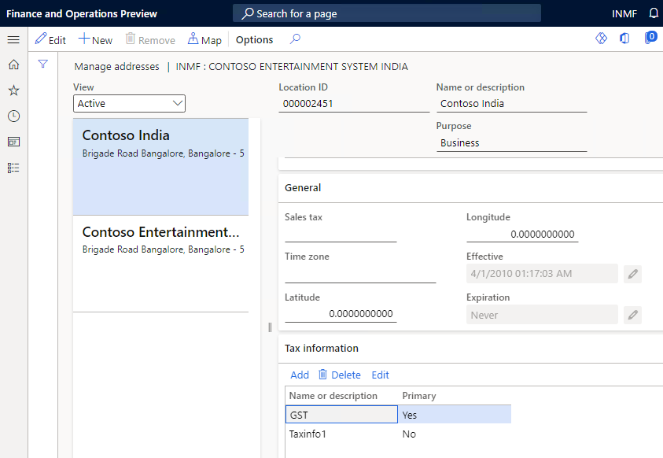
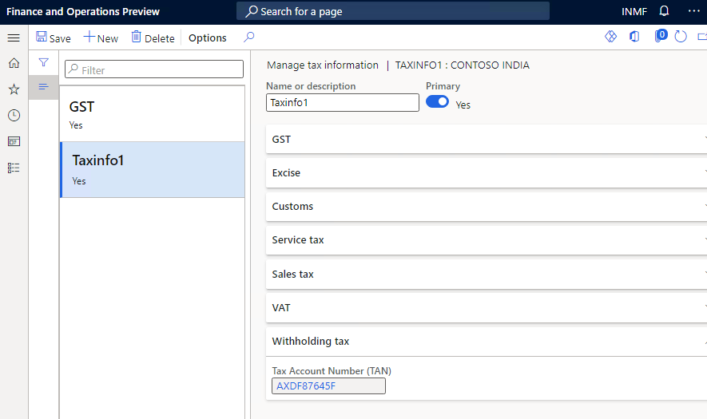

---
# required metadata

title: Set up TDS registration numbers for legal entities
description: This article explains how to set up Tax Deducted at Source (TDS) registration numbers for legal entities.
author: kailiang
ms.date: 02/12/2021
ms.topic: article
ms.prod: 

ms.technology: 

# optional metadata

ms.search.form: 
# ROBOTS: 
audience: Application User
# ms.devlang: 
ms.reviewer: kfend
# 
# ms.tgt_pltfrm: 
ms.assetid: b4b406fa-b772-44ec-8dd8-8eb818a921ef
ms.search.region: Global
# ms.search.industry: 
ms.author: kailiang
ms.search.validFrom: 2021-02-12
ms.dyn365.ops.version: AX 10.0.17

---
# Set up TDS registration numbers for legal entities

[!include [banner](../includes/banner.md)]

This article explains how to set up Tax Deducted at Source (TDS) registration numbers for legal entities.

1. Go to **Organization administration \> Organizations \> Legal entities**.

    

2. On the **Tax information** FastTab, in the **Permanent account number** field, enter the permanent account number (PAN) of the legal entity.
3. In the **Circle number** field, enter the circle number of the TDS authority.
4. In the **Ward number** field, enter the ward number of the TDS authority.
5. In the **Assessing officer** field, enter the details of the assessing officer for the TDS authority.
6. In the **Type of deductor** field, select the deductor type category for the legal entity.
7. On the Action Pane, select **Registration IDs** to open the **Manage addresses** page.
8. On the **Tax information** FastTab, select **Add** or **Edit** to open the **Manage tax information** page, where you can maintain the tax registration entry.

    

9. On the **Withholding tax** FastTab, in the **Tax Account Number (TAN)** field, enter the registration number. This number must consist of four alphabetic characters, then five numeric characters, and then one alphabetic character. Here is an example: **AXDF87645F**.
10. In the **Name or description** field, enter a description of the withholding tax registration number.

    

11. Close the page.
