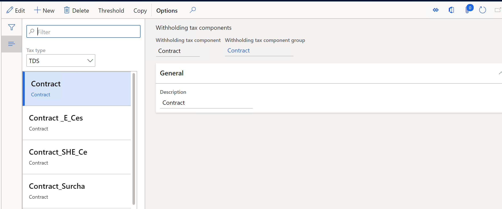
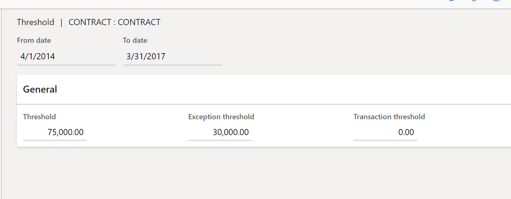
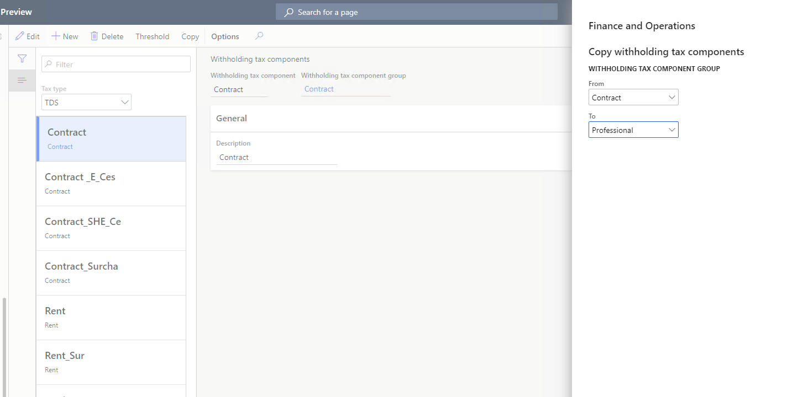

---
# required metadata

title: Set up tax components for the TDS tax type
description: This article explains how to set up withholding tax components for the Tax Deducted at Source (TDS) tax type. It also explains how to define the threshold limit that is used to calculate TDS for each TDS component.
author: kailiang
ms.date: 02/12/2021
ms.topic: article
ms.prod: 

ms.technology: 

# optional metadata

ms.search.form: 
# ROBOTS: 
audience: Application User
# ms.devlang: 
ms.reviewer: kfend
# 
# ms.tgt_pltfrm: 
ms.assetid: b4b406fa-b772-44ec-8dd8-8eb818a921ef
ms.search.region: Global
# ms.search.industry: 
ms.author: kailiang
ms.search.validFrom: 2021-02-12
ms.dyn365.ops.version: AX 10.0.17

---
# Set up tax components for the TDS tax type

[!include [banner](../includes/banner.md)]

This article explains how to set up withholding tax components for the Tax Deducted at Source (TDS) tax type. The TDS components are TDS, surcharge, PE-Cess, and SHE Cess. This article also explains how to define the threshold that is used to calculate TDS for each TDS component. Additionally, you can define an exception threshold that is used to calculate TDS for each TDS component.

Follow these steps to set up TDS components.

1. Go to **Tax \> Setup \> Withholding tax \> Withholding tax components**.

    

2. In the **Tax type** field, select **TDS** to set up withholding tax components for the TDS tax type.
3. On the Action Pane, select **New** to create a line.
4. In the **Withholding tax component** field, enter a name for the TDS component.
5. In the **Withholding tax component group** field, select the TDS withholding tax component group to attach the TDS component to.
6. On the **General** FastTab, in the **Description** field, enter a description of  the TDS component.
7. On the Action Pane, select **Threshold** to open **Threshold** page, so that you can define the threshold that is used to calculate TDS for the TDS component.
8. Use the **From date** and **To date** fields to define the period that the threshold is applicable to.
9. On the **General** FastTab, in the **Threshold** field, enter the threshold amount that is used to calculate TDS for the TDS component. The tax will be deducted at the source only when the cumulative invoice amount crosses the threshold.

    For example, if the threshold amount is 10,000, TDS is calculated after the cumulative invoice amount exceeds 10,000 (in other words, when it's 10,001 or more).

10. In the **Exception threshold** field, enter the exception threshold amount that is used to calculate TDS for the TDS component. The tax on an invoice line will be deducted at the source only when the amount crosses the exception threshold.

    For example, if the exception threshold amount is 5,000, TDS is calculated on a specific invoice line if the invoice line amount exceeds 5,000 (in other words, if it's 5,001 or more).

    

    > [!NOTE]
    > The exception threshold amount must be less than or equal to the threshold amount.
    >
    > The tax is deducted for a transaction if the transaction amount crosses the exception threshold, even if the cumulative invoice amount doesn't cross the threshold that is specified in the **Threshold** field.

11. Close the **Threshold** page to return to the **Withholding tax components** page.
12. On the Action Pane, select **Copy** to open the **Copy withholding tax components** dialog box, so that you can copy the TDS components that were set up for one TDS component group to another TDS component group.
13. In the **From** field, select the TDS component group to copy the TDS components from. In the **To** field, select the withholding tax component group to copy the TDS components to.

    > [!NOTE]
    > Common TDS components that are attached to both TDS component groups aren't copied.

14. Select **OK** to copy and create TDS components for the other TDS component group on the **Withholding tax components** page.

    

15. Close the page.
