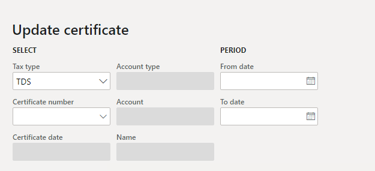
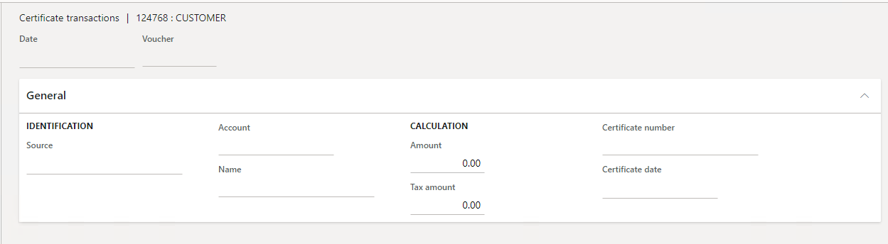

---
# required metadata

title: Update certificate numbers and dates for TDS transactions
description: This article explains how to update the recoverable certificate numbers and dates that were recorded for vendor, customer, and ledger accounts for Tax Deducted at Source (TDS).
author: kailiang
ms.date: 02/12/2021
ms.topic: article
ms.prod: 

ms.technology: 

# optional metadata

ms.search.form: 
# ROBOTS: 
audience: Application User
# ms.devlang: 
ms.reviewer: kfend
# 
# ms.tgt_pltfrm: 
ms.assetid: b4b406fa-b772-44ec-8dd8-8eb818a921ef
ms.search.region: Global
# ms.search.industry: 
ms.author: kailiang
ms.search.validFrom: 2021-02-12
ms.dyn365.ops.version: AX 10.0.17

---

# Update certificate numbers and dates for TDS transactions

[!include [banner](../includes/banner.md)]

This article explains how to update the recoverable certificate numbers and dates that were recorded for vendor, customer, and ledger accounts for Tax Deducted at Source (TDS). You can view the certificates for TDS transactions on the **Recoverable certificates** page. You can update the certificates by using the **Update Certificates** page.

Follow these steps to update certificate numbers and dates for TDS transactions.

1. Go to **Tax \> Declarations \> Withholding tax \> Update certificate**.

    

2. On the **Update certificate** page, in the **Select** section, in the **Tax type** field, select **TDS**.
3. In the **Certificate number** field, select the customer's or vendor's TDS certificate number.

    > [!NOTE]
    > The **Certificate number** field lists only TDS certificate numbers that the **Closed** check box is cleared for on the **Recoverable certificates** page.

    The **Certificate date** field shows the certificate date. The **Account type** field shows the type of account that the TDS certificate number is received for, and the **Name** field shows the name of the account.

5. In the **From date** and **To date** fields, select the start and end dates of the period to show the TDS transactions for.
6. Select **Show data** to view the TDS transactions that were posted during the selected period.

    On the **Overview** tab, the grid in the upper pane shows the following information about each TDS transaction that was posted for the vendor or customer during the selected period:

    - **Voucher** – The voucher number of the TDS transaction.
    - **Date** – The date of the TDS transaction.
    - **Amount** – The invoice amount that the TDS was calculated on.
    - **Tax amount** – The TDS tax amount that was calculated for the transaction.

7. To move specific TDS transactions from the upper grid to the lower grid, select the transactions, and then select **Include**. Alternatively, select **Include all** to move all TDS transactions from the upper grid to the lower grid.

    To move specific TDS transactions or all TDS transactions from the lower grid to the upper grid, use the **Exclude** or **Exclude all** button.

8. Select **Update** to update the **Certificate number** and **Certificate date** fields for TDS transactions in the lower grid.
10. Go to **Tax \> Indirect taxes \> Withholding tax \> Recoverable certificate**, and select **Inquiry** to view the updated transaction lines that have the new certificate numbers on the **Certificate transactions** page.

    
