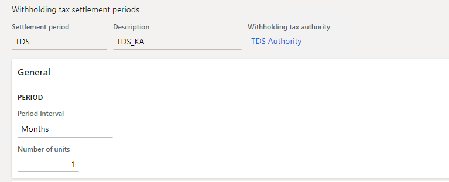

---
# required metadata

title: View posted TDS payments and transactions for a TDS settlement period
description: This article explains how to view the Tax Deducted at Source (TDS) payments and transactions that were posted for a settlement period.
author: kailiang
ms.date: 03/12/2021
ms.topic: article
ms.prod: 

ms.technology: 

# optional metadata

ms.search.form: 
# ROBOTS: 
audience: Application User
# ms.devlang: 
ms.reviewer: kfend
# 
# ms.tgt_pltfrm: 
ms.assetid: b4b406fa-b772-44ec-8dd8-8eb818a921ef
ms.search.region: Global
# ms.search.industry: 
ms.author: kailiang
ms.search.validFrom: 2021-02-12
ms.dyn365.ops.version: AX 10.0.17

---

# View posted TDS payments and transactions for a TDS settlement period

[!include [banner](../includes/banner.md)]

This article explains how to view the Tax Deducted at Source (TDS) payments and transactions that were posted for a settlement period.

1. Go to **Tax \> Indirect taxes \> Withholding tax \> Withholding tax settlement periods**.

    

2. On the **Withholding tax settlement periods** page, select **Withholding tax payments** to open the **Withholding tax payments** page, where you can view the TDS settlements that were made for a specific TDS settlement period.

    The **Overview** tab shows the following information:

    - **Date** – The date of TDS settlement.
    - **Voucher** – The voucher number of the TDS settlement transaction.
    - **Tax type** – The tax type that the settlement process is run for.
    - **Tax Account Number (TAN)** – The Tax Account Number (TAN) of the settled TDS transaction.
    - **Settlement period** – The settlement period that the TDS settlement process is run for.
    - **From date** – The start date of the settlement period.
    - **To date** – The end date of the settlement period.
    - **Withholding tax payment version** – The version of the withholding tax payment: **Original**, **Latest corrections**, or **Total list**.

5. Select **Voucher** to view the voucher entries for the TDS transaction.
6. Select **Withholding tax transactions** to view the details of the TDS transactions that were settled for a specific period during a settlement period. Select **Voucher** to view the voucher entries for the TDS transaction. Select **Withholding tax components** to view the TDS that was calculated per TDS tax component for a specific TDS tax code.
7. Close the **Withholding tax payments** page to return to the **Withholding tax settlement periods** page.
8. Select **Withholding tax transactions** to view the details of the TDS transactions that were settled for the settlement period.
