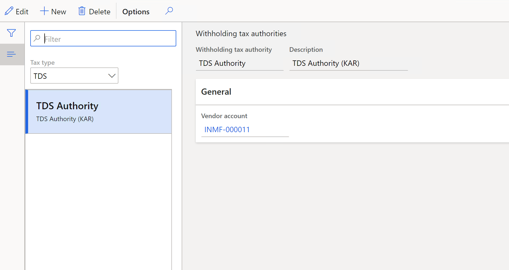

# Withholding tax authorities setup for TDS tax type

Follow these steps to set up TDS authorities.

Go to **Tax > Indirect Taxes > Withholding tax authorities**

1. In the **Tax** **type** field, select the **TDS** option to set up withholding tax authorities for TDS tax type.

2. Click **New** to create a new line. In the **Withholding** **tax** **authority** field, enter a name for the TDS authority. In the **Description** field, enter a description for the TDS authority.

3. In the **Vendor** **account** field, select the TDS authority vendor account. 

>   [!Note]
>
>   The bank name to deposit the TDS  amount that is payable to the TDS authority vendor must be defined in accounts payable > vendors > setup button > bank accounts.   

4. Close the form.