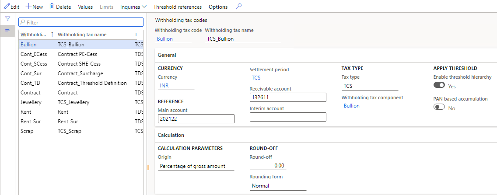

---
# required metadata

title: Set up withholding tax codes for the TDS tax type
description: This article explains how to set up tax codes for Tax Deducted at Source (TDS).
author: kailiang
ms.date: 02/12/2021
ms.topic: article
ms.prod: 

ms.technology: 

# optional metadata

ms.search.form: 
# ROBOTS: 
audience: Application User
# ms.devlang: 
ms.reviewer: kfend
# 
# ms.tgt_pltfrm: 
ms.assetid: b4b406fa-b772-44ec-8dd8-8eb818a921ef
ms.search.region: Global
# ms.search.industry: 
ms.author: kailiang
ms.search.validFrom: 2021-02-12
ms.dyn365.ops.version: AX 10.0.17

---

# Set up withholding tax codes for the TDS tax type

[!include [banner](../includes/banner.md)]

This article explains how to set up tax codes for Tax Deducted at Source (TDS).

1. Go to **Tax \> Indirect taxes \> Withholding tax \> Withholding tax codes**.

    

2. On the Action Pane, select **New** to create a withholding tax code for TDS, and enter the required details.
3. On the **General** FastTab, in the **Tax type** field, select **TDS** to categorize the tax code as a TDS tax code.
4. In the **Settlement period** field, select the TDS settlement period for the TDS tax code.
5. In the **Main account** field, select the ledger account that the TDS amount should be posted to.
6. In the **Receivable account** field, select the receivable account that the TDS amount that is deducted in sales transactions should be posted to.

    The **Origin** field is automatically set to **Percentage of gross amount**, and the value can't be changed.

    > [!NOTE]
    > You can't set the origin to **Percentage of net amount** for tax codes of the TDS tax type.

7. In the **Withholding tax component** field, select the TDS tax component for the TDS tax code.
8. On the Action Pane, select **Values** to open the **Withholding tax values** page.
9. In the **From date** field, enter the start date for the TDS value. In the **To date** field, enter the end date.

    > [!NOTE]
    > The **Minimum limit**, **Upper limit**, and **Exclude %** fields aren't available for tax codes of the TDS tax type.

10. In the **Value** field, enter the percentage of TDS for the TDS tax code.
11. Close the **Withholding tax values** page to return to the **Withholding tax codes** page.

    > [!NOTE]
    > The **Limits** button on the **Withholding tax codes** page isn't available for tax codes of the TDS tax type.

12. Close the page.
