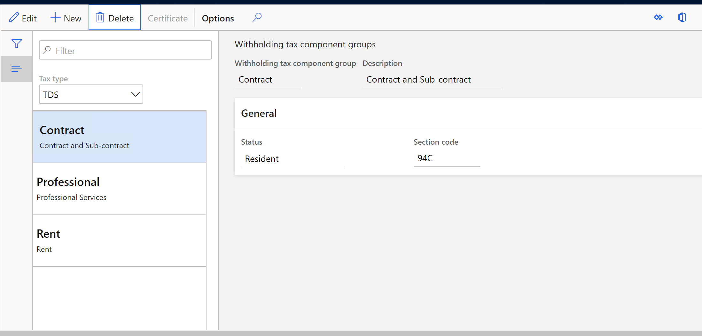

---
# required metadata

title: Set up withholding tax component groups for the TDS tax type
description: This article explains how to set up withholding tax component groups, such as Rent and Contractor, for the Tax Deducted at Source (TDS) tax type.
author: kailiang
ms.date: 02/12/2021
ms.topic: article
ms.prod: 

ms.technology: 

# optional metadata

ms.search.form: 
# ROBOTS: 
audience: Application User
# ms.devlang: 
ms.reviewer: kfend
# 
# ms.tgt_pltfrm: 
ms.assetid: b4b406fa-b772-44ec-8dd8-8eb818a921ef
ms.search.region: Global
# ms.search.industry: 
ms.author: kailiang
ms.search.validFrom: 2021-02-12
ms.dyn365.ops.version: AX 10.0.17

---
# Set up withholding tax component groups for the TDS tax type

[!include [banner](../includes/banner.md)]

This article explains how to set up withholding tax component groups, such as **Rent** and **Contractor**, for the Tax Deducted at Source (TDS) tax type.

1. Go to **Tax \> Setup \> Withholding tax \> Withholding tax component groups**.

    

2. In the **Tax type** field, select **TDS** to set up withholding tax component groups for the TDS tax type.
3. On the Action Pane, select **New** to create a line.
4. In the **Withholding tax component group** field, enter a name for the TDS component group.
5. In the **Description** field, enter a description.
6. On the **General** FastTab, in the **Status** field, select the residential status of the TDS component group. The options are **Resident** and **Non-resident**.
7. In the **Section code** field, enter the section code that is applied to the TDS component group.
8. Close the page.
