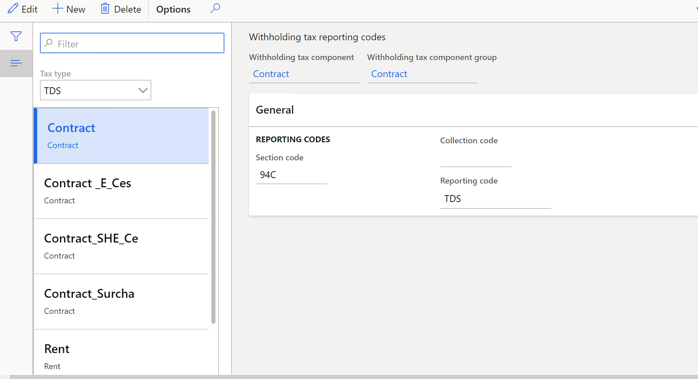

# Withholding tax reporting codes setup for TDS tax type

Set up withholding tax reporting codes to generate the Form 26Q and Form 27Q statements for TDS. Follow these steps to set up TDS reporting codes.

Go to **Tax > Setup > Withholding tax > Withholding tax reporting codes**

1. In the **Tax** **type** field, select the **TDS** option to define withholding tax reporting codes for TDS tax type.

2. In the **Withholding** **tax** **component** field, select the TDS component to define the withholding tax reporting code for. In the **Withholding** **tax** **component** **group** field, the TDS component group defined for the TDS component is displayed.

3. In the **Section** **code** field, the section code attached to the TDS component group is displayed.

4. In the **Reporting** **code** field, select the TDS reporting code from the following options.

- **TDS**

- **TCS**

- **Surcharge**

- **PE-Cess**

- **SHE Cess**

5. Close the form.
