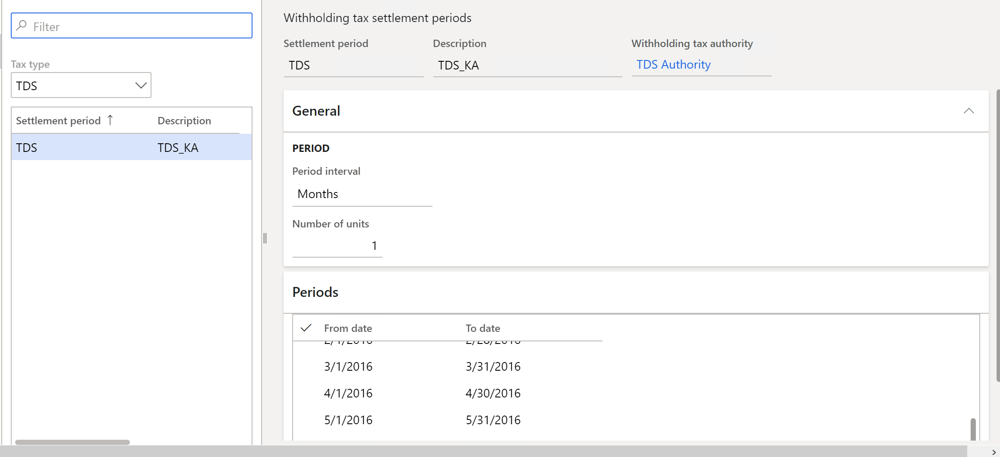
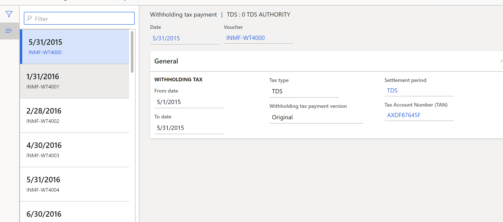

---
# required metadata

title: Set up withholding tax settlement periods for the TDS tax type
description: This article explains how to set up settlement periods for Tax Deducted at Source (TDS) settlement periods.
author: kailiang
ms.date: 02/12/2021
ms.topic: article
ms.prod: 

ms.technology: 

# optional metadata

ms.search.form: 
# ROBOTS: 
audience: Application User
# ms.devlang: 
ms.reviewer: kfend
# 
# ms.tgt_pltfrm: 
ms.assetid: b4b406fa-b772-44ec-8dd8-8eb818a921ef
ms.search.region: Global
# ms.search.industry: 
ms.author: kailiang
ms.search.validFrom: 2021-02-12
ms.dyn365.ops.version: AX 10.0.17

---

# Set up withholding tax settlement periods for the TDS tax type

[!include [banner](../includes/banner.md)]

This article explains how to set up settlement periods for Tax Deducted at Source (TDS) settlement periods.

1. Go to **Tax \> Indirect taxes \> Withholding tax \> Withholding tax settlement periods**.

    

2. In the **Tax type** field, select **TDS** to set up withholding tax settlement periods for the TDS tax type.
3. Select **New** to create a line.
4. In the **Settlement period** field, enter a name for the TDS settlement period.
5. In the **Description** field, enter a description.
6. In the **Withholding tax authority** field, select the TDS authority that you're defining the TDS settlement period for.
7. On the **General** FastTab, in the **Period interval** field, select the type of period interval for the TDS settlement period.
8. In the **Number of units** field, specify the number of units for the period interval type.
9. On the **Periods** FastTab, in the **From date** field, select the start date for the TDS settlement period. In the **To date** field, select the end date.
10. To create a subsequent TDS settlement period for an existing period, based on the period interval and period units, select **New period**.
11. To view the details of the periodic TDS settlement that is run for a specific settlement period, select **Withholding tax payments** to open the **Withholding tax payment** page.

    > [!NOTE]
    > To run the periodic TDS settlement process, go to **General ledger \> Periodic \> Withholding tax \> Withholding tax payment**.

    

12. Close the page.
