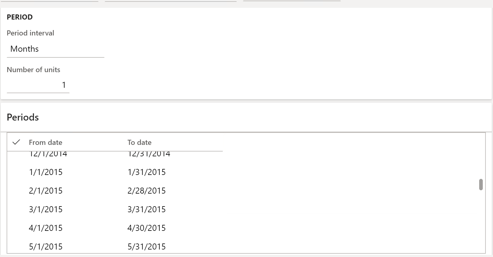

---
# required metadata

title: Withholding tax settlement periods setup for TDS tax type
description: This topic lists the steps for setting up settlement periods for Tax Deducted at Source (TDS) settlement periods.
author: kailiang
manager: AnnBe
ms.date: 02/12/2021
ms.topic: article
ms.prod: 
ms.service: dynamics-ax-applications
ms.technology: 

# optional metadata

ms.search.form: 
# ROBOTS: 
audience: Application User
# ms.devlang: 
ms.reviewer: roschlom
# ms.search.scope: Core, Operations
# ms.tgt_pltfrm: 
ms.custom: 15721
ms.assetid: b4b406fa-b772-44ec-8dd8-8eb818a921ef
ms.search.region: Global
# ms.search.industry: 
ms.author: kailiang
ms.search.validFrom: 2021-02-12
ms.dyn365.ops.version: AX 10.0.17

---

# Withholding tax settlement periods setup for TDS tax type

This topic lists the steps for setting up settlement periods for Tax Deducted at Source (TDS) settlement periods.

Begin by opening the **Withholding tax settlement periods** page (**Tax > Indirect Taxes > Withholding tax > Withholding tax settlement periods**).

 

1. In the **Tax type** field, select the **TDS** option to set up withholding tax settlement periods for TDS tax type.

2. On the **Overview** tab, press **CTRL+N** to create a new line. In the **Settlement period** field, enter a name for the TDS settlement period.

3. In the **Description** field, enter a description for the TDS settlement period.

4. In the **Withholding tax authority** field, select the TDS authority to define the TDS settlement period for.

5. In the **Period interval** field, select the type of period interval for the TDS settlement period. In the **Number of units** field, specify the number of units for the period interval type.

6. Click the **Periods** tab. In the **From date** field and **To date** field, select the starting and ending date for the TDS settlement period.

 

7. Click the **New period** button to create a subsequent TDS settlement period for an existing period based on the period interval and period units.

8. Click the **Withholding tax payments** button to view details of the periodic TDS settlement that's run for a specific settlement period. 

>   [!Note]
>   You can run the periodic TDS settlement process in general ledger > periodic > withholding tax > withholding  tax payment.  

9. Close the page.
