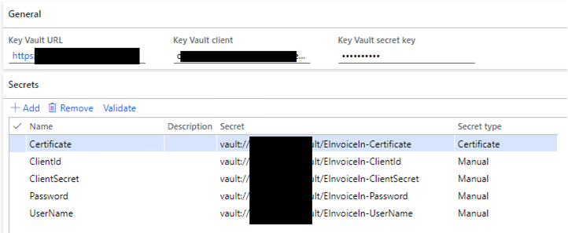

---
# required metadata

title: Electronic invoices in India
description: This topic explains how to set up and submit electronic invoices and e-Way Bill information in India.
author: lnesterov
ms.date: 04/20/2022
ms.topic: article
ms.prod: 
ms.technology: 

# optional metadata

ms.search.form: 
audience: Application User
# ms.devlang: 
ms.reviewer: kfend
# ms.tgt_pltfrm: 
# ms.custom: 
ms.search.region: India
# ms.search.industry: 
ms.author: lnesterov
ms.search.validFrom: 
ms.dyn365.ops.version: 
---

# Electronic invoices in India

An electronic invoice is a legally accepted digital tax receipt document that your organization registers at the Invoice Registration Portal (IRP). 
The obligation and applicability of using electronic invoices depends on the annual turnover. The minimum applicable threshold is determined by the legislation. Depending on this turnover, some companies might not be able to access the IRP portal directly and must use additional options like integrating with GST Service Providers (GSP). As a part of electronic invoice registration, registering e-Way Bill at the IRP portal is supported.

By using Dynamics 365 Finance to generate electronic invoices, you make sure that the electronic invoices your organization generates are secure, confidential, authentic, and legally acceptable. You can also make sure that required standards are applied to your electronic invoices.
As an alternative integration option, for example when the GSP integration is expected to be used, the applicable invoices details can be exchanged through the file export and import options.

## Setting up electronic invoices
### Feature activation
1. Go to **System administration** > **Workspaces** > **Feature management**.
2. In the list, find and select the feature, **(India) Electronic invoice under GST**.
3. Select **Enable** to activate the feature. For more information about feature management and the available options, see [Feature management overview](../../fin-ops-core/fin-ops/get-started/feature-management/feature-management-overview.md).

### Import Electronic reporting (ER) configurations
To prepare Finance to interoperate with the IRP system, import the latest versions of the ER configurations listed below. For more information, see [(ER) Import configurations from RCS](../../fin-ops-core/dev-itpro/analytics/tasks/import-configuration-rcs.md).

- Invoice model
- Invoice model mapping (IN)
- GST Invoice format (IN)
- Electronic messages framework model
- eInvoice model mapping
- eInvoice format (IN)
- eInvoice authentication import format (IN)
- eInvoice data import format (IN)

After you import the configurations, set **Default for model mapping** to **Yes** for the **eInvoice model mapping** configuration.

> [!NOTE]
> When you import from the Global Repo or Lifecycle Services (LCS), you only need to import format configurations. Related model and model mapping configurations are automatically imported. Ensure that you import the latest configuration versions available.

### Set up Electronic messaging (EM) functionality
Electronic message functionality is provided to maintain the different processes that are used in electronic reporting and the transmission of different document types. For more information about electronic messages, see [Electronic messaging](../general-ledger/electronic-messaging.md).
The most important step in setting up Electronic messaging functionality for IRP integration is to import the provided Indian IRP integration setup V5.zip data package. After you have successfully imported the setup data, almost all of the required setup will be created automatically. The only remaining required setup will be to select parameters for executable classes and set up number sequences for Electronic messaging. Those tasks are described in this topic.

> [!NOTE]
> We recommend that you only apply the latest version of the data package available at LCS.

#### Import a package of data entities that include a predefined EM setup
The process of setting up the electronic message functionality to interoperate with the IRP system has multiple steps. Because the names of some predefined entities are used in the ER configurations, use the set of pre-defined values that are included in a package of data entities for the related tables. Import the ER configurations before you import the data entities.

1. In LCS, go to the Shared asset library, and select the **Data package** asset type.
2. In the list of data package files, find and download **Indian IRP integration setup V5.zip**.
3. After the file is downloaded, open Finance, and select the company that you will interoperate with the IRP system from.
4. Go to **Workspaces** > **Data management**.
5. In the **Data management** workspace, go to **Framework parameters** > **Entity settings**, and select **Refresh entity list**. Wait for confirmation that the refresh has been completed. For more information about how to refresh the entity list, see [Entity list refresh](../../fin-ops-core/dev-itpro/data-entities/data-entities.md#entity-list-refresh).
6. Validate that the source data and target data are correctly mapped. For more information, see Validate that the source data and target data are mapped correctly.
7. Before the data entities are used to import the data from the package, sync the mapping of the source data and target data. In the package list, select a data entity, and on the Action Pane, select **Modify target mapping**.
8. Above the grid for the package, select **Generate mapping** to create a mapping from scratch, and then save the mapping.
9. Repeat steps 7 and 8 for every data entity in the package before you start the import. For more information about data management, see [Data management overview](../../fin-ops-core/dev-itpro/data-entities/data-entities-data-packages.md).
10. Next, you will import data from the Indian IRP integration setup V5.zip file into the selected company. In the **Data management** workspace, select **Import**, specify a group name, select **Add file**, and then, in the drop-down dialog box, set the **Source data format** field to **Package**.
11. Select **Upload and add**, select the **Indian IRP integration setup V5.zip** file on your computer, and upload it.
12. After the data entities are uploaded, on the Action Pane, select **Import**.

You will receive a notification in Action center, or you can manually refresh the page to view the progress of the data import. When the import is complete, the **Execution summary** page shows the results.

After the data entities are imported, the following types of electronic message processing are available. This processing contains almost all the setup that is required in your legal entity.

- **OnlineInvoicing** - Indian online invoicing. This processing supports interoperation with the IRP system to submit information about sales, free text, project customer invoices, and transfer orders. IRP responses are parsed to obtain and save the Invoice Registration Number (IRN) and signed QR code.
- **CancelInvoice** - Indian online invoicing. This processing supports interoperation with the IRP system to cancel previously registered customer invoices.
- **RegisterEWB** - Register e-Way Bill. This process supports interoperation with the system to submit information with e-Way Bill details. As a result, the e-Way Bill status and other details such as the e-Way Bill number and date are updated.
- **CancelEWB** - Cancel e-Way Bill. This processing supports interoperation with the system to cancel previously registered e-Way Bills.

To review the imported processing, go to **Tax** > **Setup** > **Electronic messages** > **Electronic message processing**.

#### Set up the integration internet addresses

1. Go to **Tax** > **Setup** > **Parameters** > **Electronic messages** > **Web service settings**.
2. Enter the following information to define the internet address for web services. Testing addresses applicable for the Sandbox environment are presented below.

    - Authentication - https://einv-apisandbox.nic.in/eivital/v1.04/auth
    - Generate IRN - https://einv-apisandbox.nic.in/eicore/v1.04/Invoice
    - Cancel IRN - https://einv-apisandbox.nic.in/eicore/v1.04/Invoice/Cancel
    - Generate WEB - https://einv-apisandbox.nic.in/eiewb/v1.04/ewaybill
    - Cancel EWB - https://einv-apisandbox.nic.in/ewaybillapi/v1.04/ewayapi
  
  > [!NOTE]
  > Internet addresses are subject to change by the National Informatics Centre (NIC). We recommend that you check for actual internet addresses on the official website of the e-Invoice System or other appropriate sources. The official documentation also has information about the available production internet addresses that you should set up.
 
3. On the **Request** parameters, specify the same set of values for all the above web services:

	| Parameter | Value |
	|-----------|-------|
	| Successful response code | 200 |
	| Request method | POST |
	| Content type | Application/json |
	| Request headers format mapping | eInvoice format (IN) |

The IRP portal might have limitations on the number of IP addresses from which it can be accessed. To satisfy these requirements, select the **Use proxy server** checkbox and set up proxy server parameters, such as a Proxy server IP address, Proxy server port number, and Proxy authentication (stored in Key Vault).

#### Set up additional fields  

EM items have additional fields that are included in the Indian Online Invoicing type of electronic message processing (OnlineInvoicing) that is used to interoperate with the IRP system and imported into the system by using a package of data entities. Additional fields are associated with EM items and are required for their processing. The system automatically sets values for additional fields when actions are run. IRP integration uses only one additional field. 

If no additional fields were imported from the data package, complete the following steps. 

1. Go to **Tax** > **Setup** > **Electronic messages** > **Additional fields**.
2. On the **Additional fields** page, select **New** and enter the following field information:

   - **Field name** - AppKey
   - **Description** - Unique ID
   - Enter the identifying unique user session

#### Set up executable class parameters
To finalize the Electronic messages setup after importing the data package, complete the following steps.

1. Go to **Tax** > **Setup** > **Electronic messages** > **Executable class setting**.
2. Select **Generate EM**.
3. On the Action Pane, select **Parameters** and in the dialog box, set the following values for the parameters of the executable class.

    - Format mapping - GST Invoice format (IN)
    - Message status in case of success - Generated
    - Message item status in case of technical error - Created

### Set up number sequences for electronic messages
To work with the Electronic messages functionality, you must define related number sequences.

1. Go to **Tax** > **Setup** > **Parameters** > **General ledger parameters**.
2. On the **Number sequences** tab, set up two number sequences:

   - Message
   - Message item
   
### Set up batch settings for automated processing of interoperation with the IRP system

1. Go to **Tax** > **Setup** > **Electronic messages** > **Electronic message processing**.
2. Select a processing such as **OnlineInvoicing** or **CancelInvoice**.
3. On the **Batch** FastTab, select **Create batch**, and then define the required parameters.

### Set up security roles for electronic message processing
Different groups of users might require access to **OnlineInvoicing** and **CancelInvoice** processing. You can limit access to the processing based on security groups that are defined in the system.

To limit access to **OnlineInvoicing** and **CancelInvoice** processing, follow these steps.

1. Go to **Tax** > **Setup** > **Electronic messages** > **Electronic message processing**.
2. Select **OnlineInvoicing** or **CancelInvoice**, and then add the security groups that must work with that processing. If no security group is defined for the processing, only a system administrator can see the processing on the **Electronic messages** page.

### Set up certificates and secrets for the IRP system
To interoperate with the IRP system, you must use a security certificate that is provided by the operator as well as all the other secrets obtained from IRP during GSTIN registration process. There are two options for storing this sensitive data:

   - Azure Key Vault storage
   - Local storage (not recommended option for production environment
   
We recommend that you use Azure Key Vault storage. For more information about how to set up Key Vault, see [Set up the Azure Key Vault Client](setting-up-azure-key-vault-client.md).

> [!NOTE]
> If you follow the recommended setup and use Key Vault, all the secrets used, including User name, User password, Client ID, Client secret, and Certificate must be uploaded to and defined in the customer’s Key Vault storage prior to defining the Key Vault parameters.

Complete the following steps to enable using the Key Vault and advanced certificate storage.

1. Go to **System administration** > **Setup** > **System parameters**.
2. Set **Use advanced certificate store** to **No** to store sensitive data locally. Set the option to **Yes** to use Key Vault storage.
3. If you set **Use advanced certificate store** to **Yes**, go to **System administration** > **Setup** > **Key Vault parameters** to create up the Key Vault parameters.
4. Create a secret with reference to the custom Key Vault storage for each of five required secrets, User name, User password, Client ID, Client secret, and Certificate.

> [!NOTE]
> The .CER certificate must be stored in Azure Key Vault as a secret, not a certificate. Open your .CER file in any text editor and copy its entire content to a secret value in Key Vault.

### Set up electronic invoice parameters

Use the **Electronic invoice parameters** page to provide information for submitting invoices to IRP and to submit additional parameter information to control validations at invoice posting time. The following is a list of available options.

- **Validate before posting** - Enable additional validation against all mandatory information to be included in the electronic invoice at the invoice posting time.
- **Validation format** - The ER format used for validation against all required mandatory elements in the electronic invoice. This option is available only when **Validate before posting** is enabled.
- **GSTIN** - Your Goods and Services Taxpayer Identification Number, used for IRP integration.
- **User name** -  A reference to the Key Vault secret for your user name provided by NIC, used for IRP integration.
- **User password** - A reference to Key Vault secret for your user password provided by NIC, used for IRP integration.
- **Client ID** - A reference to Key Vault secret for your user Client ID provided by NIC, used for IRP integration.
- **Client secret** - A reference to Key Vault secret for your Client secret provided by NIC, used for IRP integration.
- **Certificate** - A reference to Key Vault secret for your Certificate provided by NIC, used for IRP integration.

### Set up unit of measure
Complete the following steps for each unit of measure that you use in electronic invoices to match allowed external codes.

1. Go to **Organization administration** > **Setup** > **Units** > **Units**.
2. Select one of units, such as **ea**, and then select **External codes**.
3. Enter a code for the unit, such as **EInv_IN** and then enter the external code definition.

   > [!NOTE]
   > The code will be used across all units of measure to identify the master data set of units of measure codes accepted by electronic invoicing.

4. Select the electronic invoicing unit external code you created and in the **Value** field, enter a value. For example **NOS**". The external codes are used as international trade units of measure codes recommended by technical specification.

### Set up HSN codes and products
For more information about how to set up HSN codes, see [Define HSN codes and Service Accounting Codes](apac-ind-gst-hsn-service-accounting-codes.md). The following steps illustrate the process of setting up the code and assigning it to the product.

**Define an HSN code**

1, Go to **Tax** > **Setup** > **Sales tax** > **India** > **HSN code**.
2. Create a record.
3. In the **Chapter** field, enter a value.
4. In the **Heading** field, enter a value.
5. In the **Subheading** field, enter a value.
6. In the **Country/region extension** field, enter a value.
7. In the **Statistical suffix** field, enter a value.
8. Save the record and verify that the **HSN code** field is updated.
9. In the **Description** field, enter a value.
10. Select **Close**.

**Assign HSN codes to products**

1. Go to **Product information management** > **Products** > **Released products**.
2. Select a product, and then select **Edit**.
3. On the **General** FastTab, if the product type is **Item**, select a value in the **HSN code** field.

### Set up tax registration numbers
Details on how to set up GSTIN master data can be found in the topic, [Create a GSTIN master](apac-ind-gst-create-gstin-master.md). The steps illustrate only the simplified process of setting up registration numbers to use in electronic invoicing.

1. Go to **Tax** > **Setup** > **Sales Tax** > **Enterprise tax registration**.
2. If you don't have any GSTIN type registration numbers, create a new record. Otherwise go to step 5.
3. In the **Tax type** field, select **GST** and in the **Registration number type** field, select **Company**.
4. Enter the registration number and save the data.
5. Expand the **eInvoice parameters** FastTab.
6. Enter the parameters used as credentials: User name, User password, Client ID, Client Secret, and Certificate. This setup is required when there are different GSTIN registrations are expected to be used for sending e-invoices. When only single reqistration is expected to be used in the company, this can only be specified on the **Electronic invoices parameters (India)** page.

    > [!NOTE]
    > The **eInvoice parameters** FastTab on the **Enterprise tax registration numbers** page is only available when all the following conditions are met: Tax type = GST, Type = GSTIN, Registration number type = Company, and the user has full access rights to the menu item which opens the **Electronic invoices parameters (India)** page. When you send an invoice for registration at IRP, the system is first trying to obtain parameters from Enterprise tax registration numbers for the seller GSTIN of the electronic invoice. If the settings aren't found, the system uses the parameters from the **Electronic invoices parameters (India)** page. These global parameters are used only when the GSTIN in these settings is the same as the seller GSTIN of the electronic invoice that is being sent. If global settings have a different GSTIN, it means that there were no credentials found that can be used for communication with IRP, and an error occurs.

7. Create a new record.
8. In the **Tax type** field, select **GST**, and in the **Registration number type** field, select **Customer**.
9. Enter the registration number and save the data.

### Set up your legal entity

1. Go to **Organization administration** > **Organizations** > **Legal entities**.
2. Expand the **Addresses** tab and select **Add** to create new address, or select **Edit** to update an existing primary address.
3. Enter or update the **ZIP**, **Street**, **City**, **District**, **State**, and **County** field information.

   > [!NOTE]
   > States should have state codes assigned under **Organization administration** > **Setup** > **Addresses** > **Address setup** on the **State/province** tab.

4. Close the **Edit addresses** page.
5. Select **Registration IDs**, and then select your primary address.
6. On the **Manage addresses** page, expand the **Tax information** FastTab.
7. Select **Add** and enter a name and desription.
8. In the **GSTIN/GDI/UID** field, select the company registration number you created.
9. Close the **Manage addresses** page.
10. On the **Legal entities** page, expand the **Contact information** FastTab to add information to the **Primary phone** and **Primary email** fields.

### Set up your customers

1. Go to **Accounts receivable** > **Customers** > **All customers** and open a customer record. 
2. Enter or edit the customer information required for electronic invoicing.

### Set up tax information

1. On the **Customers** page, expand the **Addresses** tab and select **Add** to create a new primary address, or select **Edit** to update an existing primary address.
2. Enter or update the **ZIP**, **Street**, **City**, **District**, **State**, and **County** field information.

    > [!NOTE]
    > States should have state codes assigned under **Organization administration** > **Setup** > **Addresses** > **Address setup** on the **State/province** tab.

3. Close the **Edit addresses** page.
4. Select **Registration IDs** and select your primary address.
5. On the **Manage addresses** page, expand the **Tax information** FastTab.
6. Select **Add** and enter a name and description.
7. In the **GSTIN/GDI/UID** field, select the customer registration number you created. 
8. Close the **Manage addresses** page.

### Set up contact information

1. On the **Customers** page, select **Contacts** to edit an existing contact or to create a new contact.
2. On the **Sales demographics** tab, select an existing primary contact.
3. Expand the **Contact information** FastTab to add the primary phone and primary email.

   > [!NOTE] 
   > Customer contact details might not be necessary for some versions of Finance.

### Enable a customer for electronic invoicing

1. On the **Customers** page, expand the **Invoice and delivery** FastTab.
2. Mark the **eInvoice** checkbox.

   > [!NOTE]
   > If this option is set to **Yes**, the system will mark invoices posted for this customer account as ready for electronic invoice processing.

### Set up e-Way Bill types for electronic sending
On the **e-way Bill types** page, create a new record or select an existing record and set the parameter **Can be sent electronically** to **Yes** to confirm that the type used is marked as the one applicable for e-invoice and e-Way Bill integration.

## Working with electronic invoices
EM functionality runs actions that are included in the processing groups, based on the status of messages and message items. This could be processed either by the periodic batch job or activated manually.

### Register electronic invoices
When an invoice is posted from a sales order, free text invoice, or a project invoice proposal for an customer who has e-invoice enabled, you can run EM processing to create a JSON electronic invoice and register it at the IRP.

1. Go to **Tax** > **Inquiries and Report** > **Electronic messages**.
2. Select **OnlineInvoicing processing**.
3. Select **Run processing** to create electronic invoices for all relevant posted documents and send them to IRP.

  > [!NOTE]
  > You can select **Run in the background** to set up a batch processing and send all appropriate newly posted documents to IRP based on a predefined time interval. 

After the operation is complete, you can see information about the number of processed documents in the action log.
Successful completion of invoice registration updates information on the **E-invoice status** page which can be found in Sales or Project invoice journals. as well as invoice flag Sent electronically.

Received IRN and QR code can be printed on **Tax invoice** reports which are available in the Sales or Project invoice journals.

In addition to the e-invoice status **Created** being automatically created, the function, **Create e-invoice status** (**Accounts receivable** > **Periodic task** > **Create e-invoice status**) allows the re-initiation of e-invoice processing including the possibility to send previously posted invoices. E-invoices which are already sent, aren't affected with this option.

### Cancel electronic invoices
When an invoice is registered at IRP, you can select it for cancellation and run EM processing to cancel it at the IRP system.

1. Open **Sales invoice journal** or **Project invoice journal** page and select the invoice you want to cancel
2. Select **E-Invoice** to open the **e-Invoice status** page.
3. Select **Cancel** to select a previously successfully registered invoice for cancellation.
   
   > [!NOTE]
   >  The status is updated to **Cancel**.

4. Go to **Tax** > **Inquiries and Report** > **Electronic messages**.
5. Select **CancelInvoice processing**.
6. Select **Run processing** to cancel all electronic invoices selected for cancellation.

   > [!NOTE]
   > You can select **Run in the background** to set up a batch processing to send all appropriate newly posted documents to IRP based on a predefined time interval. After the operation is complete, you can see information about the number of processed documents in the action log pane.

If you have enabled the feature, **Transfer order cancellation** in the **Feature management** workspace, at the time that you cancel the transfer order, you can also select to cancel a shipment.

1. Go to **Inventory management** > **Inquiries and reports** > **Transfer orders** > **Transfer order history** and select the shipment for cancellation.
2. Select **Cancel** and confirm the shipment cancellation.

### Inquiry on electronic invoices
You can quickly review which invoices are registered by opening the **Sales invoice journal** or the **Project invoice journal** and then checking the status in the **Sent electronically** column.

You can find detailed information about status of electronic invoice on the **e-Invoice** page available on the **Sales invoice journal** or the **Project invoice journal** pages.

On the **e-Invoice** page, on the **Overview** tab, you can view the statuses of electronic invoice. The following is a list of possible statuses for the electronic invoice:

- **Created**: Invoice is posted and ready to be sent to IRP. You can run **OnlineInvoicing** processing to start the registration process.
- **Sent**: Invoice has been successfully registered at IRP.
- **Cancel**: Invoice is selected for cancellation. You can run **CancelInvoice** processing to start the cancellation process.
- **Canceled**: Invoice has been successfully canceled at IRP.

After successfullt registrating the invoice on the **OVerview** tab, you will see an **Acknowledgement number** and **Acknowledgement date**. On the **Details** tab, you can review the received IRN, signed QR code, and signed invoice. 
 
## e-Way Bill information

### Register e-Way Bill
When the invoice is posted for the customer account that's enabled for electronic invoices, you can add the e-Way Bill details from the **Invoice journal** page which, along with the electronic invoice, will be sent to the service. Open the e-Way Bill from the **Invoice journal** page by selecting **Invoice** > **e-Way Bill**.

On the **e-Way Bill** page, the following details should be provided:

- Tax type
- Direction
- e-Way Bill type
- Mode of transport
- Vehicle Number
- Document Number
- Document date
- Distance
- Transporter ID
- Transporter name
- Vehicle type

After the e-Way Bill for the invoice is entered, the e-Way Bill status is listed as **Created** on the **E-Invoice** page.

1. Go to **Tax** > **Inquiries and Report** > **Electronic messages** > **Electronic messages**. 
2. Select the **RegisterEWB** and then select **Run processing**. The e-Way Bill is processed and sent to the service. The status of the e-Way Bill is updated to **Sent** and the **E-way bill No** and **E-way bill date** fields are updated.

### Cancel the e-Way Bill
For e-Way Bills that are already sent, you can select **Cancel e-Way Bill** and then Cancel the electronic invoice, updating the status to **Canceled**.
To review the imported processing, go to **Tax** > **Setup** > **Electronic messages** > **Electronic message processing**.

## Alternative integration options (GSP file integration)
This feature enables the possibility to exchange the list of electronic invoices in India by using file integration.

### Prerequisites
- The primary address of the legal entity must be in India.
- The following or higher versions of GER configurations should be imported:

    - GST Export Invoices format (IN).version.104.5
    - GST Import Invoices format (IN).version.104.7

Go to **Accounts Receivable** > **Setup** > **Electronic invoice parameters**, and on the **File integration** tab, select the **Export format** and **Import format** configurations.

### File integration for the e-invoice information

You can go to **Accounts receivable** > **Invoices** > **e-Invoice** to review all electronic invoices which could be exported using the file integration.

To export electronic invoices to file, select **File Integration/Export to file**. By default, the file is generated and saved to your Download folder. However, extra setup could be done using Electronic reporting destinations. For more information, see [Electronic reporting (ER) destinations](../../fin-ops-core/dev-itpro/analytics/electronic-reporting-destinations.md).

You can import the file in return, updating the e-Invoice details and status based on the input file. To run the procedure, select **File Integration/Import from file**. By default, you can select a file manually on the importing dialog. For additional options for setting up the Electronic reporting source, see [Configure data import from SharePoint](../../fin-ops-core/dev-itpro/analytics/er-configure-data-import-sharepoint.md).

## FAQ
### Can I unselect an invoice previously successfully registered and selected for cancellation?
It is not possible to unselect an invoice after it's selected for cancellation on the **e-Invoice status** page. IRP doesn't allow an invoice to be sent again after it's canceled. The only option is to create and post a new invoice.

### Can I specify additional criteria to be considered when selecting invoices for electronic processing, either to register or cancel invoice?
You can review and modify queries used for invoice selection by going to **Tax** > **Setup** > **Electronic messages** > **Populate record actions**. If you select **Edit query**, the **System query** page opens and you can add or modify query criteria.

### Where can I find detailed information about what went wrong for an invoice that wasn't successfully registered?
You can review the action log by going to **Tax** > **Inquiries and Report** > **Electronic messages** > **Electronic messages**. Response code and response description are available in the action that failed.

### What are the supported formats of electronic invoice for India?
The export of electronic invoice can be done in a JSON format that contains all the required fields defined in the technical specification. If there is another format, or you need to add extra information to the electronic invoice message, you may use Electronic Reporting to modify the format provided by Microsoft or create a new one. For more information, see [Electronic reporting (ER) overview](../../fin-ops-core/dev-itpro/analytics/general-electronic-reporting.md). After the custom format is configured, it should be selected in the Executable class parameters instead of GST Invoice format (IN).

### What are the supported integrations for Indian electronic invoice registration?
The generated JSON electronic can be submitted to IRP directly and that is a default setup of Electronic messages done though the importing data package. As the supported integration is using Electronic messages, you can use it to change configurations and validate the possibility to integrate with any GSP of your choice. For more information about electronic messages, see [Electronic messaging](../general-ledger/electronic-messaging.md).

### There are several integration possibilities supported by the IRP. Which should I use to get credentials? Can I use the credentials in the production environment?
The supported integration option is available for the companies who are able to access ERP through direct API access. Currently, this access is granted only to companies with annual turnover exceeding the defined threshold, or who have had registered at the e-Way Bill portal. Other companies must connect through GSP. You can check the information at the e-Invoice API developer’s portal for more information on the process of on-Boarding and receiving the credentials applicable to Sandbox and Prod environments.

## Known issues
The following table provides a list of known issues and the workaround information for the issue.

| Issue | Solution |
|-------|----------|
| Unable to post project invoice. When the **Validate before posting** checkbox is marked and you are trying to post project invoice proposal, the validation error, **Document Details: Document number cannot be empty.** occurs.| Go to **Tax** > **Setup** > **Tax configuration** > **Tax setup**. Select the company and then select **Parameters**. Set **Tax document posting mode** to **Synchronous**.   Action: Generate SalesInvoice/ProjInvoice/CustomsShippingBillJour/TransferOrder EM |
| Can't find the **StateCode_IN**' field in the **LogisticsAddressState** table when generating an e-invoice in EM. | Turn off the feature, **Minimize memory consumption by storing datasets at ER reports runtime** in the **Feature management** workspace.  |
| Error generating token request | Make sure the GER configurations, e-Invoice parameters, or KeyVault setup doesn't have missing setup. If the error contains **Function DigitalCertificateManager::findCertificateBySubject has been incorrectly called**, the certificate is set up incorrectly. Download a certificate from IRP again and add it to the Azure KeyVault as a secret by copying entire file content. The following is an example of a correct setup.    |
| Error token response importing. Invalid Client-ID/Client-Secret, or Invalid Username or password. | Check Azure KeyVault. ClientId or Secret is incorrect. |
| Duplicate IRN | This shouldn't happen in a production environment. The issue appears when you use the same credentials on different environments and the same invoice numbers are sent to the IRP. Go to **Tax** > **Setup** > **GST reference number sequence group** and set up a unique number sequence for the AR GST invoice. |
| Other types of errors. Example: **The field HSN Code must be a string with a minimum length of 6 and a maximum length of 8.** or **Recipient PIN code should be 999999 for Direct Export.** | Read the error code and correct the master data. If something is wrong in the customer data or company data, it can be corrected. Correct the issue, then select an EM with an error, delete the corresponding EM item, and run the processing again. A new EM with a fixed JSON is created. If something is wrong in the transaction data, either the invoice lines or tax transactions, it can't be fixed easily. Revert the invoice, fix the master data, and try to create a new invoice. |
