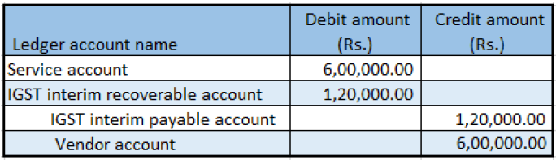

---
# required metadata

title: Import services that have GST
description: This topic explains how to import services that have Goods and Services Tax (GST).
author: EricWangChen
ms.date: 06/04/2019
ms.topic: article
ms.prod: 
ms.technology: 

# optional metadata

# ms.search.form: 
audience: Application User
# ms.devlang: 
ms.reviewer: kfend
# ms.tgt_pltfrm: 
# ms.custom: 
ms.search.region: India
# ms.search.industry: 
ms.author: wangchen
ms.search.validFrom: 2019-06-01
ms.dyn365.ops.version: 10.0.4

---

# Import services that have GST

[!include [banner](../includes/banner.md)]

Complete the procedures in this topic to import services that have Goods and Services Tax (GST).

1. Go to **Accounts payable** \> **Invoices** \> **Invoice journal**.
2. Create a journal.
3. Select **Lines**.
4. Create a purchase of services for a foreign vendor, and save the record.
5. Select **Tax information**.
6. On the **GST** FastTab, in the **SAC** field, select a value.
7. Select the **Vendor tax information** FastTab.
8. Select **OK**.

### Validate the tax details

1. Select **Tax document**.

    **Example**

    - **Taxable value:** 20,000.00
    - **IGST:** 20 percent
    - **Normal exchange rate:** 1 USD = 60 INR

2. Select **Close**.
3. Select **Post** \> **Post**.
4. Close the message that you receive.
5. Select **Inquiries** \> **Voucher**.

[!INCLUDE[footer-include](../../includes/footer-banner.md)]
