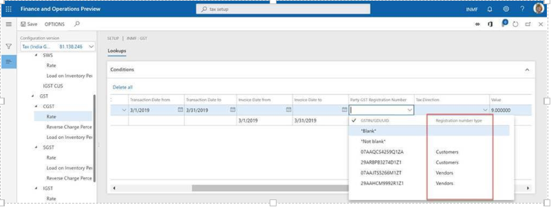
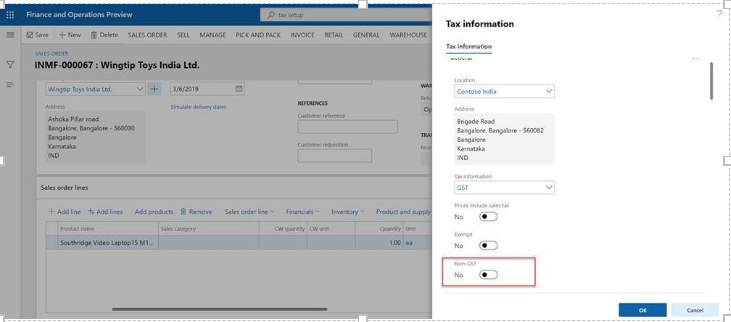
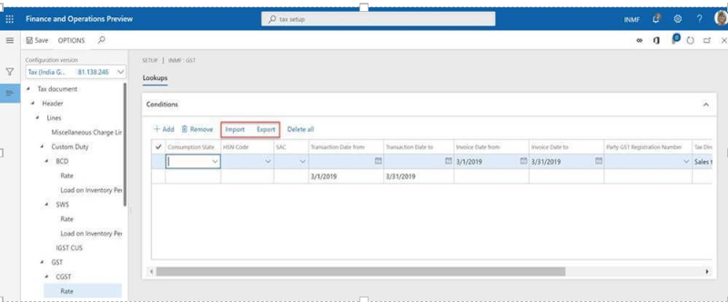
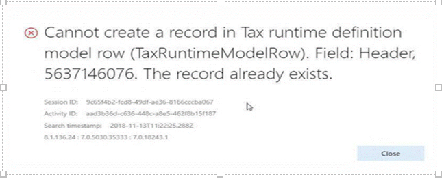

---
# required metadata

title: APAC India GST Localization Newsletter 10.0.00
description: This topic describes changes incorporated in Dynamics 365 Finance version 10.0.00
author: prabhatb
manager: Wangcheng
ms.date: 06/08/2020
ms.topic: article
ms.prod: 
ms.service: dynamics-ax-applications
ms.technology: 

# optional metadata

ms.search.form: 
audience: Application User
# ms.devlang: 
ms.reviewer: kfend
ms.search.scope: Core, Operations
# ms.tgt_pltfrm: 
ms.custom: 
ms.search.region: India
# ms.search.industry: 
ms.author: prabhatb
ms.search.validFrom: 
ms.dyn365.ops.version: 10.0.0

---
[!include [banner](../includes/banner.md)]

# Welcome to the newsletter for version 10.0.

This topic includes a summary of the new features and critical bug fixes released in version 10.0.for India.
You can learn more about the shipped features in the topic, [ What's new or changed in Finance and Operations version ](../../fin-and-ops/get-started/whats-new-changed-10-0.md).

## New Configuration 
The following configurations are available from the Shared Asset Library in LCS for use in version 10.0.0:

- Taxable Document.version.81.xml
- Taxable Document (India).version.81.138.xml
- Tax (India GST).version.81.138.246.xml 
 
You can differentiate customer GST registration number from vendor GST registration number in tax setup.

You can choose to determine the tax rate based on invoice date for the purchase transactions, like purchase invoice.

You can create Non-GST transaction which will be reflected in GSTR.

## Import/export tax setup

You can import and export tax setup for **Rate**, **Reverse charge percentage**, and **Load on inventory percentage**. 

## GTE designer enhancement

You can multi-select lookup columns and search available columns.

## Critical Fixes 

- Extended configurations can't be synchronized if you change the data model in your extended tax document.

  

- Exclude the transactions without GST from GSTR. If there is no GST applicable for the transaction, it will not be in the GSTR, unless it's exempt or Non-GST.
- Block the posting with GST if there isn't a GST transaction ID. 

## Upcoming critical fixes in 10.0.1

- Total item discount amount is not coming in GSTR.
- Item unit of measurement should show the unit and it's description.
- Total transaction value in GSTR is not equal to the invoice amount for transaction with price include tax.
- No customer billing name for  stock transfer in GSTR.
-	No defaulting logic for Original GST transaction ID for credit note.
 
